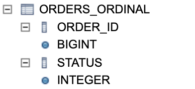
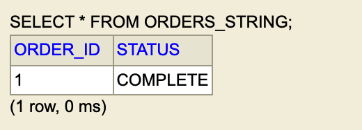

# @Enumerated 사용법

- 자바의 enum 타입을 엔티티 클래스의 속성으로 사용할 수 있습니다.

예를 들어, 실무에서 사용하였을때 주문의 상태를 `임시저장`, `진행중`, `완료`, `취소` 등으로 주문의 상태의 따라서 분리할 수 있습니다. 그래서 각 주문의 상태를 enum으로 생성을 하였고 해당 enum 타입을 엔티티 클래스의 속성으로 설정할 수 있습니다.

## 종류

`@Enumerated`는 enum의 값을 Database의 저장하는 방법을 2가지 제공합니다.
아래는 클래스 파일의 내용입니다.
```Java
public enum EnumType {
    /** Persist enumerated type property or field as an integer. */
    ORDINAL,

    /** Persist enumerated type property or field as a string. */
    STRING
}
```

`ORDINAL`은 `서수`, 즉 순서를 나타내는 수입니다. 즉 순서를 나타내는 숫자를 Database의 저장합니다. 따로 지정하지 않으면 `@Enumerated`로만 지정하면 `ÒRDINAL`로 설정됩니다.
`STRING`은 `문자열`, 즉 ENUM의 name값을 Database의 저장합니다.

## 사용법
주문과 회원 정보를 저장하는 웹 어플리케이션을 예시로 설명을 해보도록 하겠습니다.
이해를 돕기 위해서 주문과 회원의 관계에 대해서 설명드리겠습니다.

- 한명의 회원은 여러개의 주문을 등록할 수 있습니다.
- 하나의 주문은 한명의 회원을 통해서 등록할 수 있습니다.

enum 클래스는 어떠한 값을 갖는지 확인해보도록 하겠습니다.

## ENUM 클래스

주문의 상태를 나타내는 클래스를 enum을 활용하여서 다음과 같이 나타냈습니다.


주문의 상태는 `ORDER`(주문등록), `COMPLETE`(주문완료)의 상태를 갖고 있습니다.

이 상태를 이용하여서 각각 저장 테스트를 해보겠습니다.

### ORDINAL

`@Enumerated(EnumType.ORDINAL)`를 이용하여 아래와 같은 주문 도메인을 만들었습니다.


그리고 저장 및 조회 테스트를 위해서 아래와 같이 작성하였습니다.


테스트를 실행해보면 다음과 같이 성공을 합니다.


Database의 저장한 내용을 직접 확인해보겠습니다.




`STATUS`의 필드는 `int`로 만들어진 것을 확인할 수 있습니다.
`STATUS`의 값을 보면 숫자 `1`로 저장된 것을 확인할 수 있습니다.
아까 enum값을 숫자로 매핑하면 다음과 같습니다.

|orderstatus |enum|
|------------|----|    
|ORDER       |  0 |
|COMPLETE    |  1 |

### STRING

`@Enumerated(EnumType.STRING)`를 이용하여 아래와 같은 주문 도메인을 만들었습니다.


그리고 저장 및 조회 테스트를 위해서 아래와 같이 작성하였습니다.


테스트를 진행해보면 다음과 같이 성공을 합니다.


Database의 저장한 내용을 직접 확인해보겠습니다.




`STATUS`의 필드는 `varchar`로 만들어진 것을 확인할 수 있습니다.
`STATUS`의 값을 보면 숫자 `COMPLETE`로 저장된 것을 확인할 수 있습니다.

## 문제점

둘 다 테스트가 잘 되는 것을 확인할 수 있습니다.
가장 큰 차이는 숫자로 저장되느냐, 문자열로 저장되느냐의 차이입니다.

하지만 현재 주문의 상태는 `ORDER`(주문등록), `COMPLETE`(주문완료)의 상태만을 갖고 있습니다. 추후에 `INPROGRESS`(주문진행중)이 추가될 수 있고 `CANCEL`(주문취소)가 추가될 수 있습니다.

기존 Database의 데이터가 추가된 상황에서 중간에 enum 상태가 추가된다면 정상으로 동작을 할까요? 한번 확인해보겠습니다.

기존 테이블의 각각 데이터를 아래와 같이 추가하고 테스트를 해보겠습니다.
```sql
INSERT INTO ORDERS_ORDINAL(order_id, status) VALUES(1, 1);
INSERT INTO ORDERS_STRING(order_id, status) VALUES(1, 'COMPLETE')
```

### enum 필드 추가

주문의 상태 `ORDER`(주문등록), `COMPLETE`(주문완료)의 상태 사이에 `INPROGRESS`(주문진행중)를 추가하겠습니다.


그리고 동일하게 각각 테스트를 실행해보겠습니다.

### STRING

테스트 결과는 성공을 하게 됩니다.

enum의 추가와 상관없이 문자열이 저장이 되기 때문입니다.


### ORDINAL

테스트 결과는 실패를 하게 됩니다.


실패를 하는 이유는 enum의 서수와 데이터베이스의 저장된 서수가 맞지 않기 때문입니다.

기존에는 다음과 같이 매핑이 되어 있었습니다.

|orderstatus |enum|
|------------|----|    
|ORDER       |  0 |
|COMPLETE    |  1 |

하지만 중간에 `INPROGRESS`가 추가되면서 기존에 `COMPLETE`에게 매핑되어 있던 서수가 `INPROGRESS`로 매핑됩니다.

|orderstatus |enum|
|------------|----|    
|ORDER       |  0 |
|INPROGRESS  |  1 |
|COMPLETE    |  2 |

컴파일에서 에러는 나타나진 않지만 이렇게 실제 주문의 상태가 달라진다면 어떻게 될까요?
지금은 `INPROGRESS`을 추가하였지만 중간에 `CANCEL`이 추가되었다면 어떻게 될까요?  

## 정리

- `@Enumerated`를 사용할때는 가급적이면 `STRING`을 사용합니다.
- 설계가 문제가 없어도 요구사항은 언제든지 변경될 수 있습니다.
- `ORDINAL`은 Database의 숫자로 저장되기 때문에 직관적이지 않습니다.
