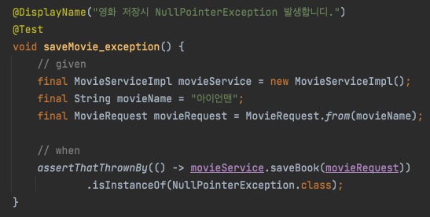

# [Spring] Injection 정리

Spring에서 제공하는 `Injection` 에 대해서 정리를 하고 추천하는 사용 방식에 대해서 말씀을 드리도록 하겠습니다.

아래에서 사용되는 소스는 모두 GitHub에서 확인할 수 있습니다. - [소스](https://github.com/codeleesh/study-code/tree/main/spring-injection)

Spirng에서 제공하는 `Injection` 은 여러가지 방법을 이용할 수 있습니다.

- 생성자 주입
- 수정자 주입(setter 주입)
- 필드 주입
- 일반 메서드 주입

각각 하나씩 직접 생성해보면서 방법과 특징들에 대해서 정리를 해보도록 하겠습니다.

## 생성자 주입

이름과 동일하게 생성자를 통해서 의존관계를 주입합니다.

여기 서점을 관리하는 애플리케이션이 있다고 가정을 하고 소스를 살펴보도록 하겠습니다.

Service의 소스를 보도록 하겠습니다.

- `BookServiceImpl` 은 `BookService` 의 구현 클래스입니다.
- `BookRepository` 은  `BookServiceImpl` 의 인스턴스 변수이며 생성자에서 변수를 받고 있습니다.

생성자 주입 순서를 보면 다음과 같습니다.

1. 스프링에서 컴포넌트 스캔을 통해서 `BookServiceImpl` 를 스프링 빈에 등록합니다.
2. 스프링 빈에 등록하면서 생성자를 호출합니다.
3. 스프링 빈에 `BookRepository` 를 찾아서 주입시켜 줍니다.

특징은 다음과 같이 정리해볼 수 있습니다.

- 스프링 빈에 등록하면서 생성자를 호출하는 시점에 딱 1번만 호출되는 것이 보장됩니다. - `Singleton 보장`

- `불변`, `필수` 의존관계에서 사용합니다.

- 스프링 빈에만 해당되지만 생성자가 딱 1개만 있다면 `@Auaowired` 를 생략해도 자동 주입이 됩니다.

- 컴파일 시점에서 생성자 파라미터가 존재하지 않으면 체크할 수 있습니다.

  

  - 생성자 파라미터가 존재하지 않기 때문에 컴파일 오류를 통해서 확인할 수 있습니다.

## 수정자 주입(setter 주입)

setter라 불리는 필드의 값을 변경하는 수정자 메소드를 통해서 의존관계를 주입하는 방법입니다.

여기 앨범을 관리하는 애플리케이션이 있다고 가정을 하고 소스를 살펴보도록 하겠습니다.

Service의 소스를 살펴보도록 하겠습니다.

특징은 다음과 같이 정리해볼 수 있습니다.

- `선택`, `변경` 가능성이 있는 의존 관계에 사용합니다.
- 자바빈 프로퍼티 규약의 수정자 메소드 방식을 사용하는 방법입니다.
  - 자바에서는 과거부터 필드의 값을 직접 변경하지 않고, setXxx, getXxx라는 메소드를 통해서 값을 읽거나 수정하는 규칙을 만들었는데, 그것이 자바빈 프로퍼티 규약입니다.
  - [Java-bean-property-docs](https://docs.oracle.com/javase/tutorial/javabeans/writing/properties.html)

하지만 다음과 같은 단점이 있습니다.

- 수정자(`setter`)를 통해서 Service 의 구현체를 주입해주지 않아도 Controller 객체는 생성 가능합니다. Controller 객체가 생성가능하기 때문에 이것은 내부에 있는 `saveAlbum` 메소드 호출이 가능합니다.  `create()` 메소드는 `bookService.saveBook` 을 호출하고 있으므로 `NullPointerException` 이 발생할 수 있습니다.
- 주입이 필요한 객체(`AlbumRepository`)가 주입되지 않아도 객체(`AlbumServiceImpl`)가 생성될 수 있다는 것이 문제입니다.
  - 잠재적으로 `NullPointerException`이 발생할 수 있습니다.

참고 사항은 다음과 같습니다.

- `@Autowired` 의 기본 동작은 주입할 대상이 없으면 오류가 발생합니다. 주입할 대상이 없어도 동작하게 하려면 `@Autowired(required = false)`로 지정하면 됩니다.

## 필드 주입

이름 그대로 필드에 주입하는 방법입니다.

여기 영화를 관리하는 애플리케이션이 있다고 가정을 하고 소스를 살펴보도록 하겠습니다.

Service의 소스를 살펴보도록 하겠습니다.

- `@Autowired`에 노란색 경고가 되어 있는 것을 확인할 수 있습니다.

  

  - 추천하지 않는 방식이며 가능한 생성자 주입으로 수정하라고 제안을 하고 있습니다.

특징은 다음과 같이 정리해볼 수 있습니다.

- 코드가 간결합니다.

하지만, 다음과 같은 단점이 있습니다.

- 외부에서 변경이 불가능해서 테스트하기 힘들다는 치명적인 단점이 있습니다.
- DI 프레임워크가 없으면 아무것도 할 수 없습니다.
- **무엇보다 컴파일 시점에서 오류를 찾을 수 없습니다.**

단점에 대해서 테스트 소스를 통해서 알아보도록 하겠습니다.

- 영화 저장시 빈 생성자를 통해서 `MovieServiceImpl` 를 생성하겠습니다.

테스트는 결과는 성공합니다.

- `movieService.saveBook()`을 실행하면 `NullPointerException` 발생합니다.

## 일반 메서드 주입

일반 메소드를 통해서 주입받을 수 있습니다.

여기 전철를 관리하는 애플리케이션이 있다고 가정을 하고 소스를 살펴보도록 하겠습니다.

Service의 소스를 살펴보도록 하겠습니다.

- 주입 받을 클래스를 인스턴스 변수로 선언합니다.
- `init` 메소드를 통해서 주입 받을 메소드를 파라미터로 선언합니다.

특징은 다음과 같습니다.

- 한번에 여러 필드를 주입 받을 수 있습니다.

하지만, 다음과 같은 단점이 있습니다.

- 일반적으로 잘 사용하지 않습니다.
- 필드 주입보다는 불편하고 역시나 빈 생성자 생성을 통해서 필수값이 누락될 수 있어서 `NullPointerException` 이 발생할 수 있습니다.

## 정리

- 필수로 생성이 되어야 한다면 생성자 주입을 사용하는 것이 제일 확실합니다.
  - `불변`으로 설계된 객체의 의도를 명확하게 나타낼 수 있습니다.
  - 생성자 주입을 사용하면 `final` 키워드를 사용할 수 있습니다.
  - 혹여나 잘못 개발을 해도 컴파일 시점에서 체크하기 때문에 런타임 오류를 방지할 수 있습니다.

- 생성자 주입 방식을 선택하는 이유는 여러가지가 있지만, 프레임워크에 의존하지 않고, 순수한 자바 언어의 특징을 잘 살리는 방법입니다.
- 기본으로 생성자 주입을 사용하고, 필수 값이 아닌 경우에는 수정자 주입 방식을 옵션으로 부여하면 됩니다. 
  - 생성자 주입과 수정자 주입을 동시에 사용할 수 있습니다.
  - 필드 주입은 사용하지 않는게 좋습니다. 필드 주입은 스프링 프레임워크가 아니면 테스트가 불가능합니다.