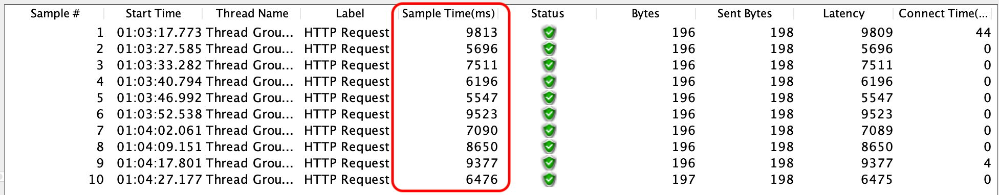
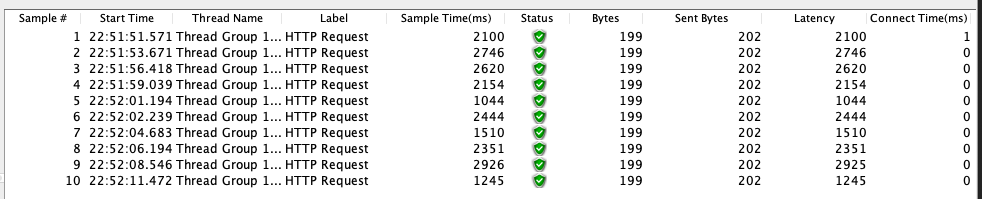
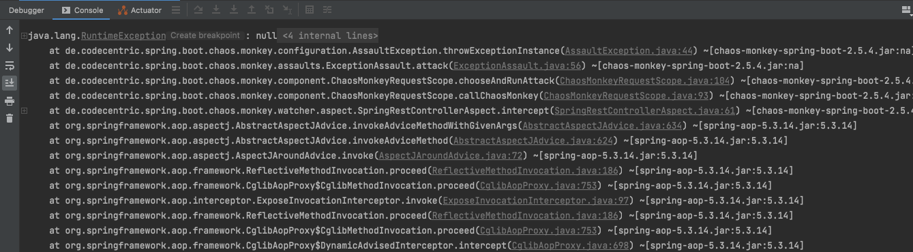
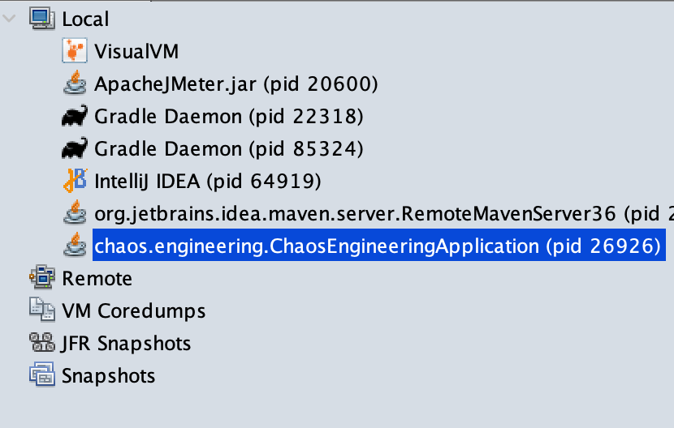
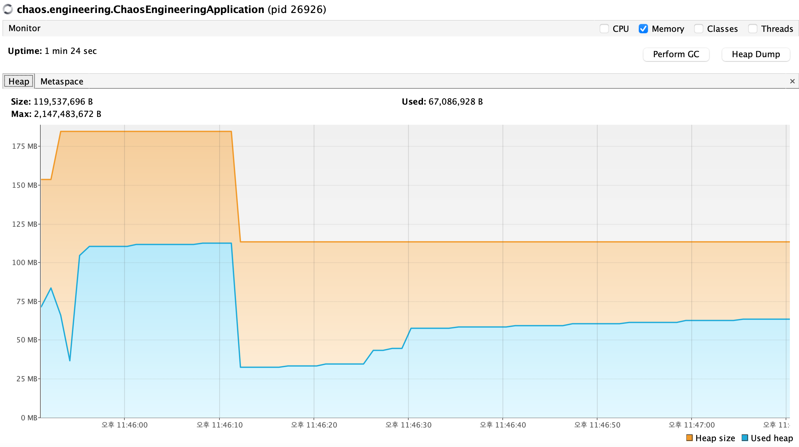
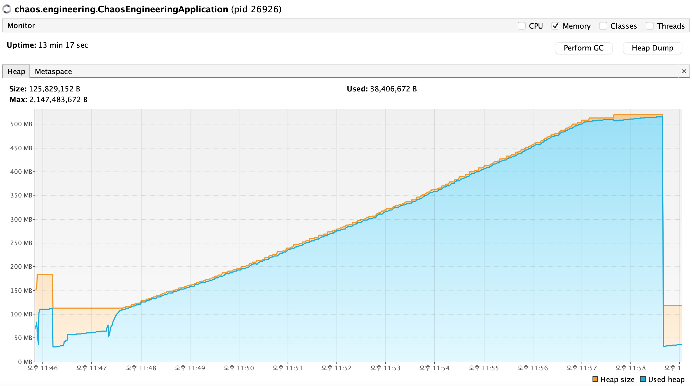
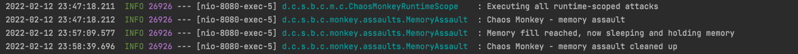

Chaos Monkey for Spring Boot를 이용하여 사용하는 애플리케이션에 어떻게 적용하는지를 알아보도록 하겠습니다.

아래 소스는 모두 Github에사 확인할 수 있습니다. - [소스](https://github.com/codeleesh/chaos-engineering)


## 설정

Spring Boot를 사용하고 있다면 쉽게 추가할 수 있습니다.


### 개발 환경

- IDE : Intelij 2021.2.2
- JDK : 1.8
- Spring Boot : 2.5.8


### Gradle

기존 사용하는 프로젝트안에 아래 2개의 라이브러리를 추가해주면 됩니다.

```
dependencies {
    ...
    implementation 'org.springframework.boot:spring-boot-starter-actuator'
    implementation 'de.codecentric:chaos-monkey-spring-boot:2.5.4'
    ...
}
```


### application.yml

기존 사용하고 있는 yml 또는 properites가 있다면 `chaos-moneky`  profile 추가합니다.

기존에 yml 파일안  `dev` 환경에다가 추가하였고 기본 설정을 `chaos-monkey`로 설정하였습니다.

```
spring:
  profiles:
    active: chaos-monkey

---
spring:
  config:
    activate:
      on-profile: chaos-monkey

  jpa:
    hibernate:
      ddl-auto: create
    properties:
      hibernate:
        format_sql: true
    show-sql: false


management:
  endpoint:
    chaosmonkey:
      enabled: true

  endpoints:
    web:
      exposure:
        # include specific endpoints
        include:
          - health
          - info
          - chaosmonkey

logging:
  level:
    org.hibernate.SQL: debug
    org.hibernate.type: trace

---
spring:
  config:
    activate:
      on-profile: dev

  jpa:
    hibernate:
      ddl-auto: create
    properties:
      hibernate:
        format_sql: true
    show-sql: false

logging:
  level:
    root: trace
    org.hibernate.SQL: debug
    org.hibernate.type: trace
```


### application 실행

설정 후 애플리케이션을 실행하면 다음과 같은 로고가 나타나게 됩니다.

```
     _____ _                       __  __             _
    / ____| |                     |  \/  |           | |
   | |    | |__   __ _  ___  ___  | \  / | ___  _ __ | | _____ _   _
   | |    | '_ \ / _` |/ _ \/ __| | |\/| |/ _ \| '_ \| |/ / _ | | | |
   | |____| | | | (_| | (_) \__ \ | |  | | (_) | | | |   |  __| |_| |
    \_____|_| |_|\__,_|\___/|___/ |_|  |_|\___/|_| |_|_|\_\___|\__, |
                                                                __/ |
    _ready to do evil!                                         |___/

:: Chaos Monkey for Spring Boot                                    ::
```


 `chaos monkey` 활성화 여부, ` watchers 설정` , `assaults` 설정은 여러가지 방법을 제공합니다.

- `Configuration` 클래스 파일을 이용
-  `yml`또는 `properties` 를 이용해서 설정
- HTTP API 호출을 활용하여서도 설정

금일은 마지막 `HTTP API` 를 이용하여서 설정 및 테스트하는 방법을 설명드리겠습니다.


### HTTP Endpoint

`yml` 설정을 진행하셨다면 아래 기본 url을 이용해서 테이블에 있는 endpoint를 붙여서 호출하면 됩니다.

- 기본 : http://127.0.0.1:8080/actuator

| ID                                                           | Description                          | Methods |
| ------------------------------------------------------------ | ------------------------------------ | ------- |
| [/chaosmonkey](https://codecentric.github.io/chaos-monkey-spring-boot/latest/#chaosmonkey) | Running Chaos Monkey configuration   | GET     |
| [/chaosmonkey/status](https://codecentric.github.io/chaos-monkey-spring-boot/latest/#chaosmonkeystatus) | Is Chaos Monkey enabled or disabled? | GET     |
| [/chaosmonkey/enable](https://codecentric.github.io/chaos-monkey-spring-boot/latest/#chaosmonkeyenable) | Enable Chaos Monkey                  | POST    |
| [/chaosmonkey/disable](https://codecentric.github.io/chaos-monkey-spring-boot/latest/#chaosmonkeydisable) | Disable Chaos Monkey                 | POST    |
| [/chaosmonkey/watchers](https://codecentric.github.io/chaos-monkey-spring-boot/latest/#watchers) | Running Watchers configuration.      | GET     |
| [/chaosmonkey/watchers](https://codecentric.github.io/chaos-monkey-spring-boot/latest/#watcherspost) | Change Watchers Configuration        | POST    |
| [/chaosmonkey/assaults](https://codecentric.github.io/chaos-monkey-spring-boot/latest/#assaultsget) | Running Assaults configuration       | GET     |
| [/chaosmonkey/assaults](https://codecentric.github.io/chaos-monkey-spring-boot/latest/#assaultspost) | Change Assaults configuration        | POST    |
| [/chaosmonkey/assaults/runtime/attack](https://codecentric.github.io/chaos-monkey-spring-boot/latest/#assaultspost) | Execute configured runtime Assault   | POST    |

>  ❗️참고
>
> [Chaos Monkey HTTP_Endpoint](https://codecentric.github.io/chaos-monkey-spring-boot/latest/#_http_endpoint)


설정은 어느 정도 끝났으니 이제 watcher 및 assaults 설정에 대해서 알아보도록 하겠습니다.

> ❗️참고
>
> Assaults를 활성화하기 전에, choas-monkey를 활성화를 먼저 진행해야 합니다.
>
> 당연한 이야기지만 서버가 내려간다면 값은 초기화되며 default값이 됩니다.
>
> choas-monkey 활성화 default 값은 false 입니다. 
>
> 이것이 불편하다면 Configuration을 구성해서 초기값을 설정할 수 있습니다.


## Watcher

Watcher Type에 활성화되어 있는 조건을 애플리케이션의 빈을 스캔하여서 찾습니다.


### Watcher 설정

- 요청

  ```http
  POST http://localhost:8080/actuator/chaosmonkey/watchers
  Content-Type: application/json
  
  {
    "controller": false,
    "restController": true,
    "service": false,
    "repository": false,
    "component": false,
    "restTemplate": false,
    "webClient": false,
    "actuatorHealth": false
  }
  ```

- 응답

  ```http
  HTTP/1.1 200 
  Content-Type: text/plain;charset=UTF-8
  Content-Length: 26
  Date: Sat, 12 Feb 2022 05:07:54 GMT
  Keep-Alive: timeout=60
  Connection: keep-alive
  
  Watcher config has changed
  
  Response code: 200; Time: 296ms; Content length: 26 bytes
  ```


### Watcher 설정 정보 조회

- 요청

  ```http
  GET http://localhost:8080/actuator/chaosmonkey/watchers
  ```

- 응답

  ```http
  HTTP/1.1 200 
  Content-Type: application/json
  Transfer-Encoding: chunked
  Date: Sat, 12 Feb 2022 05:09:02 GMT
  Keep-Alive: timeout=60
  Connection: keep-alive
  
  {
    "controller": false,
    "restController": true,
    "service": false,
    "repository": false,
    "component": false,
    "restTemplate": false,
    "webClient": false,
    "actuatorHealth": false,
    "beans": []
  }
  
  Response code: 200; Time: 38ms; Content length: 168 bytes
  ```

  

## Assaults

Assaults는 Chason Monkey의 핵심입니다. 

다음의 공격을 제공합니다.

- Request Assaults
- Runtime Assaults


### Request Assaults

- 이 공격은 응용 프로그램의 특정 지점을 공격합니다. 

- 공격하기 위해서는 감시자 설정이 되어 있어야 합니다.

- 감시자 설정은 위에 정리된 내용을 참고바랍니다.
- 2가지의 공격 유형을 제공합니다.
  - `Latency Assaults`
  - `Exception Assaults`


#### Latency Assaults

- 지연 공격이 활성화된 경우 대기 시간이 요청에 추가됩니다. 

- 요청 파라미터에 `level`을 통해 이 작업이 수행되어야 하는 요청 수를 제어합니다.
  - `level = 1`이라면 1번 호출할때 1번 지연 응답이 설정된다는 뜻입니다.
  - `level = 5`라면 5번 호출될때 5번 마지막에 지연 응답이 설정된다는 뜻입니다.


##### 지연 공격 활성화하는 단계

1. `chaos-monkey` 활성화 호출
2. `watcher` 설정 호출
3. `latency assaults` 설정 호출
4. 해당 클래스/메소드 호출


2가지 지연 공격에 대해서 알아보도록 하겠습니다.

실습에서 http api 호출시 intellij에서 제공하는 `.http` 를 사용하였습니다.


##### `@RestConstructor` 호출시 지연 공격 설정

1. `chaos-monkey` 활성화 호출

   ```http
   POST http://localhost:8080/actuator/chaosmonkey/enable
   ```

2. `watcher` 설정 호출

   ```http
   POST http://localhost:8080/actuator/chaosmonkey/watchers
   Content-Type: application/json
   
   {
     "controller": false,
     "restController": true,
     "service": false,
     "repository": false,
     "component": false,
     "restTemplate": false,
     "webClient": false,
     "actuatorHealth": false
   }
   ```

3. `latency assaults` 설정 호출

   ```http
   POST http://localhost:8080/actuator/chaosmonkey/assaults
   Content-Type: application/json
   
   {
     "level": 1,
     "latencyRangeStart": 5000,
     "latencyRangeEnd": 10000,
     "latencyActive": true
   }
   ```

   - `level`은 이 작업이 수행되어야 하는 요청 수를 제어합니다. 1이라고 설정되어 있기 때문에 요청당 무조건 지연 설정이 적용됩니다.
   - `latencyRangeStart` 최소 지연 시간입니다. 여기서는 5000(ms)으로 설정하였습니다.
   - `latencyRangeEnd` 최대 지연 시간입니다. 여기서는 10000(ms)으로 설정하였습니다.
   - `latencyActive` 은 지연 공격 활성화 여부입니다. 기본값은 `false` 입니다.

4. 해당 클래스/메소드 호출

   

   - jmeter를 활용하여서 10번 호출하였습니다.

   - 결과 시간을 보면 5000(ms) ~ 10000(ms) 사이인 것을 확인할 수 있습니다.

     

##### 특정 메소드 지연 공격 설정

1. `chaos-monkey` 활성화 호출

2. `watcher` 설정 호출

3. `latency assaults` 설정 호출

   ```http
   POST http://localhost:8080/actuator/chaosmonkey/assaults
   Content-Type: application/json
   
   {
     "level": 1,
     "latencyRangeStart": 1000,
     "latencyRangeEnd": 3000,
     "latencyActive": true,
     "watchedCustomServices": [
       "chaos.engineering.controller.GoodByeController.goodBye"
     ]
   }
   ```

4. 해당 클래스/메소드 호출

   

   - `watcher` 가 활성화 되어 있고 `watchedCustomServices`의 특정 메소드를 설정하였다면 해당 메소드만 지연 설정이 됩니다.
   - 결과 시간을 보면 1000(ms) ~ 3000(ms) 사이인 것을 확인할 수 있습니다.


#### Exception Assaults

- 메서드를 사용할 때 예외 발생 여부를 런타임에 결정할 수 있습니다.


##### 예외 공격 활성화하는 단계

1. `chaos-monkey` 활성화 호출

2. `watcher` 설정 호출

3. `exception assaults` 설정 호출

   ```http
   POST http://localhost:8080/actuator/chaosmonkey/assaults
   Content-Type: application/json
   
   {
     "latencyActive": false,
     "exceptionsActive": true,
     "killApplicationActive": false,
     "exception": {
       "type": "java.lang.RuntimeException",
       "arguments": null
     }
   }
   ```

   - `exception` 은 `type`, `arguments` 작성할 수 있습니다. 여기서는 `type`만 작성하였습니다.

4. 해당 클래스/메소드 호출

   ```http
   HTTP/1.1 500 
   Content-Type: application/json
   Transfer-Encoding: chunked
   Date: Sat, 12 Feb 2022 14:39:11 GMT
   Connection: close
   
   {
     "timestamp": "2022-02-12T14:39:11.442+00:00",
     "status": 500,
     "error": "Internal Server Error",
     "path": "/goodbye"
   }
   
   Response code: 500; Time: 441ms; Content length: 108 bytes
   ```

   - 의도한 대로 서버에서 에러가 발생하였습니다. `HttpStatusCode`가 500인 서버에러입니다.

5. 로그 결과

   

   

### Runtime Assaults

- 이 공격은 애플리케이션 전체를 공격합니다.

- 다음의 공격을 제공합니다.
  - `Memory Assaults`
  - `AppKiller Assaults`
  - `CPU Assaults`


여기서 Memory, CPU 가 증가되는 부분을 보기 위해서 `VisualVM`을 활용하도록 하겠습니다.

[VisualVM 다운로드](https://visualvm.github.io/)

사용방법은 VisualVM 실행 후 스프링 부트 애플리케이션을 시작하면 아래 그림처럼 해당 프로세스가 나타납니다.




#### Memory Assaults

JVM의 메모리를 공격합니다.

메모리 공격은 사용 중인 Java 버전에 따라 크게 달라지며, 각 Java 버전의 기본 garbage 수집기로 테스트할 수 있습니다.

Java 8에서 채우기 속도는 슬라이스당 256MB로 제한됩니다!


##### 메모리 공격 활성화하는 단계

1. `chaos-monkey` 활성화 호출

2. `memory assaults` 설정 호출

   ```http
   POST http://localhost:8080/actuator/chaosmonkey/assaults
   Content-Type: application/json
   
   {
     "memoryActive": true,
     "memoryMillisecondsHoldFilledMemory": 90000,
     "memoryMillisecondsWaitNextIncrease": 1000,
     "memoryFillIncrementFraction": 0.15,
     "memoryFillTargetFraction": 0.25
   }
   ```

   - `memoryActive` 는 메모리 공격 활성화유무입니다. 기본값은 `false` 입니다.
   - `memoryMillisecondsHoldFilledMemory`
   - `memoryMillisecondsWaitNextIncrease`
   - `memoryFillIncrementFraction`
   - `memoryFillTargetFraction`

3. `runtime attack` 호출

   ```http
   POST http://localhost:8080/actuator/chaosmonkey/assaults/runtime/attack
   ```

4. VisualVM 결과

   

   - ddd

   

   - ddd

   

5. 로그 결과

   

   - 메모리 공격 시작을 알리고 메모리가 꽉 차면 잠시 대기했다가 메모리 클린을 합니다.

   

#### AppKiller Assaults

설정을 통해 해당 애플리케이션을 종료합니다.


##### 애플리케이션 종료 공격 활성화하는 단계

1. `chaos-monkey` 활성화 호출

2. `appkiller assaults` 설정 호출

   ```http
   POST http://localhost:8080/actuator/chaosmonkey/assaults
   Content-Type: application/json
   
   {
     "killApplicationActive": true
   }
   ```

   - `killApplicationActive` 는 앱 종료를 활성호압니다. 기본값은 `false` 입니다.

3. `runtime attack` 호출

   ```http
   POST http://localhost:8080/actuator/chaosmonkey/assaults/runtime/attack
   ```

4. 로그 결과

   

   - `runtime attack` 호출과 동시에 애플리케이션 종료 공격을 하고 해당 애플리케이션은 종료됩니다.

   

#### CPU Assaults

JVM의 CPU를 공격합니다.


##### CPU 공격 활성화하는 단계

1. `chaos-monkey` 활성화 호출

2. `cpu assaults` 설정 호출

   ```http
   POST http://localhost:8080/actuator/chaosmonkey/assaults
   Content-Type: application/json
   
   {
     "cpuActive": true,
     "cpuMillisecondsHoldLoad": 90000,
     "cpuLoadTargetFraction": 0.9,
     "cpuCronExpression": "OFF"
   }
   ```

   - `cpuActive` 는 메모리 공격 활성화유무입니다. 기본값은 `false` 입니다.
   - `cpuMillisecondsHoldLoad`
   - `cpuLoadTargetFraction`
   - `cpuCronExpression`

3. `runtime attack` 호출

4. VisualVM 결과

   - 이미지는 추후에 업로드...

5. 로그 결과

   