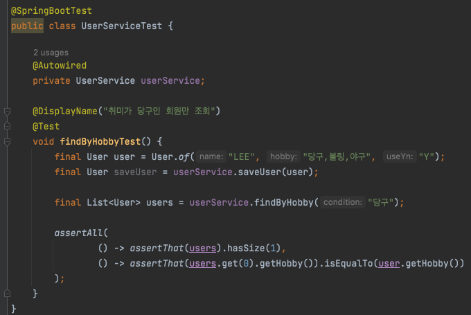
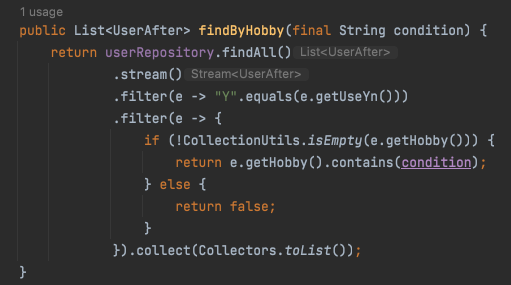

# [리팩토링] 레거시 코드 - JPA Converter 활용

회사에서 개발 중인 소스를 살펴보면서 리팩토링할 영역을 찾아보다가 JPA `Converter`를 활용하여서 변경할 포인트를 찾게 되어서 해당 내용을 공유하려고 합니다.

아래에서 공유하는 내용은 실제 회사에서 개발하는 내용은 아니며 재구성한 것입니다.

모든 소스는 GitHub를 통해서 확인하실 수 있습니다. - [링크](https://github.com/codeleesh/study-code/tree/main/jpa-basic/stream)

## 상황

사용자 도메인이 아래와 같이 존재합니다.

그 중 `hobby` 필드는 다음과 같이 Database에 저장됩니다.

### 기능

hobby 필드를 이용한 조회 기능은 다음과 같습니다.

- 취미를 입력 받는다.
- 입력 받은 취미로 해당 취미를 보유한 사용자를 조회한다.
- 사용자의 저장된 `hobby` 필드 중에 일치하는 취미가 하나라도 있으면 해당 사용자를 반환한다.

### 코드

조회하는 코드는 다음과 같이 있습니다.

- `hobby` 필드 값은 Stream을 이용하여 `split` 하여 배열로 변환
- 변환된 배열 중에 입력받은 취미가 있는지 `contains` 를 이용해서 확인
- 존재하면 해당 사용자를 반환

### 결과

테스트 코드를 실행해보면 다음과 같이 성공한 것을 확인할 수 있습니다.

*테스트코드*

*테스트결과*

하지만 해당 기능이 자꾸 눈에 거슬립니다.

- `hobby` 필드 값은 Stream을 이용하여 `split` 하여 배열로 변환

Buiseness 소스에서 `split` 을 하는 것이 거슬리기도 불편해보이기도 합니다.

또한 현재는 `,` 로 구분해서 저장하지만, `:` 로 변경된다면, 비즈니스 로직도 영향을 받게 됩니다.

## 변경

그래서, JPA의 Converter를 이용해서 다음 소스를 변경해보도록 하겠습니다.

### 기능 구현

JPA에서는 `AttributeConverter<X, Y>` 를 이용할 수 있습니다.

- 이 인터페이스를 구현하는 클래스를 사용하여 변환 가능

AttributeConverter 인터페이스를 사용하기 위해서는 두 가지 메소드를 구현해야 합니다.

- `convertToDatabaseColumn` : 테이블에 저장 또는 변경이 생겼을 때 호출되는 메소드
  - Y는 DB에서 저장되는 타입
- `convertToEntityAttribute` : 태이블에서 출력될 때 호출되는 메소드
  - X는 Java에서 사용하는 타입

####  

### 코드

- `hobby` 필드 값은 Stream을 이용하여 `split` 하여 배열로 변환

위 기능을 Converter로 변경하면 다음과 같습니다.

- 이와 같이 변경을 하게 되면 SRP와 OCP를 지키게 된다고 생각합니다.

변경된 Converter를 Entity에 적용하기 위해서는 다음과 같이 변경하면 됩니다.

- 지정할 필드에 `@Converter` 만 지정해주면 된다.

그럼, Converter를 이용해서 `split` 처리가 가능해졌으니, 기존 소스를 수정하겠습니다.

### 결과

테스트 코드를 실행해보면 다음과 같이 성공한 것을 확인할 수 있습니다.

*테스트코드*

*테스트 결과*

## 정리

- 기능을 개발하기 위해서 비즈니스 로직에서 처리하는 부분에서 순수 구현하는 기능을 위해서가 아닌 소스 추가는 불필요하다고 생각합니다.

  - 현재는 `,`로 구분해서 저장하지만 추후에 `,`가 아닌 `:` 로 변경된다면 비즈니스 로직도 영향을 받을 수 있습니다.

- JPA에서 제공하는 기능입니다.

- 앞선 예제 이외에도 Enum 변환을 통해서 사용할 수 있습니다.

  

