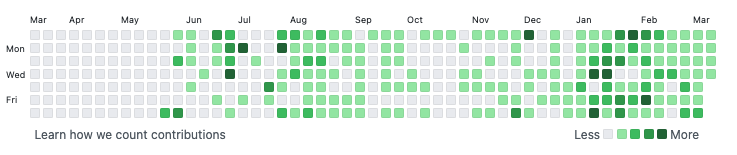
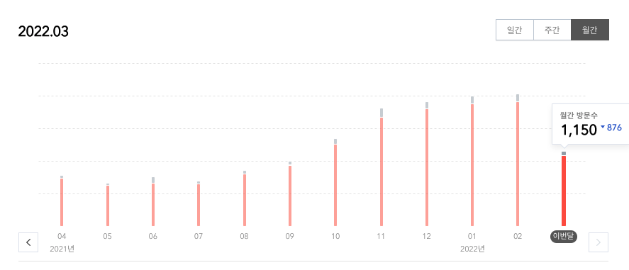
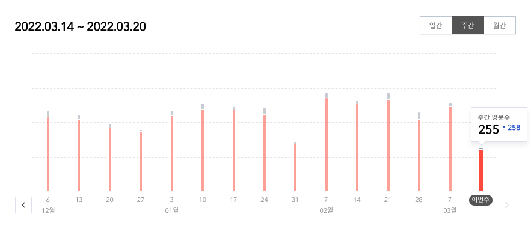
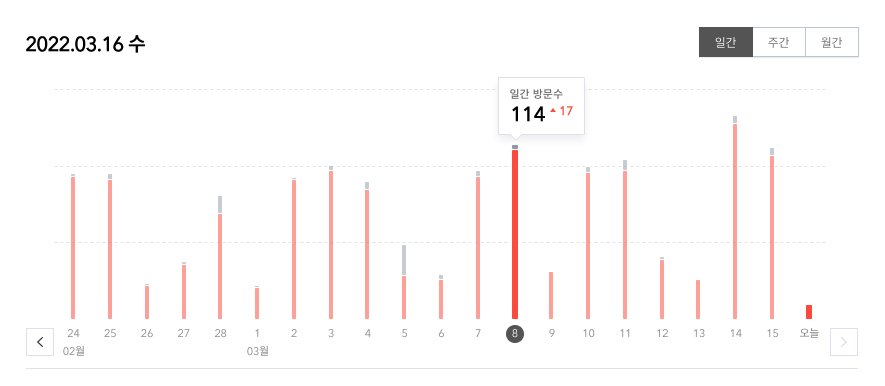
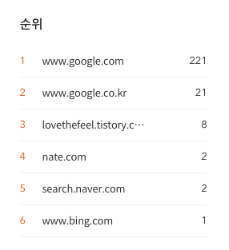
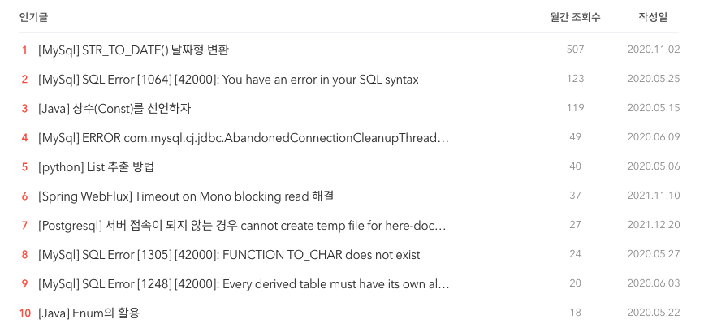
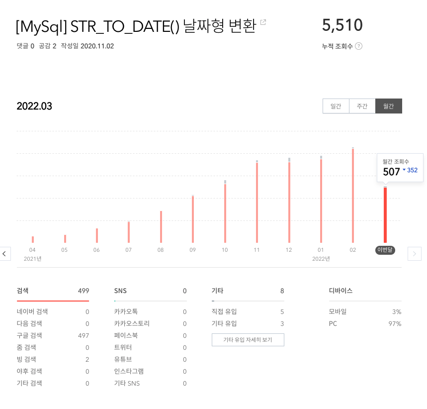

# 회고를 시작하며..

올해부터는 꼭 회고의 글을 쓰기로 마음을 먹었습니다.

회고 글을 쓰면서 1분기를 되돌아보고 무엇을 진행하였고, 무엇을 잘했으며, 무엇이 부족했는지..

무엇보다 그때의 나의 감정들은 어떠하였는지를 정리해보려고 합니다.


## 2022년 1분기

### 매일 기록 남기기

2022년 1월이 되면서 다짐한 부분이 있습니다. 바로 매일 진행한 내용을 기록을 남기는 부분입니다. 다행이도 아직까지는 꾸준히 작성을 하고 있습니다.

그날 진행한 내용과 TODO를 통해서 추후 정리가 필요한 내용을 분리하여 작성하고 있습니다. 작성하는 포맷 자체의 얽메이지 않고 최대한 자유롭게 적어서 기록의 목적을 최대한 살리고 있습니다.

기록의 대한 부분은 현재 [Github](https://github.com/codeleesh/TIL/tree/main/2022)를 통해서 확인이 가능합니다. (재미는 없습니다..)

*작성 포맷*

```
# 2022.03.20

- 매직 넘버 정리
	- [x] 내용 정리
	- [ ] 블로그 공유
- 자바 ORM 표준 JPA 프로그래밍 - 기본편
	- [X] 섹션 1. 강좌 소개 - 100%
	- [X] 섹션 2. JPA 소개 - 100%
	- [X] 섹션 3. JPA 시작하기 - 100%
	- [x] 섹션 4. 영속성 관리 - 내부 동작 방식 - 100%
	- [ ] 섹션 5. 엔티티 매핑 - 40%

## TO-DO

- [HTTP] 모든 개발자를 위한 HTTP 웹 기본 지식
	- [ ] 실습 진행 필요
		- [ ] HTTP Form GET, POST 예제
		- [ ] 영구 리다이렉션 301, 308 예제
		- [ ] 일시적인 리다이렉션 302, 307, 303 예제
		- [ ] PRG 예제
- 이력서 필요한 사항 정리
	- Experience 주제 추가하여 내용 추가
		- 블로그 내용부터 추가
		- 회사에서 리팩토링하는 내용 블로그 이동한 후 이력서 추가
	- favicon 생성하여 변경
		- https://hongpage.kr/28
- 스프링 MVC 1편 - 백엔드 웹 개발 핵심 기술
	- [x] 섹션 1. 웹 애플리케이션 이해 - 100%
	- [x] 섹션 2. 서블릿 - 100%
	- [X] 섹션 3. 서블릿, JSP, MVC 패턴 - 100%
	- [X] 섹션 4. MVC 프레임워크 만들기 - 100%
	- [ ] 섹션 5. 스프링 MVC - 구조 이해 - 10%
- Message Queue 내용 정리
	- [x] RabbitMQ 개념 및 설징 정리
	- [ ] 실습 진행 과정 설정
		- [ ] 1단계
		- [ ] 2단계
```


### 우아한테크캠프 Pro3기

2022년 1월 첫째주에는 [우아한테크캠프 Pro 3기](https://edu.nextstep.camp/c/lqsBs7x0) 수료를 위해서 늦게까지 과제 제출을 위해서 코딩을 하였습니다. 부족한 점이 많아서 신청한 강의였고, 그만큼 많이 배울수 있었고 공부할 수 있는 습관을 잡아준 과정이었습니다. 막판에는 일정을 맞추기가 힘들것 같아 하룻밤을 새서 과제를 하고 출근을 한적도 있었습니다.


### 면접 준비

우아한테크캠프 Pro 3기를 수료하면서 면접을 볼수 있는 기회가 생겨서 이력서 리팩토링을 진행하게 되었고 Github를 이용하여서 [이력서](https://codeleesh.github.io/)를 만들었습니다. 사실 그동안 이력서를 만들어볼 기회가 없었는데, 이번에 만들게 되면서 매달 이력서를 정리하는 시간을 가져야 겠다고 생각하였습니다. 나중에 쓰려고 하면 기억도 안나고 놓치는 부분도 있었습니다. 면접의 결과는 좋지 않았습니다. 물론 아쉬움 마음이 많이 컸지만 그래도 면접을 통해서 경험치를 쌓을 수 있었습니다. 면접관님들의 질문에 대해서 목록을 정리하였고 잘한 대답과 부족한 대답을 분류하는 작업을 진행하였습니다. 아직 부족한 대답에 대해서 보강을 다 하지는 못하였지만 하나씩 정리해서 블로그의 올릴 예정입니다. 해당 내용을 충분히 채워서 다음 면접의 기회가 온다면 당당하게 답할 수 있도록!!


### AWS Free Tier 사용 종료

AWS Free Tier(1년 무료)가 끝이 나면서 와이프와 같이 이용하였던 로또 번호 추출 웹 서비스를 종료하였습니다. 그래서 집에 사용하지 않고 있는 데스크탑의 Ubuntu 를 설치하여서 서버로 사용하는 계획을 세웠습니다. 최종 목표는 로또 번호 추출 웹 서비스를 다시 살려내는 것이었지만, 진행을 하지는 못하였고 회사일 + 다른 공부로 인해서 장기 Plan이 될 것 같습니다.


### Spring & JPA 학습

그와 동시에 우아한테크캠프 Pro 3기가 끝난 후 공부하는 습관 유지와 부족한 부분을 보완하기 위해서 인프런에서 김영한님의 여럿 강의를 수강하였습니다.

특히 HTTP강의와 Spring 기본편은 도움이 많이 되어서 정리할 내용이 많았습니다.


### GitHub 기여 현황



2021년도에는 공부하는 습관이 부족하였습니다. 그러다 보니 휑합니다. 푸르른 잔디를 심을 수 있도록 다시 노력해봐야겠습니다. (1분기에도 구멍이 뚫린 부분이 있지만..)


### Blog 현황


#### 월간 방문자수



해당 방문자수는 3월 2주차때 캡쳐를 하였습니다. 2월달과 비슷할것으로 보이거나 조금 앞설듯 합니다.


#### 주간 방문자수



주간 방문자수 또한 2월달과 크게 달라지지 않으며 비슷한 수치를 보입니다.


#### 일간 방문자수



3월달 일간 방문자수는 2월달과 대체적으로 비슷합니다. 


#### 유입 경로



제 블로그를 들어오시는 모든 분들이 거의 구글링을 통해서 들어오시는 것을 확인하였습니다.


#### 인기글 목록



제 블로그 인기글 1등은 압도적인 수치를 기록하는 [[MySql] STR_TO_DATE() 날짜형 변환](https://lovethefeel.tistory.com/47?category=782454)입니다. 해당 쿼리를 사용할때마다 헷갈려서 Blog로 정리를 하게 되었는데, 이렇게 인기가 많을 줄 몰랐습니다. 인기글 목록을 보면 Error를 만나게 되면서 해결한 내용들에 대해서 공유를 한 부분들이 많았습니다. 


#### 인기글



현재까지 누적 조회수는 `5,510` 인데, 전체 블로그 방문자수를 고려하였을 때 약 4/1 수치를 담당하고 있습니다. 관련 글을 좀 더 작성해서 유입수를 더 늘려야하나 고민만 하고 있습니다.