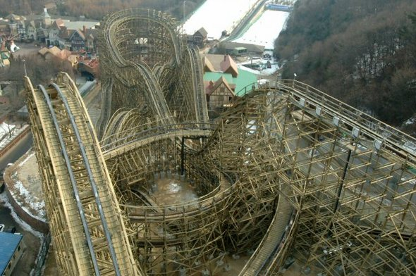

# [자료구조론] Queue 정리

웹 개발자 일을 하면서 `Queue` 을 사용하는 경우를 겪어보지 못하였습니다. 대학교 2학년때 배웠던 데이터구조론에서 자료구조에서 배웠던 기억과 코딩 테스트를 준비하면서 배웠던 부분들을 제외하고는 실제 개발 환경에서는 사용해보았던 적이 없습니다. 

 `RabbitMq` , `Kafka` 등 에서 사용되는 Queue의 모습을 볼 수 있지만, 사용해본적 역시 없습니다. 

먼저 Queue에서 제공하는 개념을 확인하고 메소드를 정리해보려고 합니다. 궁극적으로는 `RabbitMq` 와 `Kafka` 를 이용한 실습예제까지 진행하는 것이 목표입니다.

`Queue` 를 보고 가장 먼저 떠올린것은 롤러코스터에서 사람들이 줄을 스는 것이었습니다. 



(그림과는 무관합니다. 롤러코스터 안 타본지 엄청 오래되었네요.)


모든 소스 코드는 Github를 통해서 확인 가능합니다. - [소스바로가기](https://github.com/codeleesh/study-code/tree/main/java-basic-daily/src/main/java/com/lovethefeel/queue/domain)


## Queue란?

사람이 롤러코스터를 타기 위해 줄을 서는것처럼, 즉 가장 먼저 줄을 선 사람이 제일 먼저 롤러코스터를 탈 수 있는것처럼, 가장 먼저 입력된 데이터를 처리하는 FIFO(First In First Out) 구조입니다.


## Queue 특징

정해진 한 곳(`top`)을 통해서 삽입, 삭제가 이루어지는 `Stack` 과 다르게 `Queue` 는 한쪽 끝에서는 삽입연산만 이루어지며, 다른 쪽 끝에서는 삭제 연산이 이루어진다. 

`Queue` 에서 삽입연산이 이루어지는 곳은 `rear` 라고 하며, 삭제연산이 이루어지는 곳을 `front` 라고 한다.

 `Queue` 의 `rear` 에서 삽입연산을 `enqueue` 라고 하며, `front` 에서 삭제연산을 `dequeue` 라고 한다.


키워드를 정리해보면 다음과 같습니다.

- 한쪽 끝에서는 삽입연산, 다른 쪽 끝에서는 삭제연산
- 가장 첫 데이터를 `front`, 가장 끝 원소를 `rear`
- 삽입연산을 `enqueue` , 삭제연산은 `dequeue`  
- 가장 먼저 들어온 데이터가 가장 먼저 삭제


## Queue 활용

실제 프로그램에서 다음과 같이 활용 가능할것으로 보여집니다.

- 우선순위가 같은 작업 예약
- 은행 업무
- 콜센터 대기시간


## Queue 메소드

`Queue` 는 `Collections Framework` 의 구성원입니다.

Java에서 `Queue` 는 인터페이스로 제공을 합니다. 그래서 보통 `LinkedList` , `PriorityQueue`, `LinkedBlockingQueue`, `BlockingQueue`, `ArrayBlockingQueue`, `LinkedBlockingQueue`, `PriorityBlockingQueue`  등을 이용해서 구현합니다.

여기서는 `LinkedList` 를 이용해서 실습을 진행해보았습니다.


### add

```java
boolean add(E e);
```

`Queue` 의 데이터를 삽입하는 메소드이며, 사이즈 제한으로 인하여 추가의 실패하면 `IllegalStateException` 을 발생합니다.

데이터 추가의 성공하면 `true` 를 반환합니다.


### offer

```java
boolean offer(E e);
```

`Queue` 의 데이터를 삽입하는 메소드이며, 성공하면 `true`, 실패하면 `false` 를 반환합니다.


### remove

```java
E remove();
```

`Queue` 의 데이터를 삭제하는 메소드이며, `Queue` 가 비어있는데 해당 메소드를 요청하면 `NoSuchElementException` 를 발생합니다.

삭제의 성공하면 삭제된 객체를 반환합니다.


### poll

```java
E poll();
```

`Queue` 의 데이터를 삭제하는 메소드이며, `Queue` 가 비어있는데 해당 메소드를 요청하면 `null` 을 반환합니다.

삭제의 성공하면 삭제된 객체를 반환합니다.


### element

```java
E element();
```

`Queue` 의 `front` 데이터를 조회하는 메소드이며, `Queue` 가 비어있는데 해당 메소드를 요청하면 `NoSuchElementException` 를 발생합니다.

조회의 성공하면 조회된 객체를 반환합니다.


### peek

```java
E peek();
```

`Queue` 의 `front` 데이터를 조회하는 메소드이며, `Queue` 가 비어있는데 해당 메소드를 요청하면 `null` 반환합니다.

조회의 성공하면 조회된 객체를 반환합니다.


## 테스트 진행

롤러코스터의 줄을 기다리는 고객을 예로 실습을 진행해보도록 하겠습니다.

먼저는 고객 정보를 담고 있는 객체는 다음과 같습니다.

```java
/**
 * 사용자 관리 객체
 */
public class Person {
    /**
     * id
     */
    private Long id;
    /**
     * 이름
     */
    private String name;

    /**
     * 기본 생성자
     * @param id
     * @param name
     */
    private Person(final Long id, final String name) {
        validate(id, name);
        this.id = id;
        this.name = name;
    }

    /**
     * 기본 필드 검증
     * @param id
     * @param name
     */
    private void validate(final Long id, final String name) {
        if (Objects.isNull(id)) {
            throw new IllegalArgumentException("id 정보가 없습니다.");
        }
        if (Objects.isNull(name) || name == "") {
            throw new IllegalArgumentException("이름이 없습니다.");
        }
    }

    /**
     * 사용자 생성 정적 메소드
     * @param id
     * @param name
     * @return
     */
    public static Person of(final Long id, final String name) {
        return new Person(id, name);
    }
}
```

롤러코스터 대기줄을 관리하는 객체는 다음과 같습니다.

```java
/**
 * 롤러코스터 대기열 관리 객체
 */
public class RollerCoaster {
    /**
     * 대기열 필드
     */
    private Queue<Person> persons;

    /**
     * 기본 생성자
     * @param persons
     */
    public RollerCoaster(final Queue<Person> persons) {
        this.persons = persons;
    }

    /**
     * 초기화
     * @return
     */
    public static RollerCoaster init() {
        return new RollerCoaster(new LinkedList<>());
    }

    /**
     * Queue 생성 메소드 - offer
     *
     * @param person
     * @return
     */
    public boolean lineUpOffer(final Person person) {
        return this.persons.offer(person);
    }

    /**
     * Queue 생성 메소드 - add
     * @param person
     * @return
     */
    public boolean lineUpAdd(final Person person) {
        return this.persons.add(person);
    }

    /**
     * Queue front 조회 메소드 - peek
     * @return
     */
    public Person searchFrontPeek() {
        return this.persons.peek();
    }

    /**
     * Queue front 조회 메소드 - element
     * @return
     */
    public Person searchFrontElement() {
        return this.persons.element();
    }

    /**
     * Queue 삭제 메소드 - poll
     * @return
     */
    public Person lineOutPoll() {
        return this.persons.poll();
    }

    /**
     * Queue 삭제 메소드 - remove
     * @return
     */
    public Person lineOutRemove() {
        return this.persons.remove();
    }
}
```


### 회원이 줄을 선다

#### add, offer

대기열에 회원을 추가하는 메소도는 `add` 와 `offer` 가 있으며, 여기서는 `add` 로 테스트하였습니다.

```java
    @Test
    void 회원이_줄을_선다_add() {
        // given
        Person 홍길동 = Person.of(1L, "홍길동");
        RollerCoaster 놀이기구 = RollerCoaster.init();

        // when
        boolean success = 놀이기구.lineUpAdd(홍길동);

        // then
        assertEquals(success, true);
    }
```


### 놀이공원 탑승한 회원은 삭제

#### remove, poll

대기열에서 놀이공원에 탑승한 회원을 삭제하는 메소드는 `remove`, `poll` 이 있으며, 여기서는 `remove` 로 테스트하였습니다.

```java
    @Test
    void 회원이_놀이공원_탑승한다_remove() {
        // given, when
        Person person = 놀이기구.lineOutRemove();

        // then
        assertEquals(person, 손오공);
    }

```

단, 예외 케이스가 나타났을 경우에는 각 메소드는 다른 응답을 반환합니다.

`remove` 의 경우에는 놀이공원 탑승할 회원이 없을 경우 `NoSuchElementException` 을 발생합니다.

```java
    @Test
    void 놀이공원_탑승할_회원이_없다_remove() {
        // given, when
        RollerCoaster 회원줄이없는놀이기구 = RollerCoaster.init();

        // then
        assertThrows(NoSuchElementException.class, () ->
                회원줄이없는놀이기구.lineOutRemove()
        );
    }
```


`poll` 의 경우에는 놀이공원 탑승할 회원이 없을 경우 `null` 을 반환합니다.

```java
    @Test
    void 회원이_놀이공원_탑승한다_poll() {
        // given, when
        Person person = 놀이기구.lineOutPoll();

        // then
        assertEquals(person, 손오공);
    }
```

 

### 대기열 가장 맨 앞에 있는 회원을 조회

#### peek, element

대기열 가장 맨 앞에 있는 회원을 조회하는 메소드는 `peek` 와 `element` 가 있으며, 여기서는 `peek` 으로 테스트하였습니다.

```java
    private Person 손오공;
    private Person 마이콜;
    private RollerCoaster 놀이기구;

    @BeforeEach
    void init() {
        손오공 = Person.of(1L, "손오공");
        마이콜 = Person.of(2L, "마이콜");
        놀이기구 = RollerCoaster.init();
        놀이기구.lineUpAdd(손오공);
        놀이기구.lineUpAdd(마이콜);
    }

		@Test
    void 현재_맨앞줄_회원정보_확인한다_peek() {
        // given, when
        Person person = 놀이기구.searchFrontPeek();

        // then
        assertEquals(person, 손오공);
    }
```

단, 예외 케이스가 나타났을 경우에는 각 메소드는 다른 응답을 반환합니다.

`peek` 의 경우 대기열에 회원이 없을 경우 해당 메소드를 호출하면 `null` 을 반환합니다.

```java
    @Test
    void 대기줄이_없을때_회원정보_확인한다_peek() {
        // given
        RollerCoaster 회원줄이없는놀이기구 = RollerCoaster.init();

        // when
        Person person = 회원줄이없는놀이기구.searchFrontPeek();

        // then
        assertEquals(person, null);
    }
```


`element` 의 경우 대기열에 회원이 없을 경우 해당 메소드를 호출하면 `NoSuchElementException` 를 반환합니다.

```java
    @Test
    void 대기줄이_없을때_회원정보_확인한다_element() {
        // given, when
        RollerCoaster 회원줄이없는놀이기구 = RollerCoaster.init();

        // then
        assertThrows(NoSuchElementException.class, () ->
                회원줄이없는놀이기구.searchFrontElement()
        );
    }
```

