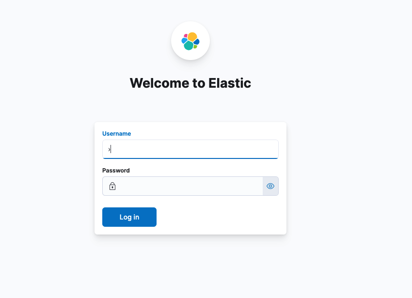

# [ELK] MacOS Docker 설치

회사에서 준비중인 웹 프로그램에서 ELK와 연동하여 수집된 로그를 보여주고 있습니다. 그래서 ELK를 학습하기 위해서 회사 내부에서 강의를 수강중에 있는데, 해당 내용을 복습하고 정리한 내용을 올리려고 합니다. 그래서 먼저 로컬에서 ELK를 설치하여서 실습을 할 수 있도록 준비를 하려고 합니다. 

설치 관련 참고 - https://github.com/deviantony/docker-elk


## 환경

- OS : MacOS


## 사전 준비

- [Docker Engine](https://docs.docker.com/get-docker/) 버전 **18.06.0** 또는 최신 버전 설치
- [Docker Compose](https://docs.docker.com/compose/install/) 버전 **1.26.0** or 최신 버전 ([Compose V2](https://docs.docker.com/compose/cli-command/) 포함) 설치
- 서버 메모리 1.5 GB 이상


## 설치 진행


### Git Clone

```
git clone https://github.com/deviantony/docker-elk.git
```


### x-pack 제거

해당 내용 참고하여 진행 - https://github.com/deviantony/docker-elk#how-to-disable-paid-features

라이센스 체크를 하기 때문에 무료로 사용하기 위해서 disable 필요합니다.

기존 : `trial` -> 변경 : `basic`


#### Elasticsearch 설정

Clone 받은 폴더에서 아래 경로에 있는 `elasticsearch.yml` 파일 열어서 수정 필요합니다.

```bash
 vi docker-elk/elasticsearch/config/elasticsearch.yml
```

```bash
---
## Default Elasticsearch configuration from Elasticsearch base image.
## https://github.com/elastic/elasticsearch/blob/master/distribution/docker/src/docker/config/elasticsearch.yml
#
cluster.name: "docker-cluster"
network.host: 0.0.0.0

## X-Pack settings
## see https://www.elastic.co/guide/en/elasticsearch/reference/current/security-settings.html
#
xpack.license.self_generated.type: basic
xpack.security.enabled: true
```


#### Logstash

Clone 받은 폴더에서 아래 경로에 있는 `logstash.yml` 파일 열어서 수정 필요합니다.

```bash
vi docker-elk/logstash/config/logstash.yml
```

```bash
---
## Default Logstash configuration from Logstash base image.
## https://github.com/elastic/logstash/blob/master/docker/data/logstash/config/logstash-full.yml
#
http.host: "0.0.0.0"
```


Clone 받은 폴더에서 아래 경로에 있는 `logstash.conf` 파일 열어서 수정 필요합니다.

```bash
vi docker-elk/logstash/pipeline/logstash.conf
```

```bash
input {
        beats {
                port => 5044
        }

        tcp {
                port => 5000
        }
}

## Add your filters / logstash plugins configuration here

output {
        elasticsearch {
                hosts => "elasticsearch:9200"
                user => "logstash_internal"
                password => "${LOGSTASH_INTERNAL_PASSWORD}"
        }
}
```


#### Kibana

Clone 받은 폴더에서 아래 경로에 있는 `kibana.yml` 파일 열어서 수정 필요합니다.

```bash
vi docker-elk/kibana/config/kibana.yml
```

```bash
---
## Default Kibana configuration from Kibana base image.
## https://github.com/elastic/kibana/blob/master/src/dev/build/tasks/os_packages/docker_generator/templates/kibana_yml.template.ts
#
server.name: kibana
server.host: 0.0.0.0
elasticsearch.hosts: [ "http://elasticsearch:9200" ]
monitoring.ui.container.elasticsearch.enabled: true

## X-Pack security credentials
#
elasticsearch.username: kibana
elasticsearch.password: ${KIBANA_SYSTEM_PASSWORD}
```


### Build

- `docker-compose.yml` 파일 있는 곳에서 아래 명령어 실행합니다.

```bash
$ docker-compose build
```


### Run

- build가 완료되었다면 관련 container를 모두 실행하는데, docker-compose를 이용하여 쉽게 실행할 수 있습니다.

```bash
$ docker-compose up -d
```

```
$ docker ps
CONTAINER ID   IMAGE          COMMAND                  CREATED          STATUS          PORTS                                                                                                                                                                        NAMES
971f93d15730   57de38626d50   "/bin/tini -- /usr/l…"   41 seconds ago   Up 39 seconds   0.0.0.0:5601->5601/tcp, :::5601->5601/tcp                                                                                                                                    docker-elk_kibana_1
596af327e43e   c92a31423d80   "/usr/local/bin/dock…"   41 seconds ago   Up 39 seconds   0.0.0.0:5000->5000/tcp, :::5000->5000/tcp, 0.0.0.0:5044->5044/tcp, :::5044->5044/tcp, 0.0.0.0:9600->9600/tcp, 0.0.0.0:5000->5000/udp, :::9600->9600/tcp, :::5000->5000/udp   docker-elk_logstash_1
a426bdbbfa42   a07757549c0b   "/bin/tini -- /usr/l…"   41 seconds ago   Up 40 seconds   0.0.0.0:9200->9200/tcp, :::9200->9200/tcp, 0.0.0.0:9300->9300/tcp, :::9300->9300/tcp                                                                                         docker-elk_elasticsearch_1
bcc331639bad   ade30fcb7cb2   "/entrypoint.sh"         42 seconds ago   Up 40 seconds   9200/tcp, 9300/tcp                                                                                                                                                           docker-elk_setup_1
```

- 최초 설치 완료 후 `docker-elk_setup_1` 올리지 않아도 됩니다.


### Clean & Remove

- 설치를 잘못하여서 정리가 필요할때 아래 명령어를 통해 제거 가능합니다.

```
docker-compose down -v
```


## 설치 완료 

설치가 완료되었다면 아래 포트 정보를 확인하여서 필요한 기능을 수행할 수 있습니다.

### 포트 정보

| Name                        | Port |
| --------------------------- | ---- |
| Logstash Beats input        | 5044 |
| Logstash TCP input          | 5000 |
| Logstash monitoring API     | 9600 |
| Elasticsearch HTTP          | 9200 |
| Elasticsearch TCP transport | 9300 |
| Kibana                      | 5601 |


### 로그인

URL 접속 - http://127.0.0.1:5601



- built-in 관리자 계정
  - id : elastic
  - pw : changeme


## 정리


- Elasticsearch, Logstash, Kibana 을 로컬 환경에서 docker-compose 를 이용하여 손쉽게 설치할 수 있습니다.


## 참고


- [Elastic stack (ELK) on Docker](https://github.com/deviantony/docker-elk)
- [docker docs](https://docs.docker.com/get-docker/)