# [Jenkins] 4.Multiproject Pipeline 적용해보기

프로젝트 진행하면서 내부 CI/CD 도구로 jenkins를 사용하기로 하였습니다. 설치부터 `Pipeline` 을 정리까지 진행을 해보고 관련 내용을 블로그로 정리하려고 합니다.  

지난번에 정리한 Pipeline 내용을 정리하면서 샘플 예제로 실습을 해보려고 합니다.

Pipeline의 대한 상세 내용은 이전 블로그 내용을 참고해주세요.

- [Jenkins] 1.설치와 초기 설정
- [Jenkins] 2.Pipeline 개념 및 Declarative Pipeline (sections)
- [Jenkins] 3.Declarative Pipeline (Directives, Sequential Stages)
- [Jenkins] 4.Multiproject Pipeline 적용해보기


## 환경

- Java : 11
- SpringBoot : 2.7.0
- IDE : intellij
- Jenkins : 2.350
- Github


소스는 Gradle Muilte Project로 구성을 하였으며 서브 모듈은 다음과 같습니다.

- app-common
  - application에서 사용하는 공통 상수 및 유틸 등을 모아놓았습니다.
  - 해당 서브모듈은 다른 모듈에서 모두 의존하고 있습니다.

- app-order
  - 주문 도메인에 해당하는 도메인, 비즈니스로직 등을 모아놓았습니다.

- app-member
  - 회원 도메인에 해당하는 도메인, 비즈니스로직 등을 모아놓았습니다.

- app-product
  - 상품 도메인에 해당하는 도메인, 비즈니스로직 등을 모아놓았습니다.


## 요구사항


필요한 요구사항은 다음과 같습니다.

변경된 Project만 Build-Test-Backup-Copy-Deploy 순으로 진행하려고 합니다.
- `app-order` 가 변경되었다고 해서 `app-member` 까지 배포하는 것이 아닙니다.
- `app-common` 이 변경되면 `app-order` , `app-member` , `app-product` 까지 배포합니다.


모든 소스는 [github](https://github.com/codeleesh/gradle-multi) 에서 확인 가능합니다.


## Jenkins 설정

필요한 플러그인 설치를 알아보고 어떠한 환경설정을 해야 하는지도 알아보도록 하갰습니다.


### 플러그인 설치

- Pipeline 및 Github 활용을 위해 다음 플러그인 설치 필요 
  - GitHub
  - GitHub Pipeline for Blue Ocean
  - Pipeline: GitHub Groovy Libraries
- tools 에서 사용하기 위해서 필요
  - Gradle
- 아래 플러그인은 `deprecated` 되었기 때문에 사용하지 않음
  - GitHub Organization Folder


### Gradle 설정

`Jenkins` 에서 gradle build를 진행하기 위해 환경설정을 진행합니다.

등록한 정보는 추후 Jenkinsfile에서 `tools` 이용해서 활용할 예정입니다.

Jenkins 관리로 이동하여서 `Global Tool Configuration` 을 선택합니다.

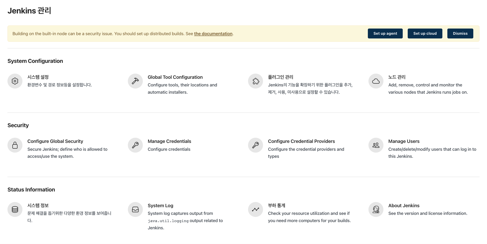


Gradle 정보를 입력합니다. 인터넷이 가능한 서버에서는 직접 다운로드 가능한 URL 정보를 입력하면 됩니다.

인터넷이 가능하지 않다면 여러가지 방법이 존재합니다.

- Nexus를 활용한 사내 repository에서 다운로드
- 직접 Jenkins 서버에서 설치

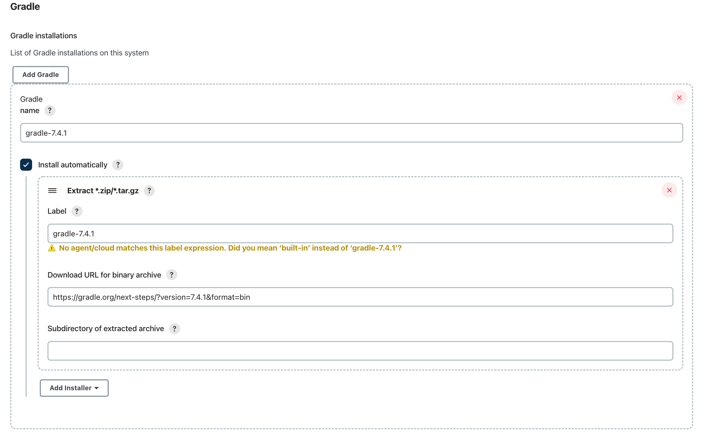


### Github Generate Token

Jenkins 에서 Github에서 사용할 계정의 대한 토큰을 발급받도록 하겠습니다. 

Github 로그인 -> Settings -> Developer setting 으로 접속 후 Personal access tokens 를 선택한다.

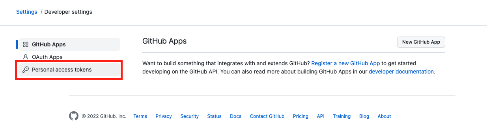


`Generate new token` 을 눌러서 새로운 토큰을 발급한다.

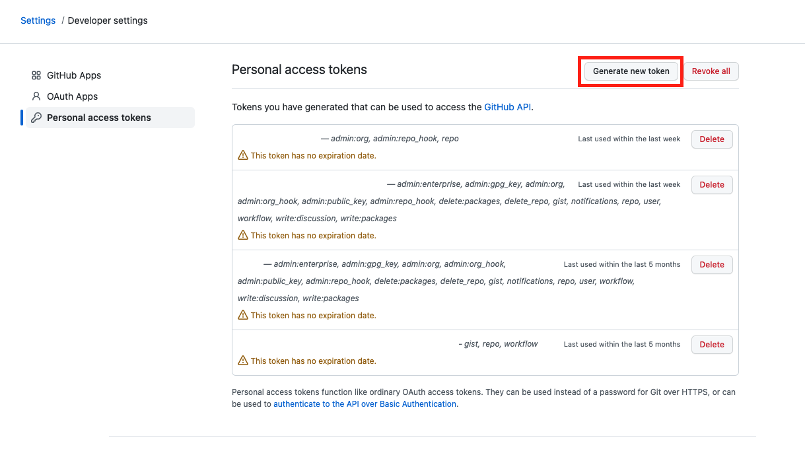


token의 Note와 Expiration을 설정한다.

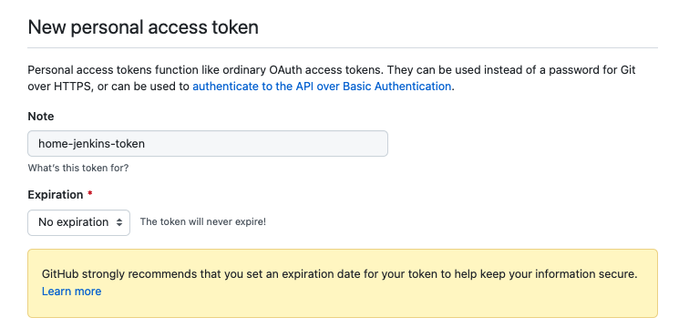


해당 token의 필요한 권한을 설정한다.

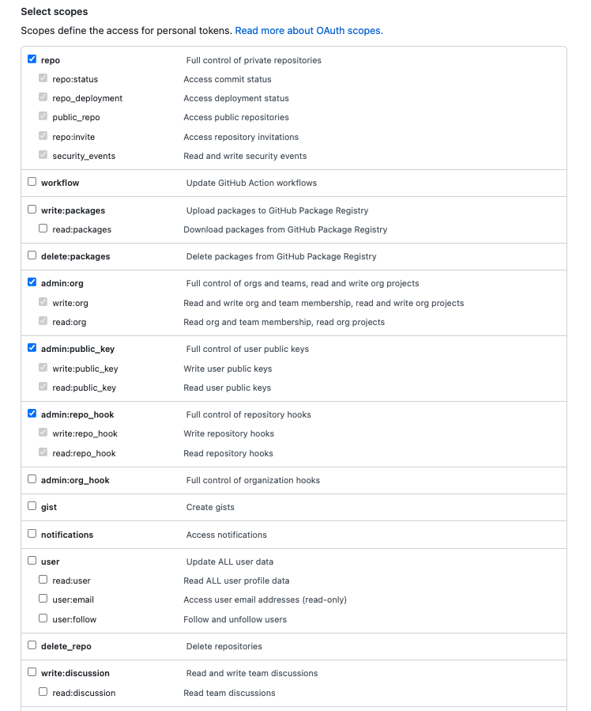


발급받은 token은 다른 곳에 저장을 잘 해놓습니다. 왜냐하면 발급받은 token을 저장하지 않고 잊어버렸다면 token을 다시 확인하기 어렵습니다.


### Github Credentials

Dashboard > Jenkins 관리 > Manage Credentials 으로 이동하여서 `Stores scoped to Jenkins` 의 `Jenkins` 선택합니다.

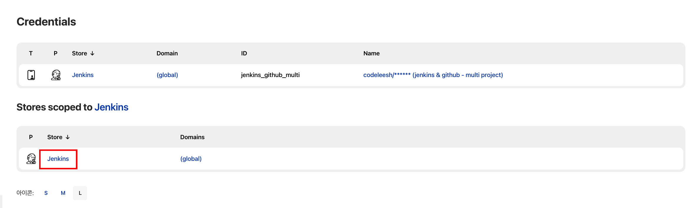


`Global credentials (unrestricted)` 선택합니다.

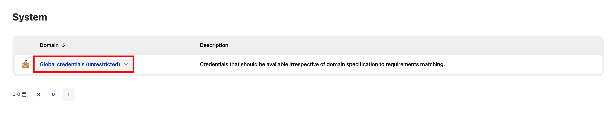


왼쪽 목록의 `Add Credentials` 선택합니다.

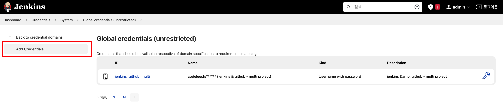


`New Credentials` 정보 등록을 위해서 아래 내용을 참고하여서 작성합니다.

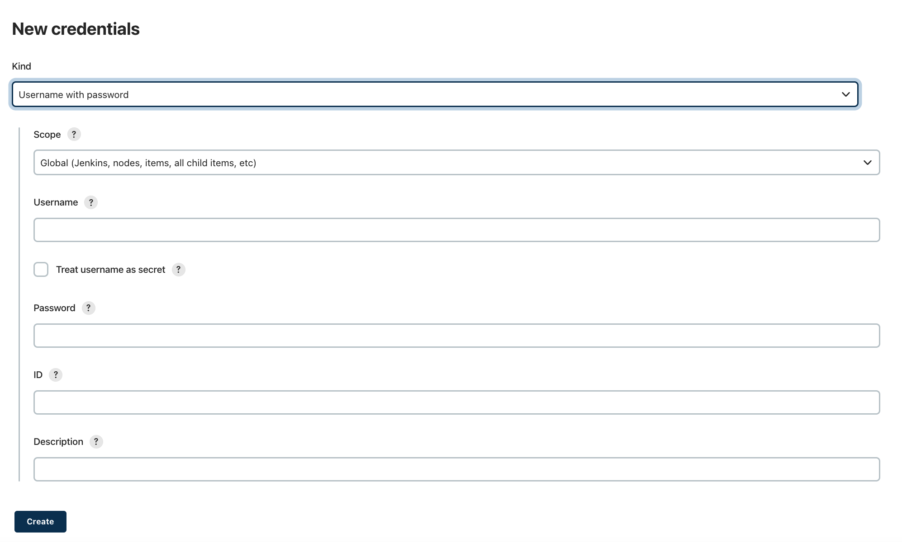

- `Kind` : Username with password
- `Scope` : Global (Jenkins, nodes, items, all child items, etc)
- `Username` : Gihub ID(nickname)
- `Password` : Generate token
- `ID` : jenkins에서 사용할 고유 아이디
- `Description` : 부가 설명


### New Item

새로운 아이템을 등록하기 위해서  `Multibranch Pipeline` 을 선택합니다.

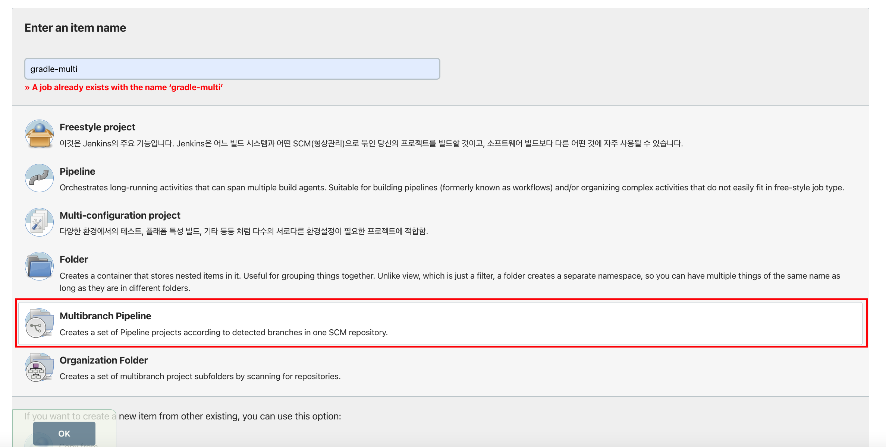


`Projects` 탭에서 `Single repository` 를 선택합니다.

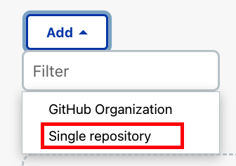


적절한 `Name` 을 입력하고 `Github` 정보를 입력합니다. `Credentials` 정보는 위에서 입력한 정보를 선택합니다. 정보를 모두 입력한 후에는 `Validate` 를 선택해서 테스트를 꼭 해봅니다.

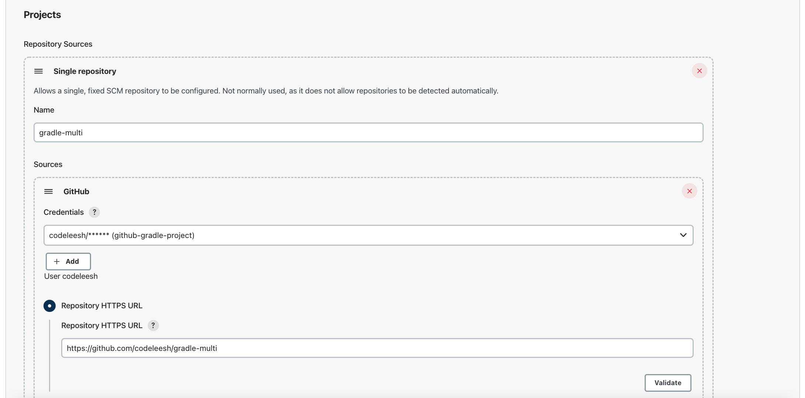

테스트를 시도하면 다음과 같은 결과가 나옵니다.

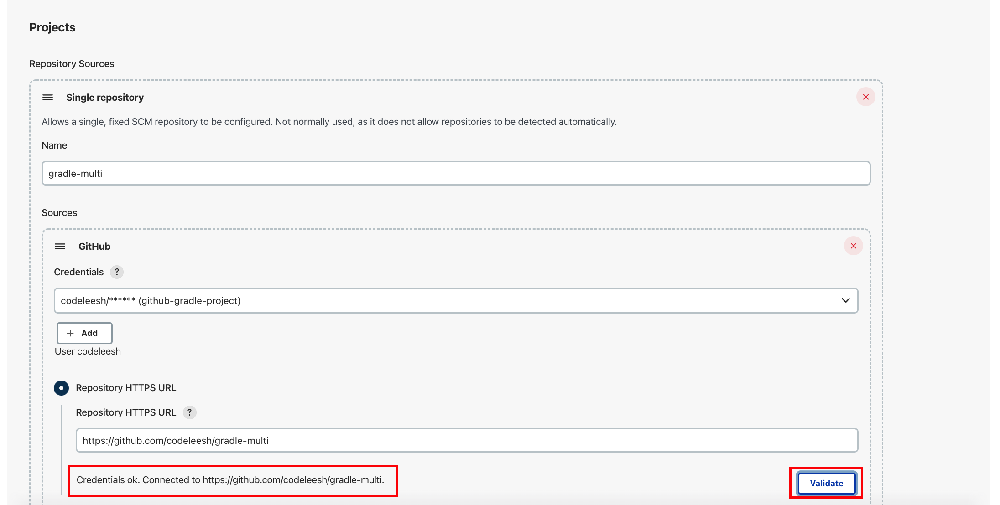


`Jenkinsfile` 을 작성하고 이를 활용하여서 pipeline을 만들려고 합니다. 아래 항목에서 `Jenkinsfile` 입력합니다.

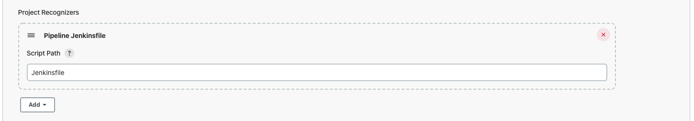


형상관리의 특정 branch만 연동할 수 있고 모든 branch를 연동할 수 있습니다. 여기서는 branch가 하나밖에 없어서 다음과 같이 설정하였습니다.

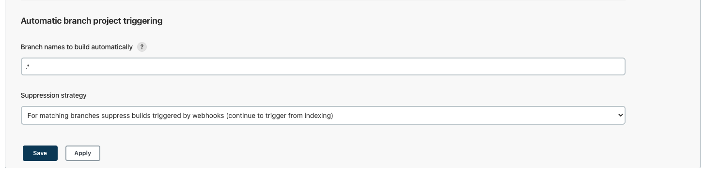


그 외 정보는 기본 설정값을 그대로 유지하였습니다.


## Pipeline 실행

위에서 생성한 아이템에서 왼쪽 목록에서 `Scan Organization Folder Now` 항목을 선택하면 됩니다.

단, `Jenkinsfile` 이 작성되어서 github repository에 존재해야 합니다.

사용한 `Jenkinsfile` 은 다음과 같습니다.

```groovy
pipeline {
    agent any

    tools {
        gradle 'gradle-7.4.1'
    }

    environment {
        BUILD_TARGET_HOME = '${BUILD_HOME}'
        PROJECT = 'gradle-multi'
        APP_MEMBER = 'app-member'
        APP_ORDER = 'app-order'
        APP_PRODUCT = 'app-product'
    }

    stages {
        stage('Build') {
            parallel {
                stage('build-app-member') {
                    when {
                        anyOf {
                            changeset "app-common/**/*"
                            changeset "app-member/**/*"
                        }
                    }
                    steps {
                        echo 'Build Start "${APP_MEMBER}"'
                        sh './gradlew ${APP_MEMBER}:build -x test'
                        echo 'Build End "${APP_MEMBER}"'
                    }
                }
                stage('build-app-order') {
                    when {
                        anyOf {
                            changeset "app-common/**/*"
                            changeset "app-order/**/*"
                        }
                    }
                    steps {
                        echo 'Build Start "${APP_ORDER}"'
                        sh './gradlew ${APP_ORDER}:build -x test'
                        echo 'Build End "${APP_ORDER}"'
                    }
                }
                stage('build-app-product') {
                    when {
                        anyOf {
                            changeset "app-common/**/*"
                            changeset "app-product/**/*"
                        }
                    }
                    steps {
                        echo 'Build Start "${APP_PRODUCT}"'
                        sh './gradlew ${APP_PRODUCT}:build -x test'
                        echo 'Build End "${APP_PRODUCT}"'
                    }
                }
            }
        }
        stage('Backup & Copy') {
            parallel {
                stage('back-copy-app-member') {
                    when {
                        anyOf {
                            changeset "app-common/**/*"
                            changeset "app-member/**/*"
                        }
                    }
                    steps {
                        echo 'Backup & Copy Start "${APP_MEMBER}"'
                        echo 'Backup & Copy End "${APP_MEMBER}"'
                    }
                }
                stage('back-copy-app-order') {
                    when {
                        anyOf {
                            changeset "app-common/**/*"
                            changeset "app-order/**/*"
                        }
                    }
                    steps {
                        echo 'Backup & Copy Start "${APP_ORDER}"'
                        echo 'Backup & Copy End "${APP_ORDER}"'
                    }
                }
                stage('back-copy-app-product') {
                    when {
                        anyOf {
                            changeset "app-common/**/*"
                            changeset "app-product/**/*"
                        }
                    }
                    steps {
                        echo 'Backup & Copy Start "${APP_PRODUCT}"'
                        echo 'Backup & Copy End "${APP_PRODUCT}"'
                    }
                }
            }
        }
        stage('Deploy') {
            parallel {
                stage('deploy-app-member') {
                    when {
                        anyOf {
                            changeset "app-common/**/*"
                            changeset "app-member/**/*"
                        }
                    }
                    steps {
                        echo 'Deploy Start "${APP_MEMBER}"'
                        echo 'Deploy End "${APP_MEMBER}"'
                    }
                }
                stage('deploy-app-order') {
                    when {
                        anyOf {
                            changeset "app-common/**/*"
                            changeset "app-order/**/*"
                        }
                    }
                    steps {
                        echo 'Deploy Start "${APP_ORDER}"'
                        echo 'Deploy End "${APP_ORDER}"'
                    }
                }
                stage('deploy-app-product') {
                    when {
                        anyOf {
                            changeset "app-common/**/*"
                            changeset "app-product/**/*"
                        }
                    }
                    steps {
                        echo 'Deploy Start "${APP_PRODUCT}"'
                        echo 'Deploy End "${APP_PRODUCT}"'
                    }
                }
            }
        }
    }
}
```


실행 결과는 다음과 같습니다. 변경분이 없기에 빌드는 작동하지 않습니다.

```bash
Branch indexing
15:52:06 Connecting to https://api.github.com with no credentials, anonymous access
Obtained Jenkinsfile from 93402bb3d3eaebc3b61720bd3e4e6e975a4c2838
[Pipeline] Start of Pipeline
[Pipeline] node
Running on Jenkins in /var/jenkins_home/workspace/gradle-multi_gradle-multi_main
[Pipeline] {
[Pipeline] stage
[Pipeline] { (Declarative: Checkout SCM)
[Pipeline] checkout
The recommended git tool is: NONE
Warning: CredentialId "github-gradle" could not be found.
 > git rev-parse --resolve-git-dir /var/jenkins_home/workspace/gradle-multi_gradle-multi_main/.git # timeout=10
Fetching changes from the remote Git repository
 > git config remote.origin.url https://github.com/codeleesh/gradle-multi.git # timeout=10
Fetching without tags
Fetching upstream changes from https://github.com/codeleesh/gradle-multi.git
 > git --version # timeout=10
 > git --version # 'git version 2.30.2'
 > git fetch --no-tags --force --progress -- https://github.com/codeleesh/gradle-multi.git +refs/heads/main:refs/remotes/origin/main # timeout=10
Checking out Revision 93402bb3d3eaebc3b61720bd3e4e6e975a4c2838 (main)
 > git config core.sparsecheckout # timeout=10
 > git checkout -f 93402bb3d3eaebc3b61720bd3e4e6e975a4c2838 # timeout=10
Commit message: "feat: 멤버 생성자 및 검증 로직 추가"
 > git rev-list --no-walk 93402bb3d3eaebc3b61720bd3e4e6e975a4c2838 # timeout=10
[Pipeline] }
[Pipeline] // stage
[Pipeline] withEnv
[Pipeline] {
[Pipeline] withEnv
[Pipeline] {
[Pipeline] stage
[Pipeline] { (Declarative: Tool Install)
[Pipeline] tool
Installer "Extract *.zip/*.tar.gz" cannot be used to install "gradle-7.4.1" on the node "Jenkins"
[Pipeline] envVarsForTool
Installer "Extract *.zip/*.tar.gz" cannot be used to install "gradle-7.4.1" on the node "Jenkins"
[Pipeline] }
[Pipeline] // stage
[Pipeline] withEnv
[Pipeline] {
[Pipeline] stage
[Pipeline] { (Build)
[Pipeline] parallel
[Pipeline] { (Branch: build-app-member)
[Pipeline] { (Branch: build-app-order)
[Pipeline] { (Branch: build-app-product)
[Pipeline] stage
[Pipeline] { (build-app-member)
[Pipeline] stage
[Pipeline] { (build-app-order)
[Pipeline] stage
[Pipeline] { (build-app-product)
[Pipeline] echo
Warning, empty changelog. Have you run checkout?
[Pipeline] echo
Warning, empty changelog. Have you run checkout?
[Pipeline] echo
Warning, empty changelog. Have you run checkout?
[Pipeline] echo
Warning, empty changelog. Have you run checkout?
[Pipeline] echo
Warning, empty changelog. Have you run checkout?
[Pipeline] echo
Warning, empty changelog. Have you run checkout?
Stage "build-app-member" skipped due to when conditional
[Pipeline] }
Stage "build-app-order" skipped due to when conditional
[Pipeline] }
Stage "build-app-product" skipped due to when conditional
[Pipeline] }
[Pipeline] // stage
[Pipeline] // stage
[Pipeline] // stage
[Pipeline] }
[Pipeline] }
[Pipeline] }
[Pipeline] // parallel
[Pipeline] }
[Pipeline] // stage
[Pipeline] stage
[Pipeline] { (Backup & Copy)
[Pipeline] parallel
[Pipeline] { (Branch: back-copy-app-member)
[Pipeline] { (Branch: back-copy-app-order)
[Pipeline] { (Branch: back-copy-app-product)
[Pipeline] stage
[Pipeline] { (back-copy-app-member)
[Pipeline] stage
[Pipeline] { (back-copy-app-order)
[Pipeline] stage
[Pipeline] { (back-copy-app-product)
[Pipeline] echo
Warning, empty changelog. Have you run checkout?
[Pipeline] echo
Warning, empty changelog. Have you run checkout?
[Pipeline] echo
Warning, empty changelog. Have you run checkout?
[Pipeline] echo
Warning, empty changelog. Have you run checkout?
[Pipeline] echo
Warning, empty changelog. Have you run checkout?
[Pipeline] echo
Warning, empty changelog. Have you run checkout?
Stage "back-copy-app-member" skipped due to when conditional
[Pipeline] }
Stage "back-copy-app-order" skipped due to when conditional
[Pipeline] }
Stage "back-copy-app-product" skipped due to when conditional
[Pipeline] }
[Pipeline] // stage
[Pipeline] // stage
[Pipeline] // stage
[Pipeline] }
[Pipeline] }
[Pipeline] }
[Pipeline] // parallel
[Pipeline] }
[Pipeline] // stage
[Pipeline] stage
[Pipeline] { (Deploy)
[Pipeline] parallel
[Pipeline] { (Branch: deploy-app-member)
[Pipeline] { (Branch: deploy-app-order)
[Pipeline] { (Branch: deploy-app-product)
[Pipeline] stage
[Pipeline] { (deploy-app-member)
[Pipeline] stage
[Pipeline] { (deploy-app-order)
[Pipeline] stage
[Pipeline] { (deploy-app-product)
[Pipeline] echo
Warning, empty changelog. Have you run checkout?
[Pipeline] echo
Warning, empty changelog. Have you run checkout?
[Pipeline] echo
Warning, empty changelog. Have you run checkout?
[Pipeline] echo
Warning, empty changelog. Have you run checkout?
[Pipeline] echo
Warning, empty changelog. Have you run checkout?
[Pipeline] echo
Warning, empty changelog. Have you run checkout?
Stage "deploy-app-member" skipped due to when conditional
[Pipeline] }
Stage "deploy-app-order" skipped due to when conditional
[Pipeline] }
Stage "deploy-app-product" skipped due to when conditional
[Pipeline] }
[Pipeline] // stage
[Pipeline] // stage
[Pipeline] // stage
[Pipeline] }
[Pipeline] }
[Pipeline] }
[Pipeline] // parallel
[Pipeline] }
[Pipeline] // stage
[Pipeline] }
[Pipeline] // withEnv
[Pipeline] }
[Pipeline] // withEnv
[Pipeline] }
[Pipeline] // withEnv
[Pipeline] }
[Pipeline] // node
[Pipeline] End of Pipeline

Could not update commit status, please check if your scan credentials belong to a member of the organization or a collaborator of the repository and repo:status scope is selected


GitHub has been notified of this commit’s build result

Finished: SUCCESS
```


## 정리

- Github를 연동하기 위해서는 `GitHub`, `GitHub Pipeline for Blue Ocean`, `Pipeline: GitHub Groovy Libraries` 플러그인을 설치하면 됩니다.
- Gradle 를 `tools` 이용해서 활용하기 위해서는 Jenkins 관리로 이동하여서 `Global Tool Configuration` 에서 등록해야 합니다.
- `MultiBranch Pipeline` 을 이용하여서 git 연동 및 pipeline을 구성할 수 있습니다.


## 참고

- [Pipeline](https://www.jenkins.io/doc/book/pipeline/)
