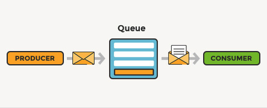

# [RabbitMQ] MacOS docker 설치


회사에서 `Message Queue` 서버를 도입할 예정인데, 이와 관련하여서 개발 경험을 해본적이 없습니다. 그래서 Spring과 `RabbitMQ` 를 사용하여서 연동하는 간단한 예제를 만들어보고 좀 더 심화된 내용으로 만들어보면서 동작 과정을 파악해보려고 합니다. 그래서 첫 시간으로 `RabbitMQ` 개념 및 사용하는 방법 등을 알아보고 설치까지 완료하여보겠습니다.


## RabbitMQ란?

queue에 대한 간단한 개념은 아래 내용을 참고하시면 좋습니다.

[[자료구조론 Queue]](https://lovethefeel.tistory.com/84)


> https://www.cloudamqp.com/blog/what-is-message-queuing.html

- 오픈 소스 `Message Broker`(메시지 브로커)

- `Message Broker`(메시지 브로커)란?

  `Publisher`(송신자)로부터 전달받은 메시지를  `Subscriber` (수신자)로 전달해주는 중간 역할이며 응용 소프트웨어 간에 메시지를 교환할 수 있게 합니다.

  

### 어떻게 사용할까?



> https://www.cloudamqp.com/blog/what-is-message-queuing.html

- `Publish`(송신자)가 보낸 메시지를 Queue에 적재
- `Subscribe`(수신자)가 이를 받아서 사용하는 구조
- 이러한 구조를 `Publish/Subscribe(pub/sub) pattern` 또는 `Producer/Consumer pattern`


### 장점

- 비동기(Asynchronous): Queue에 넣어두기 때문에 나중에 처리할 수 있다.
- 분리 또는 비동조(Decoupling): 애플리케이션과 분리할 수 있다.
- 탄력성(Resilience): 일부가 실패 시 전체에 영향을 받지 않는다.
- 과잉(Redundancy): 실패 할 경우 재실행이 가능하다.
- 보증(Guarantees): 작업이 처리된 걸 확인할 수 있다.
- 확장성(Scalable): 다수의 프로세스들이 큐에 메시지를 보낼 수 있다.


### 대표적인 메시지 브로커

- Apache Kafka
- RabbitMQ
- AWS SQS(Simple Queue Service)
- GCP Cloud Pub/Sub
- ...


## 설치 진행

설치 방법은 여러가지 방법이 있습니다.

- 직접 다운로드
- Mac인 경우 homebrew 이용
- docker-compose 이용


### 직접 다운로드

- https://www.rabbitmq.com/download.html


### Mac인 경우 `homebrew` 이용

```bash
brew install rabbitmq
```


### docker-compose 이용

- docker-compose.yml 작성

  ```yaml
  version: '1'
  services:
    rabbitmq:
      image: 'rabbitmq:3-management-alpine'
      container_name: rabbitmq-stream
      volumes:
        - /Users/lsh/Desktop/docker_home/rabbitmq/etc/:/etc/rabbitmq/
        - /Users/lsh/Desktop/docker_home/rabbitmq/data/:/var/lib/rabbitmq/
        - /Users/lsh/Desktop/docker_home/rabbitmq/logs/:/var/log/rabbitmq/    
      ports:
        - "5672:5672"
        - "15672:15672"
      environment:
        RABBITMQ_ERLANG_COOKIE: "RabbitMQ-My-Cookies"
        RABBITMQ_DEFAULT_USER: "admin"
        RABBITMQ_DEFAULT_PASS: "admin"
  ```

- `version` 

  - docker-compose의 버전에 따라 여러 차이가 있기 때문에 작성할 때엔 버전을 정의 해주는것이 좋습니다.

- `services`

  - 컨테이너를 실행하기 위한 단위로 보면 됩니다.

  - service안의 container들은 하나의 project로서 docker-compose로 관리 됩니다.

- `services.rabbitmq`

  - 생성 할 container 이름을 지정 합니다.

- `services.rabbitmq.image`

  - docker-compose 안에서 베이스 이미지를 지정할 수 있습니다.
  - docker build를 할 때와 마찬가지로 이미지가 로컬 환경에 없다면 해당 이미지를 다운받아서 base 이미지로 사용합니다.
  - `rabbitmq:3-management-alpine` 이미지는 위 이미지는 [Alpine Linux Project]([]())를 기반으로 합니다. Alpine Linux는 대부분 Base 기반의 이미지(~ 5mb) 보다 훨씬 작아서 슬림한 이미지를 제공합니다.

- `services.rabbitmq.volumes`

  - dockerfile에서 사용되는 volume과 같이 컨테이너에 볼륨을 마운트할 때 사용됩니다. <호스트>:<컨테이너> 방식으로 사용하고 마지막에 :ro를 추가해 볼륨을 읽기 전용으로 사용할 수 있습니다.
  - 보통 docker-compose를 통해 빌드하게 되면 이미지가 생성되는데, 개발을 하다보면 수시로 코드를 수정하게 되는데 수정할 때마다 이미지를 재생성하면 굉장히 비효율적이게 됩니다.
  - 이때 코드 수정을 하고 있는 호스트의 경로를 컨테이너와 연결시켜서 이미지 빌드 없이 코드가 반영될 수 있도록 하는 것이 volume의 장점입니다.

  - `./.docker/rabbitmq/etc/rabbitmq.conf:/etc/rabbitmq/rabbitmq.conf` : RabbitMQ [configuration](https://www.rabbitmq.com/configure.html#config-file) 파일을 설정하기 위함
  - `./.docker/rabbitmq/data/:/var/lib/rabbitmq/` : RabbitMQ 데이터에 접근하기 위함
  - `./.docker/rabbitmq/logs/:/var/log/rabbitmq/` : RabbitMQ 로그에 접근하기 위함

- `services.rabbitmq.ports`

  - ports는 호스트 OS와 컨테이너의 포트를 바인딩 시키는 포트포워딩의 역할을 합니다.
  - ports는 <호스트 머신의 포트번호> : <컨테이너의 포트 번호> 와 같은 순서로 바인딩이 이루어집니다. 만약, 8080:8080이 아닌 8080만 지정했을 경우(컨테이너의 포트번호만 지정한 경우, 호스트 머신의 포트는 랜덤한 값으로 설정됩니다. 예를 들면, 4631(랜덤):8080와 같이 지정됩니다. 

- `services.rabbitmq.environment`

  - `RABBITMQ_ERLANG_COOKIE`
    - 노드 간 인증을 위한 수단으로 쿠키를 사용한다. 
    - 클러스터 내 각 노드가 동일한 쿠키 값을 가지고 있다면 인증된 노드로 판단하는 식입니다.

  - `RABBITMQ_DEFAULT_USER`
    - 기본 로그인 사용자 아이디

  - `RABBITMQ_DEFAULT_PASS`
    - 기본 로그인 사용자의 패스워드


여기서는 `docker-compose` 를 이용하여서 설치를 해보도록 하겠습니다.


## 설치 진행


`docker-compose.yml` 파일 존재하는 곳에 가서 아래 명령어를 실행합니다.


### Docker

```bash
docker-compose up -d
```


## 관리 UI 화면

아래 접속 URL을 이용하여서 웹에서 접속을 하면 로그인 창이 나오게 됩니다.

- 접속 URL : `http://localhost:15672`

  


## 관리자 계정

- 기본 계정 및 패스워드 : `admin/admin`

  - `localhost` 에서만 접속이 가능


## 추가 계정 설정

- 사용자 및 패스워드 추가

  ```bash
  $ rabbitmqctl add_user rabbitmq password
  ```

- `Administrator` 설정

  ```bash
  $ rabbitmqctl set_user_tags rabbitmq administrator
  ```


## 로그인


## 정리

- `rabbitMq` 는 `Publisher`(송신자)로부터 전달받은 메시지를  `Subscriber` (수신자)로 전달해주는 중간 역할이며 응용 소프트웨어 간에 메시지를 교환합니다.


## 참고

- https://www.rabbitmq.com/