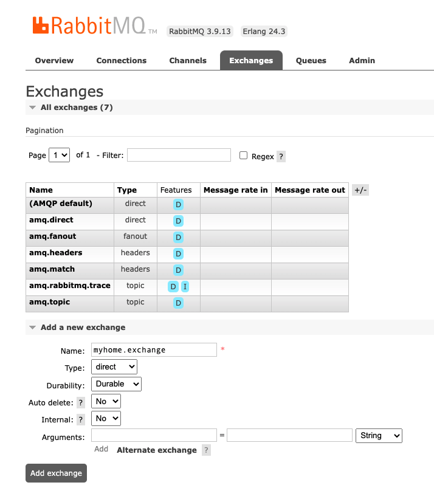
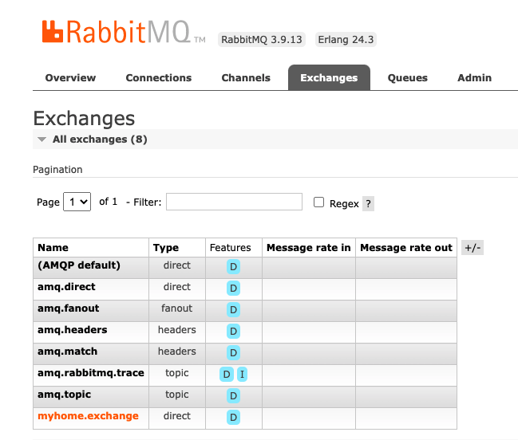
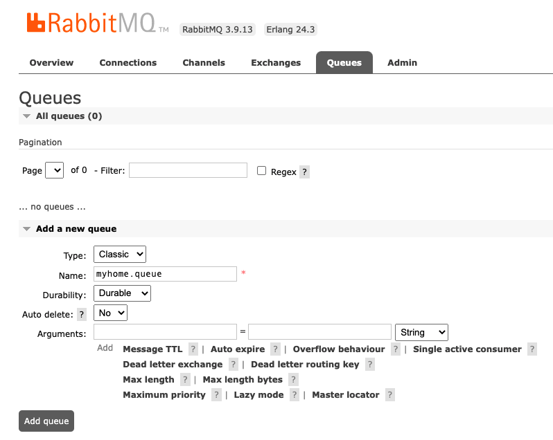
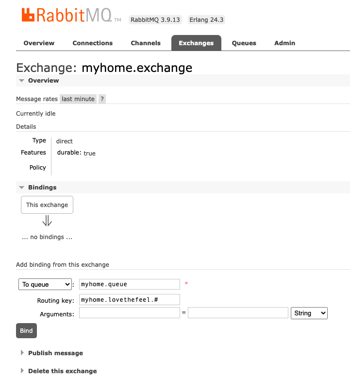
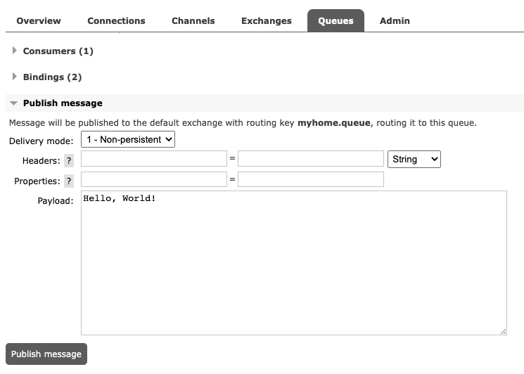
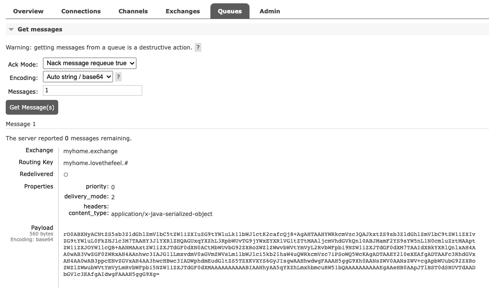

# [RabbitMq] spring-boot-starter-amqp 활용 publish-subscribe


실습을 위해서 RabbitMq 설치를 진행하였습니다. Spring boot 를 이용하여서 Publisher-Subscribe 예제 프로젝트를 직접 만들어어보고 이해도를 높여보도록 하겠습니다. 

먼저, RabbitMq의 메시지를 처리하는 프로세스는 다음과 같이 단순하게 작성을 하였습니다.


## 메시지 프로세스

1. `Publisher` 메세지 발생 주체가 메세지를 발생 시킵니다.
2. 메세지를 RabbitMQ의 API를 이용해 RabbitMQ 영역으로 보내게 됩니다.
   - RabbitMQ의 API는 rabbitTemplate을 이용해서 RabbitMQ와 통신을 쉽게 해줍니다.
3.  `Exchange` 가 메세지 내용을 확인합니다.
   - 어느 Exchange로 보내는지에 대한 정보와 이 Exchange는 어느 Queue로 routing이 되야 하는지에 대한 정보도 함께 보내게 됩니다.
4.  메세지는 Queue 영역에 가서 쌓이게 됩니다.
5. `Subscribe` 는 Queue를 주기적으로 polling 하면서 데이터가 쌓이게 되면 가져옵니다.


그럼, 소스를 통해서 알아보기전에 테스트를 위한 `Exchange`, `Queue`, `Routing Key` 를 만들도록 하겠습니다.


## RabbitMq 관리 화면

### Exchanges

RabbitMQ Management에 가서 Exchange 메뉴로 이동하여서 아래 `Add a new exchange` 를 이용하여 새롭게 추가합니다.



- Name : myhome.exchange
- Type : direct
- Durability : Durable
- Auto delete : No
- Internal : No


추가된 결과는 다음과 같습니다.




### Queue

저장 공간을 설정합니다.




### Routing Key

해당  `Exchange` 라우팅할 저장 공간을 연결합니다. 위에서 생성한 `Queue` 공간을 연결하면 됩니다.




여기까지 진행하였으면 데이터 적재를 위한 초기 설정은 완료되었습니다. 


## 개발 환경

- Spring Boot : 2.7.2
- Java : 11
- IDE : Intellij


모든 소스는 Github 통해서 확인이 가능합니다. - [소스 바로가기](https://github.com/codeleesh/study-code/tree/main/spring-boot-rabbitmq)


### 프로젝트

프로젝트는 2가지로 `publish` 와 `subscribe` 로 나누어서 구성을 하였습니다. 


#### build.gradle

```groovy
implementation 'org.springframework.boot:spring-boot-starter-amqp'
```


#### Subscribe

`@RabbitListener` 를 이용해서 해당 큐에 메시지가 전송되면 메시지를 가져와서 출력합니다.

```java
@Slf4j
@Component
public class MyHomeListener {

    @RabbitListener(queues = "myhome.queue")
    public void receiveMessage(final Message message) {
        log.info("Message {}", message);
        final String messageString = new String(message.getBody(), StandardCharsets.UTF_8);
        log.info("messageString {}", messageString);
    }
}
```


##### 메시지 수신 테스트

1. `Subscribe` 프로젝트를 기동합니다.

2. 관리 페이지 > `Queues` 에서 public message 에 전송할 메시지를 입력합니다. 여기서는 `Hello, World!` 를 입력하고 `Publish message` 버튼을 누릅니다.




3. 로그를 확인해봅니다.

   ```
   2022-08-06 16:44:47.789  INFO 86976 --- [ntContainer#0-1] m.l.rabbitmq.listener.MyHomeListener     : messageString Hello, World!
   ```


수신은 간단한 문자열로 테스트를 하였습니다. 전송은 사용자의 정보를 등록하는 API를 만들어서 해당 정보를 요청하는 것으로 진행을 해보도록 하겠습니다.


### Publisher

`RabbitTemplate` 을 이용해서 요청받은 사용자의 정보를 등록하는 API를 만들었습니다.

```java
@Slf4j
@Service
@RequiredArgsConstructor
public class MemberService {

    private final RabbitTemplate rabbitTemplate;

    private static final String EXCHANGE_NAME = "myhome.exchange";

    public String memberPublish(final Member member) {

        log.info("Member {}", member);
        rabbitTemplate.convertAndSend(EXCHANGE_NAME, "myhome.lovethefeel.#", member);
        return "message send success!";
    }
}
```

컨트롤러는 다음과 같습니다.

```java
@RequiredArgsConstructor
@RequestMapping("/member")
@RestController
public class MemberController {

    private final MemberService memberService;

    @PostMapping("publish")
    public String memberPublish(@RequestBody final MemberRequest memberRequest) {

        return memberService.memberPublish(Member.from(memberRequest));
    
```


위 API를 이용해서 메신저 전송을 테스트해보도록 하겠습니다.


##### 메시지 전송 테스트

1. 사용자의 정보를 등록하는 API를 요청합니다. (API는 위에 참고)

```http
POST http://localhost:19080/member/publish
Content-Type: application/json

{
  "memberName": "lee",
  "memberStatus": "INPROGREES",
  "address": {
    "city": "My City",
    "state": "My State",
    "zipCode": "20090"
  },
  "created": "2022-08-06T10:00:00",
  "createdBy": "lee",
  "updated": "2022-08-06T10:00:00",
  "updateBy": "lee"
}
```

2. 요청한 결과 로그는 다음과 같습니다. `Created new connection` 메시지로 보아서는 성공한 것 같습니다.

```
2022-08-06 17:00:04.603  INFO 87554 --- [io-19080-exec-3] m.l.member.application.MemberService     : Member Member{memberName='lee', memberStatus=INPROGREES, address=Address{city='null', state='null', zipCode='null'}, created=2022-08-06T10:00, createdBy='lee', updated=2022-08-06T10:00, updateBy='lee'}
2022-08-06 17:00:04.652  INFO 87554 --- [io-19080-exec-3] o.s.a.r.c.CachingConnectionFactory       : Attempting to connect to: [localhost:5672]
2022-08-06 17:00:04.715  INFO 87554 --- [io-19080-exec-3] o.s.a.r.c.CachingConnectionFactory       : Created new connection: rabbitConnectionFactory#52b46d52:0/SimpleConnection@5941b192 [delegate=amqp://admin@127.0.0.1:5672/, localPort= 56503]
```

3. 관리 페이지에서 확인을 해봅니다. 해당 `Queue` 상세 정보로 이동한 다음 `Get Message(s)` 에서 확인할 수 있습니다.

  


지금까지는 각 구간별로 테스트를 진행하였는데, 이제는 Publusher와 Subscribe 연동하여서 테스트를 진행해보도록 하겠습니다.


### Publisher-Subscribe 연동 테스트

1. publish 애플리케이션 사용자의 정보를 등록하는 API를 호출합니다.

   ```http
   POST http://localhost:19080/member/publish
   Content-Type: application/json
   
   {
     "memberName": "lee",
     "memberStatus": "INPROGREES",
     "address": {
       "city": "My City",
       "state": "My State",
       "zipCode": "20090"
     },
     "created": "2022-08-06T10:00:00",
     "createdBy": "lee",
     "updated": "2022-08-06T10:00:00",
     "updateBy": "lee"
   }
   ```

2. publish 애플리케이션 서버의 로그를 확인합니다. 위에서 요청한 정보가 잘 생성된것으로 보여집니다.

   ```
   2022-08-06 18:23:47.376  INFO 91991 --- [io-19080-exec-1] m.l.member.application.MemberService     : Member Member{memberName='lee', memberStatus=INPROGREES, address=Address{city='My City', state='My State', zipCode='20090'}, created=2022-08-06T10:00, createdBy='lee', updated=2022-08-06T10:00, updateBy='lee'}
   2022-08-06 18:23:47.407  INFO 91991 --- [io-19080-exec-1] o.s.a.r.c.CachingConnectionFactory       : Attempting to connect to: [localhost:5672]
   2022-08-06 18:23:47.466  INFO 91991 --- [io-19080-exec-1] o.s.a.r.c.CachingConnectionFactory       : Created new connection: rabbitConnectionFactory#67022ea:0/SimpleConnection@4ac9470c [delegate=amqp://admin@127.0.0.1:5672/, localPort= 58282]
   ```

3. subscribe 애플리케이션 서버의 로그를 확인합니다. 아래와 같이 정상적으로 수신한것을 확인할 수 있습니다.

   ```
   2022-08-06 18:05:18.321  INFO 90887 --- [           main] o.s.a.r.c.CachingConnectionFactory       : Created new connection: rabbitConnectionFactory#2459319c:0/SimpleConnection@26f46fa6 [delegate=amqp://admin@127.0.0.1:5672/, localPort= 58080]
   2022-08-06 18:05:18.377  INFO 90887 --- [           main] .l.SpringBootRabbitmqConsumerApplication : Started SpringBootRabbitmqConsumerApplication in 1.228 seconds (JVM running for 1.847)
   2022-08-06 18:05:31.479  INFO 90887 --- [ntContainer#0-1] me.lovethefeel.listener.MyHomeListener   : Message Member Member{memberName='lee', memberStatus=INPROGREES, address=Address{city='My City', state='My State', zipCode='20090'}, created=2022-08-06T10:00, createdBy='lee', updated=2022-08-06T10:00, updateBy='lee'}
   ```

   

## 문제 해결

### ClassNotFoundException

publish에서 해당 Member 객체를 전달한 후 subscribe 할 때 아래 에러가 나타났습니다.

```
Caused by: java.lang.ClassNotFoundException: me.lovethefeel.member.domain.Member
	at java.base/jdk.internal.loader.BuiltinClassLoader.loadClass(BuiltinClassLoader.java:582) ~[na:na]
	at java.base/jdk.internal.loader.ClassLoaders$AppClassLoader.loadClass(ClassLoaders.java:178) ~[na:na]
	at java.base/java.lang.ClassLoader.loadClass(ClassLoader.java:521) ~[na:na]
	at java.base/java.lang.Class.forName0(Native Method) ~[na:na]
	at java.base/java.lang.Class.forName(Class.java:398) ~[na:na]
```

현재는 테스트를 하기 위해서 Member라는 객체를 각각 프로젝트에서 만들어서 사용하고 있습니다. 아래와 같이 경로가 달라서 발생한 오류였습니다. 경로만 동일하게 맞춰주면 에러는 발생하지 않습니다.

- publish : me.lovethefeel.member.domain.Member
- subscribe : me.lovethefeel.rabbitMq.member.domain.Member


### InvalidClassException, IllegalArgumentException

객체는 동일하게 맞췄지만 역직렬화 하기 위한 `serialVersionUID` 값이 다르다고 하면서 에러가 나타났습니다.

```
Caused by: java.lang.IllegalArgumentException: Could not deserialize object
	at org.springframework.amqp.utils.SerializationUtils.deserialize(SerializationUtils.java:94) ~[spring-amqp-2.4.6.jar:2.4.6]
	at org.springframework.amqp.support.converter.SimpleMessageConverter.fromMessage(SimpleMessageConverter.java:113) ~[spring-amqp-2.4.6.jar:2.4.6]
	... 16 common frames omitted
Caused by: java.io.InvalidClassException: me.lovethefeel.member.domain.Member; local class incompatible: stream classdesc serialVersionUID = -3263295914214539458, local class serialVersionUID = 3404221201730030137
	at java.base/java.io.ObjectStreamClass.initNonProxy(ObjectStreamClass.java:689) ~[na:na]
	at java.base/java.io.ObjectInputStream.readNonProxyDesc(ObjectInputStream.java:1903) ~[na:na]
	at java.base/java.io.ObjectInputStream.readClassDesc(ObjectInputStream.java:1772) ~[na:na]
	at java.base/java.io.ObjectInputStream.readOrdinaryObject(ObjectInputStream.java:2060) ~[na:na]
	at java.base/java.io.ObjectInputStream.readObject0(ObjectInputStream.java:1594) ~[na:na]
	at java.base/java.io.ObjectInputStream.readObject(ObjectInputStream.java:430) ~[na:na]
	at org.springframework.amqp.utils.SerializationUtils.deserialize(SerializationUtils.java:91) ~[spring-amqp-2.4.6.jar:2.4.6]
	... 17 common frames omitted
```

- Member 객체는 `Serializable` 구현해서 사용하고 있기 때문에 아래 `serialVersionUID` 를 생성해야 합니다. 그래서 publish와 subscribe에 있는 객체 모두 동일한 `serialVersionUID` 값을 갖고 있어야 합니다.

- 다음과 같이 추가하면 됩니다.

  ```java
  public class Member implements Serializable {
  
      private static final long serialVersionUID = -3263295914214539458L;
      ...
  }
  ```

  

## 정리

- RabbitMq는 Exchange, Queue, Routing Key 설정이 필요합니다.
  - 관리페이지를 이용하여 쉽게 설정할 수 있습니다.
- Subscribe는 `@RabbitListener` 를 rabbitMq 서버와 수신할 수 있습니다.
- Publish는 `RabbitTemplate` 를 통해서 rabbitMq 서버를 호출할 수 있습니다.
- 역직렬화하기 위해서는 publish와 subscribe에 있는 객체 모두 동일한 `serialVersionUID` 값을 갖고 있어야 합니다.
