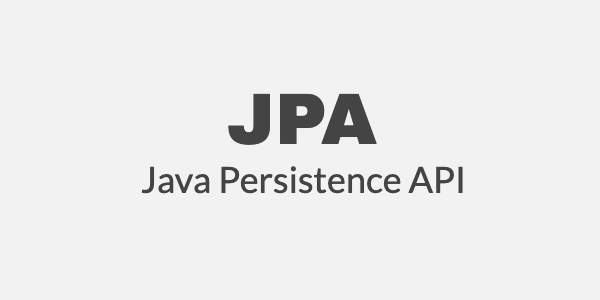

# [JPA] 엔티티 식별자 생성 방식




테이블을 설계하면서 기본키는 어떠한 논리적 근거를 가지고 설계를 해야할까요? 먼저 기본키의 제약 조건의 특징부터 알아본다면 다음과 같습니다.

- null일 수 없습니다.
- 유일해야 합니다.
- 변하면 안됩니다.

그래서, 이러한 값을 현실세계에서의 값을 가져와서 기본키로 설정하곤 합니다.

- 주민등록번호
- 사원번호
- 주문번호 등등


다음 보도자료는 주민등록번호를 금지하는 제도입니다. - [주민등록번호, 이제는 함부로 수집하지 못한다!](https://mois.go.kr/frt/bbs/type010/commonSelectBoardArticle.do?bbsId=BBSMSTR_000000000008&nttId=40667)

이 제도 도입을 통해서 기존에 주민등록번호를 기본키로 설정한 시스템들은 힘들게 수정을 하였을 것입니다. 기본키는 수많은 외래키와 인덱스와 연관관계가 있기 때문에 수정을 하는 것에 있어서 많은 문제를 불러올 수 있습니다. 그리고 지금 현실세계에서 주민등록번호 또는 사원번호가 기본키를 만족할지 몰라도 미래까지 이 조건을 만족한다고 장담할 수 있을까요? 물론 너무 길게 내다보고 생각할 수는 있지만,  장담은 할 수 없다고 생각합니다.*그렇기에 굳이 현실세계와 연관이 있는 값을 기본키로 설정할 필요는 없다고 생각합니다. 즉, 대리키(대체키)를 사용해야 한다고 생각합니다.*

JPA에서는 기본키 설정을 위해서 키 생성 전략을 지원하고 있습니다. 키 생성 전략에 대해서 알아보고 각각 DBMS의 따른 지원 전략에 대해서 알아보고 테스트까지 해보도록 하겠습니다.

모든 소스는 Github 통해서 확인이 가능합니다. - [소스 바로가기](https://github.com/codeleesh/study-code/tree/main/profile-properties)


## 기본키 매핑

JPA에서는 기본키를 매핑하기 위해서는 `@Id` 애노테이션을 이용합니다.


## 키 생성 전략

키 생성 전략은 다음과 같습니다.

- 직접 할당
- 식별 컬럼 방식(`IDENTITY`)
- 시퀀스 사용 방식(`SEQUENCE`)
- 테이블 사용 방식(`TABLE`)


## 직접 할당

`@Id` 설정 대상에 직접 값을 설정합니다. 사용자가 입력한 값, 규칙에 따라 생성한 값이 됩니다. 예를 들어서, 이메일, 주문 번호, 주문등록번호가 될 수 있습니다.


### 적용 방법

호텔 정보를 저장하는 테이블을 생성하기 위해서 기본키가 문자열로 되어 있는 `hotel_id` 로 지정하였습니다.

```java
@Entity
@Table(name = "hotel_info")
public class Hotel {

    @Id
    @Column(name = "hotel_id")
    private String id;

    @Column(name = "hotel_name")
    private String name;

    @Column(name = "hotel_year")
    private int year;

    @Column(name = "hotel_grade")
    @Enumerated(STRING)
    private Grade grade;

    private LocalDateTime created;

    @Column(name = "modified")
    private LocalDateTime lastModified;
  
    // 생성자 및 getter/setter 생략
}
```

Entity 정보를 토대로 JPA를 통해서 테이블을 생성해보겠습니다. 순수 JPA를 사용한다면 다음 옵션을 설정하면 됩니다.

```properties
hibernate.hbm2ddl.auto=create
```

Spring Data JPA를 사용한다면 다음 옵션을 설정하면 됩니다.

```properties
spring.jpa.hibernate.ddl-auto=create
```

그리고 실행을 하면, 다음 로그를 보시면 `hotel_id` 가 `primary key` 로 생성된 것을 확인할 수 있습니다.

```
23:23:45.375 [main] DEBUG org.hibernate.SQL - 
    
    create table hotel_info (
       hotel_id varchar(255) not null,
        created datetime(6),
        hotel_grade varchar(255),
        modified datetime(6),
        hotel_name varchar(255),
        hotel_year integer,
        primary key (hotel_id)
    ) engine=InnoDB
```


### 실습

위에서 생성한 테이블을 토대로 기본키를 직접 지정하여서 호텔 정보를 저장하는 실습을 해보도록 하겠습니다. 기본키를 직접 지정하는 방식이기에 `@Id` 애노테이션 이외 어떠한 설정도 되어 있지 않습니다. 그럼, Hotel 정보를 저장하도록 해보겠습니다. 아래는 소스 일부 내용입니다.

```java
Hotel hotel = new Hotel("H-01", "하얏트", 2022, Grade.S2);
logger.info("persist 실행 전");
em.persist(hotel);
logger.info("persist 실행 함");
logger.info("생성한 식별자: {}", hotel.getId());
logger.info("커밋하기 전");
tx.commit();
logger.info("커밋함");
```

```bash
00:44:36.479 [main] INFO  me.lovethefeel.MainDirect - persist 실행 전
00:44:36.501 [main] INFO  me.lovethefeel.MainDirect - persist 실행 함
00:44:36.501 [main] INFO  me.lovethefeel.MainDirect - 생성한 식별자: H-01
00:44:36.502 [main] INFO  me.lovethefeel.MainDirect - 커밋하기 전
00:44:36.515 [main] DEBUG org.hibernate.SQL - 
    /* insert me.lovethefeel.domain.Hotel
        */ insert 
    into
        hotel_info (created, hotel_grade, modified, hotel_name, hotel_year, hotel_id) 
    values
        (?, ?, ?, ?, ?, ?)
00:44:36.551 [main] INFO  me.lovethefeel.MainDirect - 커밋함
```

- 기본키를 직접 지정하기에 em.persist()와 tx.commit()과 상관없이 기본키의 값을 알 수 있습니다.
- tx.commit() 시점에 insert 쿼리가 실행이 됩니다.


직접 지정 방식은 간단하게 적용해볼 수 있습니다. 그럼, 식별 컬럼 방식(IDENTITY)을 실습해보도록 하겠습니다.


## 식별 컬럼 방식(`IDENTITY`)

식별 컬럼 방식은 기본키 생성을 데이터베이스에 위임합니다. 해당 전략을 사용하는 DBMS는 `MySQL`, `PostgreSQL`, `SQL Server`, `DB2` 에서 사용합니다. 예를 들어, MySQL의 AUTO_INCREMENT로 보시면 됩니다.

식별 컬럼 방식은 트랜잭션 커밋 시점에 INSERT SQL을 실행합니다. AUTO_INCREMENT를 통해 생성된 기본키의 값은 데이터베이스에 INSERT SQL을 실행한 이후에 알 수 있습니다. 즉, 데이터베이스에 값이 INSERT 할때 알 수 있습니다.


### 적용 방법

호텔의 리뷰를 작성한 정보를 관리하는 테이블을 생성하기 위해서 `review_id` 로 기본키를 설정하였고 `@GeneratedValue(strategy = IDENTITY)` 전략을 사용하면 됩니다.

```java
@Entity
public class Review {
    @Id
    @Column(name = "review_id")
    @GeneratedValue(strategy = IDENTITY)
    private Long id;

    @Column(name = "hotel_id")
    private String hotelId;

    private int mark;

    @Column(name = "writer_name")
    private String writerName;
    private String comment;
    private LocalDateTime created;
  
    // 생성자 및 getter/setter 생략
}
```


다음 로그를 보시면 `review_id` 가 `primary key` 로 생성된 것을 확인할 수 있으며, `auto_increment` 가 같이 생성된 것 또한 확인할 수 있습니다.

```
23:23:45.422 [main] DEBUG org.hibernate.SQL - 
    
    create table Review (
       review_id bigint not null auto_increment,
        comment varchar(255),
        created datetime(6),
        hotel_id varchar(255),
        mark integer not null,
        writer_name varchar(255),
        primary key (review_id)
    ) engine=InnoDB
```

해당 전략을 테스트하기 위해서 MySQL를 로컬에 설치하여서 진행하였습니다. 설치 방법은 다음 블로그를 참고 바랍니다.


### 실습

위에서 생성한 테이블을 토대로 기본키 식별 컬럼 방식 지정에 대해서 Review 정보를 저장하는 실습을 해보도록 하겠습니다. 아래는 소스 일부 내용입니다.

```java
Review review = new Review("H-01", 5, "작성자", "댓글");
logger.info("persist 실행 전");
em.persist(review);
logger.info("persist 실행 함");
logger.info("생성한 식별자: {}", review.getId());
logger.info("커밋하기 전");
tx.commit();
logger.info("커밋함");
```

```bash
00:41:59.399 [main] INFO  me.lovethefeel.MainIdentity - persist 실행 전
00:41:59.415 [main] DEBUG org.hibernate.SQL - 
    /* insert me.lovethefeel.domain.Review
        */ insert 
    into
        Review (comment, created, hotel_id, mark, writer_name) 
    values
        (?, ?, ?, ?, ?)
00:41:59.440 [main] INFO  me.lovethefeel.MainIdentity - persist 실행 함
00:41:59.440 [main] INFO  me.lovethefeel.MainIdentity - 생성한 식별자: 1
00:41:59.440 [main] INFO  me.lovethefeel.MainIdentity - 커밋하기 전
00:41:59.453 [main] INFO  me.lovethefeel.MainIdentity - 커밋함
```

- em.persist() 시점에서 INSERT 쿼리가 실행이 되며, 객체에 식별자 값이 할당됨을 알 수 있습니다.
  - AUTO_INCREMENT는 DB에 INSERT SQL을 실행한 이후에 id 값을 알 수 있습니다.
  - 영속성 컨텍스트 관리를 위해서 PK값이 있어야 하는데, 1차 캐시 안에 있는 @Id 값은 DB에 넣기 전까지는 세팅을 할 수 없습니다.
  - *그래서, IDENTITY 전략에서만 예외적으로 `em.persist()` 가 호출되는 시점에 바로 데이터베이스의 INSERT 쿼리 실행합니다.* 

- INSERT 쿼리가 실행된 이후 기본키인 식별자 값을 알 수 있습니다.


식별 컬럼  방식 또한 간단하게 적용해볼 수 있습니다. 다음으로는 시퀀스 사용 방식(SEQUENCE)을 실습해보도록 하겠습니다.


## 시퀀스 사용 방식(`SEQUENCE`)

시퀀스 사용 방식은 유일한 값을 순서대로 생성하는 특별한 데이터베이스 오브젝트입니다. 시퀀스 방식을 사용하기 위해서는 시퀀스 오브젝트를 생성하여서 사용해야 합니다. 주로 사용하는 DBMS는 Oracle, PostgreSql, DB2, H2 데이터베이스에서 사용합니다. 아래는 Oracle 데이터베이스를 통하여 시퀀스 오브젝트를 생성하는 DDL 쿼리입니다.

```
CREATE SEQUENCE jpauser.user_id_seq
// 아래는 생략 가능
       INCREMENT BY 숫자
       START WITH 숫자
       MINVALUE 숫자 | NOMINVALUE
       MAXVALUE 숫자 | NOMAXVALUE
       CYCLE | NOCYCLE
       CACHE | NOCACHE
       ORDER | NOORDER;
```

위의 쿼리의 대한 기본 옵션의 대한 설명은 다음과 같습니다. JPA를 통하여 생성하였을때 일부 기본값이랑 차이가 있으니 비교 차원에서 알아보겠습니다.

- INCRENENT BY : Sequence의 번호 생성 간격 설정, 기본값은 1씩 증가
- START WITH : 시작 번호 지정, 기본값은 1
- MAXVALUE : 번호의 최대값 지정, 기본값은 NOMAXVALUE이며 최대값은 10^27
- MINVALUE : 번호의 최소값을 지정, 기본값은 NOMINVALUE이며 최소값은 1
- CYCLE : 최대값 또는 최소값을 도달하였을때 숫자 반복 여부 지정, 기본값은 NOCYCLE
- CACHE : 공유메모리에 미리 생성할 번호의 개수 지정, 기본값은 20


데이터를 삽입하기전 해당 시퀀스를 조회하기 위해서 매번 데이터베이스를 다녀와야 한다는 부분이 살짝 불편합니다. 또한 데이터베이스 연결을 위해서 네트워크 통신도 해야 됩니다. 이러한 부분들이 성능의 영향을 미치지 않을까라는 생각이 들 수 있습니다. 그래서 SEQUENCE에서는 미리 일정량의 사이즈(숫자)를 가지고 있고 해당 사이즈만큼 데이터베이스를 통신하지 않고 소모하여서 SEQUENCE를 생성합니다.  단, 일정량의 사이즈를 가지고 있는 상태에서 WAS가 중지되거나 비정상적으로 종료된다면 SEQUENCE 중간에 숫자 구멍이 생겨버리게 됩니다.

```
예를 들어, CACHE가 20으로 설정이 되어있는 시퀀스의 값이 있습니다. 사용자 저장 이벤트가 발생하여서 사용자를 저장하기 위해서 시퀀스의 사이즈 20만큼 가져왔습니다. 그래서 사용자 아이디는 1로 저장이 되었습니다. 그 후 시스템이의 문제가 생겨서 비정상적으로 종료되었습니다. 그 후 복구를 하여서 시스템이 다시 정상으로 돌아왔습니다. 또 다른 사용자 저장 이벤트가 발생하였고 시퀀스의 사이즈를 새롭게 20만큼 가져왔습니다. 그래서 사용자 아이디는 21로 저장이 되었습니다.
```

하지만 allocationSize를 설정하기 위해서는 한가지 유의 사항이 있습니다. 바로 데이터베이스의 시퀀스 증가값이 1인 경우라면, allocationSize 또한 1로 맞춰 주어야 합니다. 관련해서 자세한 내용은 다음 내용을 참고해주세요.

[[JPA] 식별자 할당 SEQUENCE(시퀀스) 사용 전략](https://dololak.tistory.com/479)


### 적용 방법

활동 로그 정보를 관리하는 테이블을 생성하기 위해서 `id` 로 기본키를 설정하였고 `@SequenctGenerator` 전략을 사용하면 됩니다. 설정과 관련된 내용은 소스를 참고 바랍니다.

```java
@Entity
@Table(schema = "test_jpa", name = "activity_log")
public class ActivityLog {
    @Id
    @SequenceGenerator(
            name = "log_seq_gen",
            sequenceName = "activity_seq",
            schema = "test_jpa",
            allocationSize = 1
    )
    @GeneratedValue(generator = "log_seq_gen")
    private Long id;
    @Column(name = "user_id")
    private String userId;
    @Column(name = "activity_type")
    private String activityType;
    private LocalDateTime created;
  
    // 생성자 및 getter/setter 생략
}
```

SEQUENCE를 사용하기 위한 옵션의 대한 설명은 다음과 같습니다.

- name
  - 식별자 생성기의 이름으로 필수값입니다.
  - 생성기의 이름은 잘 식별할 수 있게  `특정문자_seq_gen` 으로 설정합니다.
- sequenceName
  - 데이터베이스에 등록되어 있는 시퀀스 이름이며, 설정하지 않는다면 기본값은 `hibernate_sequence` 입니다.
  - 필수로 설정하며 잘 식별할 수 있게  `특정문자_seq` 와 같이 지정합니다.
- initialValue
  - DDL 생성 시에만 사용되며, 시퀀스 DDL을 생성할 때 처음 시작하는 수를 지정합니다. 설정하지 않는다면 기본값은 1입니다.
  - 시작값을 1로 시작하기 때문에 따로 설정하지 않습니다.
- allocationSize
  - 시퀀스를 한 번 호출할때 증가하는 수로, 성능 최적화에 사용됩니다.
  - 기본값은 50입니다.
- 그외 catalog, schema
  - catalog는 mysql에서, schema는 oracle에서 사용하나 중요하지 않습니다.


다음 로그를 보시면 `activity_seq` 의 sequence가 생성된 것을 확인할 수 있습니다. 그리고 `activity_log` 테이블의  `id` 가 `primary key` 로 생성된 것 또한 확인할 수 있습니다.

```
01:20:23.146 [main] DEBUG org.hibernate.SQL - create sequence test_jpa.activity_seq start with 1 increment by 1
01:20:23.166 [main] DEBUG org.hibernate.SQL - 
    
    create table test_jpa.activity_log (
       id number(19,0) not null,
        activity_type varchar2(255 char),
        created timestamp(6),
        user_id varchar2(255 char),
        primary key (id)
    )
```

해당 전략을 테스트하기 위해서 Oracle를 로컬에 설치하여서 진행하였습니다.


### 실습

JPA에서는 식별자 생성 처리하며, 객체 생성시에 식별값을 설정하지 않습니다. em.persist() 하기전 데이터베이스에서 SEQUENCE를 먼저 가져오고 그 후 INSERT 쿼리가 호출됩니다. 

```java
ActivityLog log = new ActivityLog("U01", "VISIT");
logger.info("persist 실행 전");
em.persist(log);
logger.info("persist 실행 함");
logger.info("생성한 식별자: {}", log.getId());
logger.info("커밋하기 전");
tx.commit();
logger.info("커밋함");
```

```
01:20:23.314 [main] INFO  me.lovethefeel.MainSequence - persist 실행 전
01:20:23.324 [main] DEBUG org.hibernate.SQL - 
    select
        test_jpa.activity_seq.nextval 
    from
        dual
01:20:23.406 [main] INFO  me.lovethefeel.MainSequence - persist 실행 함
01:20:23.406 [main] INFO  me.lovethefeel.MainSequence - 생성한 식별자: 1
01:20:23.406 [main] INFO  me.lovethefeel.MainSequence - 커밋하기 전
01:20:23.418 [main] DEBUG org.hibernate.SQL - 
    /* insert me.lovethefeel.domain.ActivityLog
        */ insert 
    into
        test_jpa.activity_log (activity_type, created, user_id, id) 
    values
        (?, ?, ?, ?)
01:20:23.428 [main] INFO  me.lovethefeel.MainSequence - 커밋함
```

- em.persist() 시점에 sequence를 조회하여서 식별자값을 알 수 있습니다.
- tx.commit() 호출 시점에 INSERT 쿼리가 실행이 됩니다.


시퀀스 사용  방식 또한 간단하게 적용해볼 수 있습니다. 다음으로는 테이블 사용 방식을 실습해보도록 하겠습니다.


## 테이블 사용 방식(`TABLE`)

키 생성 전용 테이블을 하나 만들어서 데이터베이스 시퀀스를 흉내내는 전략을 사용합니다. 장점으로는 모든 데이터베이스에서 사용 가능합니다. 단점으로는 테이블 조회를 사용해야하기 때문에 성능상의 문제가 있습니다. 운영 환경에서는 사용하기에는 약간 부담스럽습니다.


### 적용 방법

접속 이력 정보를 관리하는 테이블을 생성하기 위해서 `id` 로 기본키를 설정하였고 `@TableGenerator` 전략을 사용하면 됩니다. 설정과 관련된 내용은 소스 및 설명을 참고 바랍니다.

```java
@Entity
@Table(name = "access_log")
public class AccessLog {
    @Id
    @TableGenerator(
            name = "accessIdGen",
            table = "id_seq",
            pkColumnName = "entity",
            pkColumnValue = "accesslog",
            valueColumnName = "nextval",
            initialValue = 0,
            allocationSize = 1
    )
    @GeneratedValue(generator = "accessIdGen")
    private Long id;
    private String path;
    private LocalDateTime accessed;
  
    // 생성자 및 getter/setter 생략
}
```

Table의 SEQUENCE 전략을 사용하기 위한 옵션의 대한 설명은 다음과 같습니다.

- name
  - 식별자 생성기의 이름으로 필수값입니다.
  - 식별 가능한 값으로 설정하되, `특정문자열+IdGen` 의 조합이 직관적이라고 생각합니다.
- table
  - 키생성 테이블명을 나타내며, 기본값으로는 hibernate_sequence 입니다.
  - 기본값을 사용하는 것보다는 해당 테이블이 기본키를 관리하기 위한 테이블임을 명확하게 나타내는 것이 좋다고 생각합니다. `id_seq` 가 훨씬 이해하기 좋다고 생각합니다.
- pkColumnName
  - 시퀀스 컬럼명으로, 기본값으로는 sequence_name 입니다.
- pkColumnValue 
  - pkColumnName의 들어갈 데이터입니다.
- valueColumnName
  - 시퀀스 값 컬럼명으로, 기본값으로는 next_val 입니다.
- initialValue
  - 초기값을 나타내며, 기본값으로 0입니다.
  - 마지막으로 생성된 값이 기준입니다.
- allocationSize
  - 시퀀스 한 번 호출에 증가하는 수를 나타내며, 성능 최적화시 사용될 수 있습니다.
  - 기본값은 50입니다.
- catalog, schema
  - catalog는 mysql에서, schema는 oracle에서 사용하나 중요하지 않습니다.
- uniqueConstraints(DDL)
  - 유니크 제약 조건을 지정할 수 있으나 중요하진 않습니다.


다음 로그를 보시면 `access_log` 테이블의  `primary key` 로 `id` 가 생성된 것을 확인할 수 있습니다. 그리고 엔티티별로 시퀀스를 관리하는  `id_seq` 테이블이 생성된 것 또한 확인할 수 있습니다. 그리고 테이블의 초기값인 `accesslog` 엔티티의 기본 시퀀스 값이 0임을 나타내는 데이터를 INSERT 하였습니다.

```
01:28:19.627 [main] DEBUG org.hibernate.SQL - 
    
    create table access_log (
       id bigint not null,
        accessed datetime(6),
        path varchar(255),
        primary key (id)
    ) engine=InnoDB
    
01:28:19.702 [main] DEBUG org.hibernate.SQL - 
    
    create table id_seq (
       entity varchar(255) not null,
        nextval bigint,
        primary key (entity)
    ) engine=InnoDB
    
01:28:19.745 [main] DEBUG org.hibernate.SQL - 
    
    insert into id_seq(entity, nextval) values ('accesslog',0)
```


### 실습

위에서 생성한 테이블을 토대로 테이블 사용 방식 식별자 생성 방식 지정에 대해서 접근 이력 정보를 저장하는 실습을 해보도록 하겠습니다. 아래는 소스 일부 내용입니다.

```java
AccessLog log = new AccessLog("/path01", LocalDateTime.now());
logger.info("persist 실행 전");
em.persist(log);
logger.info("persist 실행 함");
logger.info("생성한 식별자: {}", log.getId());
logger.info("커밋하기 전");
tx.commit();
logger.info("커밋함");
```

```
01:45:43.654 [main] INFO  me.lovethefeel.MainTableSeuquence - persist 실행 전
01:45:43.669 [main] DEBUG org.hibernate.SQL - 
    select
        tbl.nextval 
    from
        id_seq tbl 
    where
        tbl.entity=? for update
01:45:43.683 [main] DEBUG org.hibernate.SQL - 
    update
        id_seq 
    set
        nextval=?  
    where
        nextval=? 
        and entity=?
01:45:43.705 [main] INFO  me.lovethefeel.MainTableSeuquence - persist 실행 함
01:45:43.705 [main] INFO  me.lovethefeel.MainTableSeuquence - 생성한 식별자: 1
01:45:43.705 [main] INFO  me.lovethefeel.MainTableSeuquence - 커밋하기 전
01:45:43.714 [main] DEBUG org.hibernate.SQL - 
    /* insert me.lovethefeel.domain.AccessLog
        */ insert 
    into
        access_log (accessed, path, id) 
    values
        (?, ?, ?)
01:45:43.730 [main] INFO  me.lovethefeel.MainTableSeuquence - 커밋함
```

- em.persist() 호출 시점에서 시퀀스 테이블을 조회하여서 식별자 값을 알 수 있으며 그 다음값을 이용할 수 있도록 업데이트까지 진행합니다.
- tx.commit() 호출 시점에 INSERT 쿼리가 실행이 됩니다.


## 정리

- 데이터베이스의 기본키는 대리키를 사용해야 합니다.
- 식별자 생성 방식에는 직접 할당, 식별 컬럼 방식, 시퀀스 사용 방식, 테이블 저장 방식이 존재합니다.
- DBMS의 맞게 주로 사용하는 방식은 식별 컬럼 방식 또는 시퀀스 사용 방식입니다.
  - 데이터베이스의 시퀀스 증가값이 1인 경우라면, allocationSize 또한 1로 맞춰 주어야 합니다
- 테이블 저장 방식은 테이블 조회를 사용해야 하기 때문에 실제 운영 환경에서는 사용 빈도가 낮습니다.


## 참고

- [영한님 - 인프런 JPA 강의 참고](https://www.inflearn.com/course/ORM-JPA-Basic#)
- [범균님 - JPA 기초 05 엔티티 식별자 생성 방식](https://youtu.be/Xw9uTs72SVo)
- [[JPA] 식별자 할당 SEQUENCE(시퀀스) 사용 전략](https://dololak.tistory.com/479)
- MySQL 설치
- Oralce 설치
