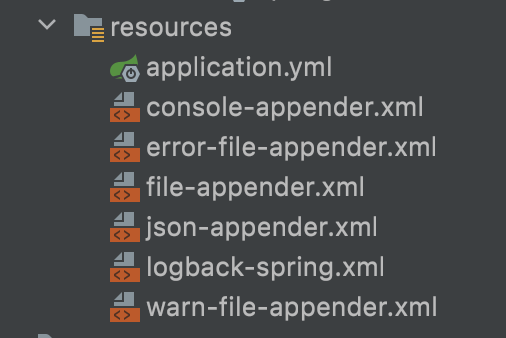

# [Logback] 7.SpringBoot에서 Logback 사용하기 - 웹 어플리케이션 구성

Logback의 대한 전체 내용을 정리하고 그 내용을 바탕으로 실제 웹 어플리케이션을 구성하는 내용으로 실습을 진행해보도록 하겠습니다.

- [Logback] 1.SpringBoot에서 Logback 사용하기 - 주의점, 구성, 상속, 파라미터 처리
- [Logback] 2.SpringBoot에서 Logback 사용하기 - 환경설정 파일
- [Logback] 3.SpringBoot에서 Logback 사용하기 - Appender와 Policy
- [Logback] 4.SpringBoot에서 Logback 사용하기 - Encoder
- [Logback] 5.SpringBoot에서 Logback 사용하기 - MDC
- [Logback] 6.SpringBoot에서 Logback 사용하기 - Filter
- *[Logback] 7.SpringBoot에서 Logback 사용하기 - 웹 어플리케이션 구성*


여기서는 Spring-Boot를 통해서 Logback를 이용하여 어플리케이션을 개발할 때 나름 best practice를 정리해보려고 합니다.

모든 소스는 Github를 통해서 확인하실 수 있습니다. - [소스](https://github.com/codeleesh/study-code/tree/main/spring-boot2-webflux)


## 환경

- Spring Boot : 2.6.7 (Spring Webflux 사용)
- Java : 11
- IDE : Intellij


## 실습 요구사항

- `<context>` 를 `HOSTNAME` 으로 설정하여서 로그 출력시 활용합니다.
- `appender` 를 각 파일별로 분리하여서 관리합니다. 예를 들면,
  - console 용 appender를 xml 파일로 분리합니다.
  - file 용 appender를 xml 파일로 분리합니다.
  - json 용 appender를 xml 파일로 분리합니다.

- root 로거의 레벨은 기본 설정을 사용하며, 로그가 중복되지 않도록 설정합니다.
- 로그백 관련 설정은 외부 파일(`logback-spring.xml`)을 이용하여서 관련 설정들을 관리합니다.
- `active profile` 을 이용하여서 로그를 관리합니다.
  - `local` 은 `info` 로 로그를 관리하고, `prod` 은 `error` 로 관리합니다.

- 로그는 `console` 과 `rolling` 으로 분리합니다.
  - 일별로 로그가 생성되며 7일간 보관합니다. 
  - 각 로그는 `gz` 으로 압축합니다.
  - 각 로그당 파일 용량은 50MB이며, 로그의 총 용량은 2GB입니다.
- 모든 요청과 응답에 대한 로그 관리를 위해 MDC를 사용합니다. 
  - 공통 소스로 처리하는 방안에 대해서 확인을 해보고 적용합니다.

- json 로그의 콘솔 및 파일 출력을 위해 간단한 예제를 작성합니다.


## 실습 결과

### `<context>` 를 `HOSTNAME` 으로 설정하여서 로그 출력시 활용합니다.

- `<configuration>` 안에 `<contextName>` 태그를 이용하여  `${HOSTNAME} ` 를 설정한다.
- `<pattern>`  안에 `%contextName` 으로 설정합니다.

```xml
<configuration>
  <contextName>${HOSTNAME}</contextName>
  ...
  <pattern>[%contextName] ...</pattern>
</configuration>
```

- 결과

```bash
[isanghoui-MacBookPro.local] - [2022.05.22 00:59:52.087] - [INFO ] - [main] - [] - [c.l.w.SpringBoot2WebfluxApplication] - The following 1 profile is active: "test"
```


### `appender` 를 각 파일별로 분리하여서 관리합니다. 

- 다음과 같이 파일을 분리하였습니다.

  

- logback-spring.xml

  - 각각의  `appender` 를 include 설정이 있습니다.
  - 전체 `appender`에서 사용할 전역변수를 설정합니다.
  - `springProfile` 을 통해 로그 레벨 설정 및 `appender` 설정을 환경별로 분리하여서 설정할 수 있습니다.

- console-appender.xml

  - 로그 level인 `INFO` 인 console 용 appender 설정합니다.

- error-file-appender.xml

  - 로그 level이 `ERROR` 인 경우에 대해서만 `error-logfile` 로 보관합니다.

- file-appender.xml

  - 로그 level인 `INFO` 인 file 용 appender 설정합니다.

- json-appender.xml

  - 특정 이벤트에 대해서 로그를 쉽게 보기 위해 `JSON` appender를 설정합니다.

- warn-file-appender.xml

  - 로그 level이 `WARN` 이상인 경우에 대해서만 `warn-logfile` 로 보관합니다.


### root 로거의 레벨은 기본 설정을 사용하며, 로그가 중복되지 않도록 설정합니다.

- `additivity` 옵션을 활용하여서 로그가 중복되지 않도록 설정합니다.

  ```xml
  <configuration>
  ...
  				<root level="INFO" additivity="false">
              <appender-ref ref="file" />
              <appender-ref ref="console" />
              <appender-ref ref="error-file" />
              <appender-ref ref="warn-file" />
          </root>
  ...
  </configuration>
  ```


### 로그백 관련 설정은 외부 파일(`logback-spring.xml`)을 이용하여서 관련 설정들을 관리합니다.

- `logback-spring.xml` 파일을 생성하여 로그 관련 설정을 합니다. 스프링 부트에서 자동으로 로드합니다.


### `active profile` 을 이용하여서 로그를 관리합니다.

- `springProfile` 을 활용합니다.

  ```xml
  <configuration>
  ...
  		<springProfile name="test">
          <root level="INFO" additivity="false">
              <appender-ref ref="file" />
              <appender-ref ref="console" />
              <appender-ref ref="error-file" />
              <appender-ref ref="warn-file" />
          </root>
          <logger name="json" level="INFO" >
              <appender-ref ref="json" />
          </logger>
      </springProfile>
    
      <springProfile name="prod">
          <root level="ERROR" additivity="false">
              <appender-ref ref="file" />
              <appender-ref ref="console" />
              <appender-ref ref="error-file" />
              <appender-ref ref="warn-file" />
          </root>
          <logger name="json" level="ERROR" >
              <appender-ref ref="json" />
          </logger>
      </springProfile>
  ...
  </configuration>
  ```

  

### 로그는 `console` 과 `rolling` 으로 분리합니다.

- 로그 파일의 경우 `SizeAndTimeBasedRollingPolicy` 을 이용하여 다음과 같이 설정하였습니다.

  ```xml
  <included>
  ...
  				<rollingPolicy class="ch.qos.logback.core.rolling.SizeAndTimeBasedRollingPolicy">
              <fileNamePattern>${LOG_HOME}/rolling/logFile.%d{yyyy-MM-dd}.%i.gz</fileNamePattern>
              <maxFileSize>50MB</maxFileSize>
              <maxHistory>7</maxHistory>
              <totalSizeCap>2GB</totalSizeCap>
          </rollingPolicy>
  ...
  </included>
  ```


### 모든 요청과 응답에 대한 로그 관리를 위해 MDC를 사용합니다. 

- `WebFilter` 를 통해 요청과 응답의 대한 공통 처리를 합니다. `WebFilter` 는 `WebFlux` 에서 사용합니다. 아래는 `WebFilter` 를 이용하여 요청 시 MDC를 새로 생성하여 주고 응답 시 MDC를 초기화합니다.

  ```java
  @Slf4j
  @Component
  public class WebMDCFilter implements WebFilter {
  
      private static final String TRACE_ID = "traceId";
  
      @Override
      public Mono<Void> filter(ServerWebExchange exchange, WebFilterChain chain) {
          return chain.filter(exchange).transformDeferred(this::doFilter);
      }
  
      private Publisher<Void> doFilter(Mono<Void> call) {
          // before
          return Mono.fromRunnable(this::doBeforeRequest)
                  // do request
                  .then(call)
                  // after (success)
                  .doOnSuccess(done -> doAfterRequest())
                  .doOnError(done -> doAfterRequestError());
      }
  
      private void doAfterRequestError() {
          log.info("MDC GET : {}", MDC.get(TRACE_ID));
          MDC.clear();
          log.info("MDC CLEAR : {}", MDC.get(TRACE_ID));
          log.info("===================== END =====================");
      }
  
      private void doBeforeRequest() {
          log.info("===================== START =====================");
          final String traceId = UUID.randomUUID().toString();
          MDC.put(TRACE_ID, traceId);
          log.info("traceId : {}", traceId);
      }
    
      private void doAfterRequest() {
          log.info("MDC GET : {}", MDC.get(TRACE_ID));
          MDC.clear();
          log.info("MDC CLEAR : {}", MDC.get(TRACE_ID));
          log.info("===================== END =====================");
      }
  }
  ```

- `logback` 에서는 `traceId` 를 이용하여 출력할 수 있습니다.

  - `%X{traceId}`

  ```
  <encoder>
  	<charset>utf8</charset>
  	<pattern>[%contextName]-[%d{yyyy.MM.dd HH:mm:ss.SSS}]-[%-5level]-[%thread]-[%X{traceId}]-[%logger{5}]-%msg%n</pattern>
  </encoder>
  ```

- 로그 결과

  ```bash
  [isanghoui-MacBookPro.local] - [2022.05.22 01:00:46.650] - [INFO ] - [reactor-http-nio-3] - [] - [c.l.w.c.WebMDCFilter] - ===================== START =====================
  [isanghoui-MacBookPro.local] - [2022.05.22 01:00:46.652] - [INFO ] - [reactor-http-nio-3] - [3737f530-4150-4485-adb6-4580d6068947] - [c.l.w.c.WebMDCFilter] - traceId : 3737f530-4150-4485-adb6-4580d6068947
  [isanghoui-MacBookPro.local] - [2022.05.22 01:00:46.659] - [INFO ] - [reactor-http-nio-3] - [3737f530-4150-4485-adb6-4580d6068947] - [c.l.w.p.a.ProductService] - saveUser - productRequest [ProductRequest{productName='치킨', productAmount=10000, productStatus=ENABLE, productCount=10}]
  insert into product (id, product_amount, product_count, product_name, product_type) values (default, ?, ?, ?, ?)
  insert into product (id, product_amount, product_count, product_name, product_type) values (default, 10000, 10, '치킨', 'ENABLE');
  [isanghoui-MacBookPro.local] - [2022.05.22 01:00:46.664] - [INFO ] - [reactor-http-nio-3] - [3737f530-4150-4485-adb6-4580d6068947] - [c.l.w.p.a.ProductService] - saveUser - productResponse [ProductResponse{productId=2, productName='치킨', productType=ENABLE, productCount=10}]
  [isanghoui-MacBookPro.local] - [2022.05.22 01:00:46.669] - [INFO ] - [reactor-http-nio-3] - [3737f530-4150-4485-adb6-4580d6068947] - [c.l.w.c.WebMDCFilter] - MDC GET : 3737f530-4150-4485-adb6-4580d6068947
  [isanghoui-MacBookPro.local] - [2022.05.22 01:00:46.669] - [INFO ] - [reactor-http-nio-3] - [] - [c.l.w.c.WebMDCFilter] - MDC CLEAR : null
  [isanghoui-MacBookPro.local] - [2022.05.22 01:00:46.669] - [INFO ] - [reactor-http-nio-3] - [] - [c.l.w.c.WebMDCFilter] - ===================== END =====================
  ```


### json 로그의 콘솔 및 파일 출력을 위해 간단한 예제를 작성합니다.

- `json` 로그 출력은 2가지 형태를 제공합니다.
  - 첫번째 방법은 `strcture-arguments` 방법이며
  - 두번째 방법은 `markers` 방법입니다.


#### structur-arguments

##### value

- JSON 이벤트에 "key":"value"를 추가하고 message의 key를 제외한 값을 추가합니다.

```java
log.info("log message {}", value("name", "value"));
```

```json
{
  "@timestamp" : "2022-05-29 15:05:07.161",
  "@version" : "1",
  "message" : "log message value",
  "logger_name" : "json",
  "thread_name" : "reactor-http-nio-3",
  "level" : "INFO",
  "level_value" : 20000,
  "HOSTNAME" : "isanghoui-MacBookPro.local",
  "traceId" : "7180f914-2231-44c9-94dc-5721bffc71a3",
  "name" : "value",
  "caller_class_name" : "com.lovethefeel.webflux.logformat.application.LogService",
  "caller_method_name" : "callStructureArguments",
  "caller_file_name" : "LogService.java",
  "caller_line_number" : 22
}
```


- 객체를 출력할 수 있습니다. 다음 Foo 객체는 인스턴스 변수가 없으며, toString을 override 하였습니다.

```java
Foo foo = new Foo();
log.info("log message {}", value("foo", foo));
```

```json
{
  "@timestamp" : "2022-05-29 15:05:07.170",
  "@version" : "1",
  "message" : "log message Foo{}",
  "logger_name" : "json",
  "thread_name" : "reactor-http-nio-3",
  "level" : "INFO",
  "level_value" : 20000,
  "HOSTNAME" : "isanghoui-MacBookPro.local",
  "traceId" : "7180f914-2231-44c9-94dc-5721bffc71a3",
  "foo" : { },
  "caller_class_name" : "com.lovethefeel.webflux.logformat.application.LogService",
  "caller_method_name" : "callStructureArguments",
  "caller_file_name" : "LogService.java",
  "caller_line_number" : 33
}
```


- 객체를 출력할 수 있습니다. 다으 ProductRequest는 인스턴스 변수가 있으며, toString을 overrider하였습니다.

```java
final ProductRequest productRequest = ProductRequest.from("치킨", new BigDecimal("20000"), ProductStatus.ENABLE, 10);
log.info("log message {}", fields(productRequest));
```

```json
{
  "@timestamp" : "2022-05-29 15:05:07.172",
  "@version" : "1",
  "message" : "log message com.lovethefeel.webflux.product.dto.ProductRequest@e772c402",
  "logger_name" : "json",
  "thread_name" : "reactor-http-nio-3",
  "level" : "INFO",
  "level_value" : 20000,
  "HOSTNAME" : "isanghoui-MacBookPro.local",
  "traceId" : "7180f914-2231-44c9-94dc-5721bffc71a3",
  "product_name" : "치킨",
  "product_amount" : 20000,
  "product_status" : "ENABLE",
  "product_count" : 10,
  "caller_class_name" : "com.lovethefeel.webflux.logformat.application.LogService",
  "caller_method_name" : "callStructureArguments",
  "caller_file_name" : "LogService.java",
  "caller_line_number" : 43
}
```


##### keValue

기본적으로 JSON 이벤트에 "key":"value"를 추가하고 message에 name=value를 추가합니다.

```java
log.info("log message {}", keyValue("name", "value"));
```

```json
{
  "@timestamp" : "2022-05-29 15:05:07.167",
  "@version" : "1",
  "message" : "log message name=value",
  "logger_name" : "json",
  "thread_name" : "reactor-http-nio-3",
  "level" : "INFO",
  "level_value" : 20000,
  "HOSTNAME" : "isanghoui-MacBookPro.local",
  "traceId" : "7180f914-2231-44c9-94dc-5721bffc71a3",
  "name" : "value",
  "caller_class_name" : "com.lovethefeel.webflux.logformat.application.LogService",
  "caller_method_name" : "callStructureArguments",
  "caller_file_name" : "LogService.java",
  "caller_line_number" : 24
}
```


- 기본적으로 JSON 이벤트에 "key":"value"를 추가하고 `{}` 지정되지 않았기 때문에 message에 추가하지 않습니다.

```java
log.info("log message", keyValue("name", "value"));
```

```json
{
  "@timestamp" : "2022-05-29 15:05:07.167",
  "@version" : "1",
  "message" : "log message",
  "logger_name" : "json",
  "thread_name" : "reactor-http-nio-3",
  "level" : "INFO",
  "level_value" : 20000,
  "HOSTNAME" : "isanghoui-MacBookPro.local",
  "traceId" : "7180f914-2231-44c9-94dc-5721bffc71a3",
  "name" : "value",
  "caller_class_name" : "com.lovethefeel.webflux.logformat.application.LogService",
  "caller_method_name" : "callStructureArguments",
  "caller_file_name" : "LogService.java",
  "caller_line_number" : 26
}
```


- "key":"value"를 여러개 추가합니다.

```java
log.info("log message {} {}", keyValue("name1", "value1"), keyValue("name2", "value2"));
```

```json
{
  "@timestamp" : "2022-05-29 15:05:07.168",
  "@version" : "1",
  "message" : "log message name1=value1 name2=value2",
  "logger_name" : "json",
  "thread_name" : "reactor-http-nio-3",
  "level" : "INFO",
  "level_value" : 20000,
  "HOSTNAME" : "isanghoui-MacBookPro.local",
  "traceId" : "7180f914-2231-44c9-94dc-5721bffc71a3",
  "name1" : "value1",
  "name2" : "value2",
  "caller_class_name" : "com.lovethefeel.webflux.logformat.application.LogService",
  "caller_method_name" : "callStructureArguments",
  "caller_file_name" : "LogService.java",
  "caller_line_number" : 28
}
```


- "key":"value"를 출력형태 message를 변경할 수 있습니다.

```java
log.info("log message {}", keyValue("name", "value", "{0}=[{1}]"));
```

```json
{
  "@timestamp" : "2022-05-29 15:05:07.169",
  "@version" : "1",
  "message" : "log message name=[value]",
  "logger_name" : "json",
  "thread_name" : "reactor-http-nio-3",
  "level" : "INFO",
  "level_value" : 20000,
  "HOSTNAME" : "isanghoui-MacBookPro.local",
  "traceId" : "7180f914-2231-44c9-94dc-5721bffc71a3",
  "name" : "value",
  "caller_class_name" : "com.lovethefeel.webflux.logformat.application.LogService",
  "caller_method_name" : "callStructureArguments",
  "caller_file_name" : "LogService.java",
  "caller_line_number" : 30
}
```


##### entries

- JSON 이벤트에 각 Map 항목에 대한 "key":"value" 항목을 추가하고 message에 map.toString()을 추가합니다.

```java
Map myMap = new HashMap();
myMap.put("name1", "value1");
myMap.put("name2", "value2");
log.info("log message {}", entries(myMap));
```

```json
{
  "@timestamp" : "2022-05-29 15:05:07.170",
  "@version" : "1",
  "message" : "log message {name2=value2, name1=value1}",
  "logger_name" : "json",
  "thread_name" : "reactor-http-nio-3",
  "level" : "INFO",
  "level_value" : 20000,
  "HOSTNAME" : "isanghoui-MacBookPro.local",
  "traceId" : "7180f914-2231-44c9-94dc-5721bffc71a3",
  "name2" : "value2",
  "name1" : "value1",
  "caller_class_name" : "com.lovethefeel.webflux.logformat.application.LogService",
  "caller_method_name" : "callStructureArguments",
  "caller_file_name" : "LogService.java",
  "caller_line_number" : 38
}
```


##### array

- key가 fieldName(`array`) 이고 value가 개체의 JSON 배열(`1, 2, 3`) 이고 message는 배열의 문자열 버전인 JSON 이벤트에 필드를 추가합니다.

```java
log.info("log message {}", array("array", 1, 2, 3));
```

```json
{
  "@timestamp" : "2022-05-29 15:05:07.171",
  "@version" : "1",
  "message" : "log message array=[1, 2, 3]",
  "logger_name" : "json",
  "thread_name" : "reactor-http-nio-3",
  "level" : "INFO",
  "level_value" : 20000,
  "HOSTNAME" : "isanghoui-MacBookPro.local",
  "traceId" : "7180f914-2231-44c9-94dc-5721bffc71a3",
  "array" : [ 1, 2, 3 ],
  "caller_class_name" : "com.lovethefeel.webflux.logformat.application.LogService",
  "caller_method_name" : "callStructureArguments",
  "caller_file_name" : "LogService.java",
  "caller_line_number" : 40
}
```


#### markers

##### append

- JSON 이벤트에 "key":"value"를 추가합니다.

```java
log.info(append("name", "value"), "log message");
```

```json
{
  "@timestamp" : "2022-05-29 15:32:15.195",
  "@version" : "1",
  "message" : "log message",
  "logger_name" : "json",
  "thread_name" : "reactor-http-nio-2",
  "level" : "INFO",
  "level_value" : 20000,
  "HOSTNAME" : "isanghoui-MacBookPro.local",
  "traceId" : "c4edd7b3-b409-430c-ab93-08c7d368003d",
  "name" : "value",
  "caller_class_name" : "com.lovethefeel.webflux.logformat.application.LogService",
  "caller_method_name" : "callMarkers",
  "caller_file_name" : "LogService.java",
  "caller_line_number" : 50
}
```


- JSON 이벤트에 "key":"value"를 추가하면서 `and` 를 이용해서 추가할 수 있습니다.

```java
log.info(append("name1", "value1").and(append("name2", "value2")), "log message");
```

```json
{
  "@timestamp" : "2022-05-29 15:32:15.196",
  "@version" : "1",
  "message" : "log message",
  "logger_name" : "json",
  "thread_name" : "reactor-http-nio-2",
  "level" : "INFO",
  "level_value" : 20000,
  "HOSTNAME" : "isanghoui-MacBookPro.local",
  "traceId" : "c4edd7b3-b409-430c-ab93-08c7d368003d",
  "name1" : "value1",
  "name2" : "value2",
  "caller_class_name" : "com.lovethefeel.webflux.logformat.application.LogService",
  "caller_method_name" : "callMarkers",
  "caller_file_name" : "LogService.java",
  "caller_line_number" : 52
}
```


- 객체에 대해서 JSON 이벤트에 "key":"value"를 추가합니다.

```java
final ProductRequest productRequest = ProductRequest.from("치킨", new BigDecimal("20000"), ProductStatus.ENABLE, 10);
log.info(append("object", productRequest), "log message");
```

```json
{
  "@timestamp" : "2022-05-29 15:32:15.216",
  "@version" : "1",
  "message" : "log message",
  "logger_name" : "json",
  "thread_name" : "reactor-http-nio-2",
  "level" : "INFO",
  "level_value" : 20000,
  "HOSTNAME" : "isanghoui-MacBookPro.local",
  "traceId" : "c4edd7b3-b409-430c-ab93-08c7d368003d",
  "object" : {
    "product_name" : "치킨",
    "product_amount" : 20000,
    "product_status" : "ENABLE",
    "product_count" : 10
  },
  "caller_class_name" : "com.lovethefeel.webflux.logformat.application.LogService",
  "caller_method_name" : "callMarkers",
  "caller_file_name" : "LogService.java",
  "caller_line_number" : 64
}
```


##### appendEntries

- JSON 이벤트에 각 Map 항목에 대한 "key":"value" 항목을 추가합니다.

```java
Map myMap = new HashMap();
myMap.put("name1", "value1");
myMap.put("name2", "value2");
log.info(appendEntries(myMap), "log message");
```

```json
{
  "@timestamp" : "2022-05-29 15:32:15.197",
  "@version" : "1",
  "message" : "log message",
  "logger_name" : "json",
  "thread_name" : "reactor-http-nio-2",
  "level" : "INFO",
  "level_value" : 20000,
  "HOSTNAME" : "isanghoui-MacBookPro.local",
  "traceId" : "c4edd7b3-b409-430c-ab93-08c7d368003d",
  "name2" : "value2",
  "name1" : "value1",
  "caller_class_name" : "com.lovethefeel.webflux.logformat.application.LogService",
  "caller_method_name" : "callMarkers",
  "caller_file_name" : "LogService.java",
  "caller_line_number" : 57
}
```


##### appendArray

- key가 fieldName(`array`) 이고 value가 개체의 JSON 배열(`1, 2, 3`) 을 JSON 이벤트에 항목을 추가합니다.

```java
log.info(appendArray("array", 1, 2, 3), "log message");
```

```json
{
  "@timestamp" : "2022-05-29 15:32:15.198",
  "@version" : "1",
  "message" : "log message",
  "logger_name" : "json",
  "thread_name" : "reactor-http-nio-2",
  "level" : "INFO",
  "level_value" : 20000,
  "HOSTNAME" : "isanghoui-MacBookPro.local",
  "traceId" : "c4edd7b3-b409-430c-ab93-08c7d368003d",
  "array" : [ 1, 2, 3 ],
  "caller_class_name" : "com.lovethefeel.webflux.logformat.application.LogService",
  "caller_method_name" : "callMarkers",
  "caller_file_name" : "LogService.java",
  "caller_line_number" : 59
}
```


##### appendRaw

- key가 fieldName(`array`) 이고 value가 JSON String을 JSON 이벤트에 항목을 추가합니다.

```java
log.info(appendRaw("array", "[1,2,3]"), "log message");
```

```json
{
  "@timestamp" : "2022-05-29 15:32:15.215",
  "@version" : "1",
  "message" : "log message",
  "logger_name" : "json",
  "thread_name" : "reactor-http-nio-2",
  "level" : "INFO",
  "level_value" : 20000,
  "HOSTNAME" : "isanghoui-MacBookPro.local",
  "traceId" : "c4edd7b3-b409-430c-ab93-08c7d368003d",
  "array" : [1,2,3],
  "caller_class_name" : "com.lovethefeel.webflux.logformat.application.LogService",
  "caller_method_name" : "callMarkers",
  "caller_file_name" : "LogService.java",
  "caller_line_number" : 61
}
```


##### appendFields

- JSON 이벤트에 "key":"value"에서 key를 제외한 value만 추가합니다.

```java
log.info(appendFields(productRequest), "log message");
```

```json
{
  "@timestamp" : "2022-05-29 15:32:15.279",
  "@version" : "1",
  "message" : "log message",
  "logger_name" : "json",
  "thread_name" : "reactor-http-nio-2",
  "level" : "INFO",
  "level_value" : 20000,
  "HOSTNAME" : "isanghoui-MacBookPro.local",
  "traceId" : "c4edd7b3-b409-430c-ab93-08c7d368003d",
  "product_name" : "치킨",
  "product_amount" : 20000,
  "product_status" : "ENABLE",
  "product_count" : 10,
  "caller_class_name" : "com.lovethefeel.webflux.logformat.application.LogService",
  "caller_method_name" : "callMarkers",
  "caller_file_name" : "LogService.java",
  "caller_line_number" : 66
}
```


## 정리

- `appender` 를 분리하여서 설정할 수 있으며, 분리된 설정으로 파일에 대한 가독성이 좋아집니다. 
- 로거의 `중복`이 발생하면 간단한 설정으로 막을 수 있습니다.
- logback 설정은 외부 파일(`logback-spring.xml`) 에서만 관리하여 관리의 모호함을 없앱니다.
- `profile` 설정에 따라서 로그 설정을 다르게 할 수 있습니다.
- `console` 과 `rolling` 설정을 할 수 있고 `rolling` 설정을 통해 파일 보관 일자, 파일 용량 등 설정할 수 있습니다.
- `MDC` 를 설정하여 요청과 응답의 대한 로그 관리를 할 수 있습니다.
- JSON 로그 출력 방법에 대해서 `structurrd-agruments` 와 `markers` 를 알아보았습니다.