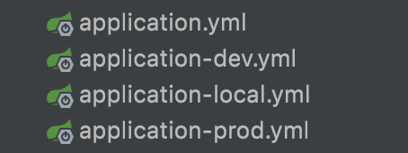
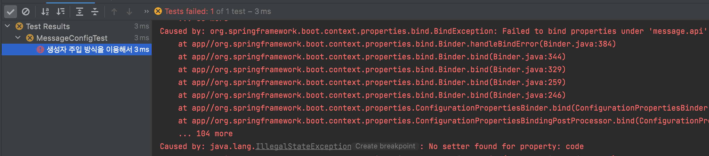
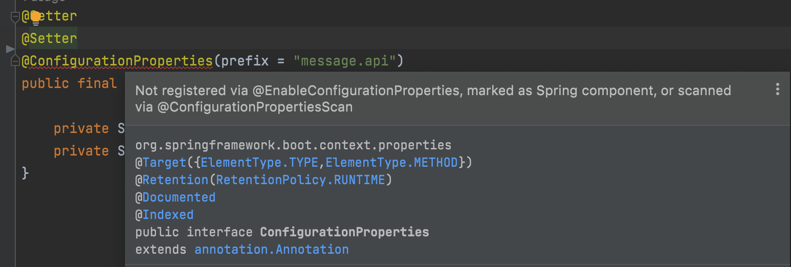
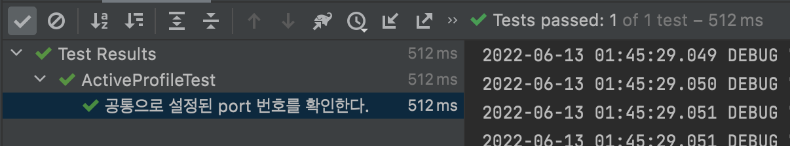
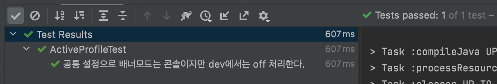
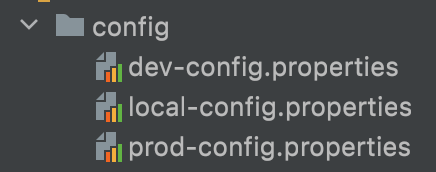
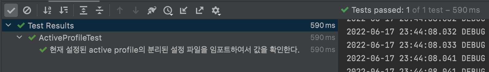

# [Springboot] 어플리케이션 환경설정 profile 별 관리방법

SpringBoot를 사용하면서 `application.yml` 을 많이 사용합니다. 실제 프로젝트 환경에서는 로컬, 개발, 품질, 운영 환경으로 관리하기 때문에 서버별로 습관적으로 환경설정 파일을 분리하여서해서 profile 수만큼 `application.yml` 을 생성해서 사용하였습니다.

물론, 이렇게 사용하면서 지금까지 문제되는 사항은 없었습니다. 하지만 공통적으로 설정된 정보가 변경되었을시에 해당 파일만큼 수정을 해야한다는 것이 불편하게 느껴졌습니다. 

만약 공통설정 정보를 따로 관리한다면 어떻게 될까요? profile 의 종속적인 설정 정보를 제외한 공통 환경 설정 정보를 따로 관리하여서 만약 정보가 변경된다면 공통 설정 정보만 변경하여도 모든 profile의 환경 설정 정보가 반영이 됩니다. 


## 외부 설정 파일이란?

- 애플리케이션에서 사용하는 여러가지 설정 값들을 애플리케이션의 밖이나 안에 정의하여서 관리할 수 있습니다.
- 설정값은 스프링 설정정보 또는 토큰 정보, 데이터베이스 접속 정보, API 서버 정보, 로그 설정 정보 등을 관리합니다.


## applcation.properties란?

- 스프링부트가 애플리케이션을 구동할 때 자동으로 로딩하는 파일로, key - value 형식으로 값을 정의하며 애플리케이션에서 참조하여 사용할 수 있습니다.
- `applcation.yml` 파일의 형식도 지원합니다. 

테스트를 진행한 소스에서는 yml 파일 형식을 사용하였습니다.


### 우선 순위

Spring Boot의 구성 파일(application.properties 및 application.yaml)은 다음과 같은 우선순위로 구성이 됩니다. *이 우선순위를 활용해볼 예정입니다.*

1. 해당 jar 파일안에 있는 외부 설정 파일(`application.properties` or `application.yml`)
2. 해당 jar 파일안에 있는 특정 profile 외부 설정 파일(`application-{profile}.properties` or `application-{profile}.yml`)
3. jar 파일 외부에 있는 외부 설정 파일(`application.properties` or `application.yml`)
4. jar 파일 외부에 있는 특정 profile 외부 설정 파일(`application-{profile}.properties` or `application-{profile}.yml`)

보시는 바와 같이, `application.yml` 파일을 먼저 로드한 후 각 Profile별 설정 파일인 `application-{profile}.yml` 파일을 로드를 하게 됩니다.


### 스캔 범위

Spring Boot는 응용 프로그램이 시작될 때 다음 위치에서 `application.properties` 및 `application.yaml` 파일을 자동으로 찾아 로드합니다.

1. `classpath:/`
2. `classpath:/config/`
3. `file:./`
4. `file:./config/`

위의 경로는 기본 경로이며, 필요하다면 경로를 직접 지정해줄수도 있습니다.


### 스캔 경로를 직접 지정

`spring.config.location`에 별도로 설정 파일 위치가 명시되면 기본 위치값 위치들을 대체합니다

```
-Dspring.config.location=file:/home/config
```


### 스캔 경로 직접 + 기본경로 지정

`spring.config.additional-location`으로 설정 파일 위치가 설정되면, 기본 위치들에 추가로 사용됩니다. 추가 위치들은 기본 위치보다 먼저 검색됩니다. 예를 들어, 추가 위치가 `classpath:/custom-config/,file:./custom-config/`이면, 검색 순서는 다음과 같습니다:

1. `file:./custom-config/`
2. `classpath:custom-config/`
3. `file:./config/`
4. `file:./`
5. `classpath:/config/`
6. `classpath:/`


## 현재까지 관리 방법

지금까지 프로젝트 소스를 구성할때 외부 설정 파일을 다음과 같이 구성하였습니다.

- application-local.yml
- application-dev.yml
- application-prod.yml

위와 같이 구성하였을때 장점과 단점을 생각해보았습니다.

먼저, 장점은 다음과 같습니다.

- 각 profile별 분리된 외부 설정 파일을 보장합니다.


단점은 다음과 같습니다. 

- 공통 설정이 변경되면 각 profile별로 전부 수정을 해야 합니다.
  - 예를 들어, 서버의 port 18080일때 port 변경시 profile별 모든 외부 설정 파일을 변경해야 합니다.


## 변경 관리 방법

이번에 프로젝트 소스 구성시 기존 방법을 사용해보지 않고 아래 방법으로 시도를 해보았습니다.

공통된 외부 환경 설정 파일(`application.yml`) 은 하나의 파일로 관리합니다.

- spring 의 설정 정보들, swagger 정보, 서버 포트 정보 등이 있습니다.
- application.yml 하나로 공통 설정 정보들을 관리합니다.

profile의 종속적인 정보들(`application-{profile}.yml`) 은 분리를 해서 관리합니다.

- 데이터베이스 접속 정보
- 내/외부 API 호출 정보
- application-local.yml, application-dev.yml, application-prod.yml 등으로 분리해서 각 설정 정보들을 관리합니다.


위와 같이 구성하였을때 장점은 다음과 같습니다.

- 공통된 설정 정보와 profile별 설정 정보가 분리되어서 구분하기 편합니다.
- 공통된 설정 정보가 변경된다면 하나의 파일만 수정하면 됩니다.


## 개발 환경

- Spring Boot : 2.6.7 
- application.yml 사용
- Java : 11
- IDE : Intellij


모든 소스는 Github 통해서 확인이 가능합니다. - [소스 바로가기](https://github.com/codeleesh/study-code/tree/main/profile-properties)


### 실습

application 환경설정 파일은 공통적인 속성을 관리하는 `application.yml` 과 각 profile별로 관리중인 `application-{profile}.yml` 로 설정하였습니다.




application 환경 설정 파일에 속성을 로드하는 여러가지 방법 중에서 `@Value` 와 `@ConfigurationProperties` 을 활용하였습니다.

`@Value` 

```java
@Getter
@Component
public class ActiveProfile {

    @Value("${server.port}")
    private int port;

    @Value("${spring.config.activate.on-profile}")
    private String profile;

    @Value("${spring.main.banner-mode}")
    private String bannerMode;

    @Value("${external.api.url}")
    private String externalApiUrl;
}
```

`@ConfigurationProperties`

```java
@Getter
@Setter
@Component
@RequiredArgsConstructor
@ConfigurationProperties(prefix = "message.api")
public final class MessageConfig {

    private String code;
    private String name;
}
```


설정 도중 다음 속성은 꼭 놓치지 않고 설정해야 합니다.

setter 메소드가 없으면 다음과 같은 에러가 발생합니다.



`@Component` 설정 즉, Spring의 Bean으로 등록되어 있지 않다면 다음과 같은 에러가 발생합니다.




application의 환경설정은 다음과 같이 설정하였습니다.

`application.yml`

```yaml
server:
  port: 8080

logging:
  level:
    root: debug

spring:
  main:
    banner-mode: console

message:
  api:
    code: app
    name: external-api
```

`application-dev.yml`

```yaml
spring:
  main:
    banner-mode: off
  config:
    activate:
      on-profile: dev
    import: classpath:config/dev-config.properties
server:
  address: dev.localhost
```


#### 테스트

공통(`application.yml`) 설정 파일에 대한 단위 테스트를 진행해보겠습니다.

```java
@SpringBootTest
@ActiveProfiles("dev")
class ActiveProfileTest {

    @Autowired
    private ActiveProfile activeProfile;

    @DisplayName("공통으로 설정된 port 번호를 확인한다.")
    @Test
    void serverPortTest() {
        // then
        assertThat(activeProfile.getPort()).isEqualTo(8080);
    }
    ...
}
```

공통 `application.yml` 의 포트 정보를 확인하여서 테스트가 성공하는 것을 확인할 수 있습니다.




공통(`application.yml`) 설정에서는 `banner-mode` 가 `console` 로 설정되어 있지만, profile dev에서는 `banner-mode` 가 `off` 로 설정되어 있습니다. 이런 상황에서 우선순위상 공통 설정을 먼저 확인한 후 각 profile별 설정을 확인합니다. 즉 `off` 가 적용됩니다.

```java
    @DisplayName("공통 설정으로 배너모드는 콘솔이지만 dev에서는 off 처리한다.")
    @Test
    void bannerModeTest() {
        // then
        assertThat(activeProfile.getBannerMode()).isEqualTo("false");
    }
```

스프링부트가 로드시 `application.yml` 정보를 로드한뒤 `application-dev.yml` 정보를 로드하면서 `banner-mode` 가 `console` 에서 `off` 로 변경되었습니다. 그리하여서 다음 테스트는 성공하게 됩니다.




### application 파일안에 설정정보 import

실제 실무에서 한번도 사용해보지 않은 방법이지만 알아두기 위해서 실습을 진행하였습니다.

`spring.config.import` 를 활용하여서 custom 환경설정 파일 정보를 사용할 수 있습니다.

파일은 다음과 같이 구성하였습니다.



properties 안에 정보는 호출할 외부 API url 정보를 설정하였습니다.

`dev-config.properties`

```properties
external.api.url=http://dev-host:8080/api
```

해당 정보를 정확하게 불러오는지 테스트를 해보도록 하겠습니다. 소스는 다음과 같습니다.

```java
    @DisplayName("현재 설정된 active profile의 분리된 설정 파일을 임포트하여서 값을 확인한다.")
    @Test
    void externalApiUrl() {
        // then
        assertThat(activeProfile.getExternalApiUrl()).isEqualTo("http://dev-host:8080/api");
    }
```

테스트는 다음과 같이 성공하게 됩니다.




## 마무리

- 스프링부트에서는 `application.properties`, `application.yml` 를 로드해서 사용할 수 있습니다.
  - 로드되는 우선순위를 이용하여서 공통으로 관리할 설정 정보와 profile의 종속적으로 관리할 설정 정보를 나눠서 사용할 수 있습니다.
- 환경설정 파일은 기본 스캔 범위가 있으며, 직접 스캔 범위를 지정할 수 있습니다.
- 환경설정 파일은 스프링부트가 로드되면서 설정 파일을 스캔해서 로드를 합니다. 즉, 스프링의 등록된 빈이 있어야  `@Value`, `@ConfigurationProperties` 를 사용할 수 있습니다.
- 환경설정 파일안에 custom 설정 파일을 import하여서 설정 정보를 로드할 수 있습니다.


## 참고

- [Springboot - Externalized Configuration](https://docs.spring.io/spring-boot/docs/current/reference/htmlsingle/#features.external-config)