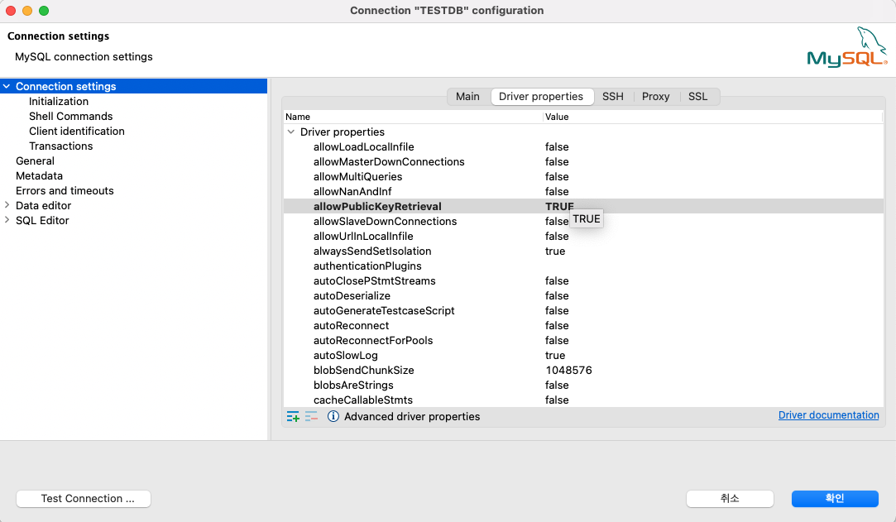
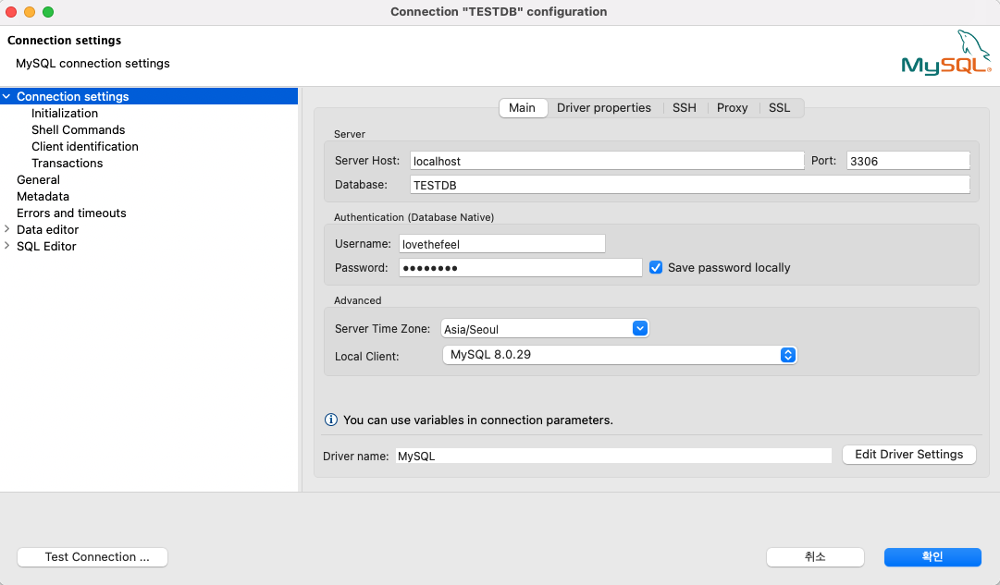
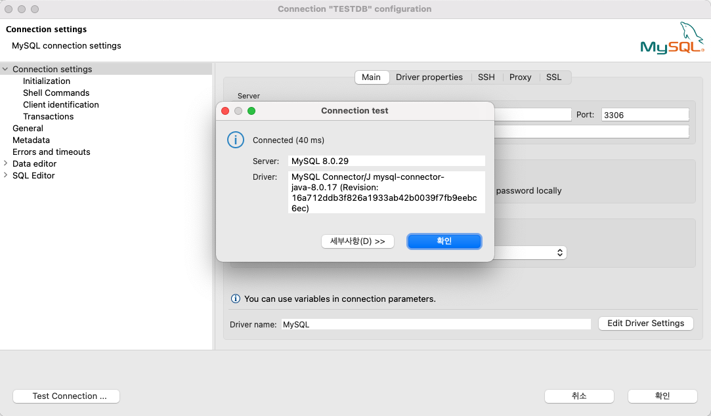

# [MySQL8] MacOS docker 설치

JPA 테스트 환경을 만들기 위해서 맥북 로컬환경에 MySQL을 설치하려고 합니다. 설치는 docker를 이용하려고 하며, 사용하기 위한 준비 작업 내용을 정리하려고 합니다. docker 이용은 많이 해봤기에 이번에는 docker-compose 를 활용하여서 진행해보도록 하겠습니다.


## docker-compose 작성 

```bash
version: '3.7'

services:
  mysql:
    image: mysql:8.0
    container_name: mysql8
    ports:
      - 3306:3306 # HOST:CONTAINER
    environment:
      - MYSQL_DATABASE=TESTDB
      - MYSQL_ROOT_PASSWORD=password
      - TZ=Asia/Seoul
    command:
      - --character-set-server=utf8mb4
      - --collation-server=utf8mb4_unicode_ci
    volumes:
      - /Users/lsh/Desktop/docker_home/config/mysql8:/var/lib/mysql
```

- version
  - docker-compose의 버전에 따라 여러 차이가 있기 때문에 작성할 때엔 버전을 정의 해주는것이 좋습니다.
- services
  - 컨테이너를 실행하기 위한 단위로 보면 됩니다. 

  - service안의 container들은 하나의 project로서 docker-compose로 관리 됩니다.
- services.{container이름}
  - 생성 할 container 이름을 지정 합니다.

  - 여기서는 `mysql` 로 지정하였습니다.
- services.mysql.image
  - docker-compose 안에서 베이스 이미지를 지정할 수 있습니다.

  - docker build를 할 때와 마찬가지로 이미지가 로컬 환경에 없다면 해당 이미지를 다운받아서 base 이미지로 사용합니다.
- services.mysql.environment
  - 컨테이너에서 사용할 환경 변수를 정의합니다.
  - 여기서는 catalog, root password, tz를 정의하였습니다.
- services.mysql.command
  - 컨테이너에서 작동하는 명령어를 설정합니다.
  - MySQL 8은 기본 characeter set과 collation 이 utf8mb64와 utf8mb4_0900_ai_ci이므로 별도 설정은 필요하지 않습니다.
- services.mysql.volumes 
  - dockerfile에서 사용되는 volume과 같이 컨테이너에 볼륨을 마운트할 때 사용됩니다. <호스트>:<컨테이너> 방식으로 사용하고 마지막에 :ro를 추가해 볼륨을 읽기 전용으로 사용할 수 있습니다.
  - 보통 docker-compose를 통해 빌드하게 되면 이미지가 생성되는데, 개발을 하다보면 수시로 코드를 수정하게 되는데 수정할 때마다 이미지를 재생성하면 굉장히 비효율적이게 됩니다.
  - 이때 코드 수정을 하고 있는 호스트의 경로를 컨테이너와 연결시켜서 이미지 빌드 없이 코드가 반영될 수 있도록 하는 것이 volume의 장점입니다.
- services.mysql.ports
  - ports는 호스트 OS와 컨테이너의 포트를 바인딩 시키는 포트포워딩의 역할을 합니다. 
  - ports는 <호스트 머신의 포트번호> : <컨테이너의 포트 번호> 와 같은 순서로 바인딩이 이루어집니다. 만약, 8080:8080이 아닌 8080만 지정했을 경우(컨테이너의 포트번호만 지정한 경우, 호스트 머신의 포트는 랜덤한 값으로 설정됩니다. 4631(랜덤):8080와 같이요.


## docker-compose 실행

컨테이너 생성 및 실행을 다음 명령어이를 이용하면 됩니다.

```bash
docker-compose up
```


## docker 컨테이너 접속

아래 명령어를 이용하면 mysql 컨테이너 접속이 가능합니다,

```bash
docker exec -it mysql /bin/bash
```

접속 결과

```bash
root@14ee217e9e12:/#
```


## 데이터베이스 설정

### mysql 접속

docker 컨테이너의 접속한 상태에서 mysql 접속하기 위해서는 아래 명령어를 이용하면 됩니다.

```bash
root@14ee217e9e12:/# mysql -u root -p
```

접속 결과

```bash
Enter password:
Welcome to the MySQL monitor.  Commands end with ; or \g.
Your MySQL connection id is 8
Server version: 8.0.29 MySQL Community Server - GPL

Copyright (c) 2000, 2022, Oracle and/or its affiliates.

Oracle is a registered trademark of Oracle Corporation and/or its
affiliates. Other names may be trademarks of their respective
owners.

Type 'help;' or '\h' for help. Type '\c' to clear the current input statement.

mysql>
```


### 사용자 추가하기

#### localhost 에서만 접속 가능한 계정 생성

```
mysql> USE mysql;
mysql> CREATE USER 'YOUR_SYSTEM_USER'@'localhost' IDENTIFIED BY 'YOUR_PASSWD';
mysql> GRANT ALL PRIVILEGES ON *.* TO 'YOUR_SYSTEM_USER'@'localhost';
mysql> FLUSH PRIVILEGES;
```


#### 모든 DB, 테이블에 접속 가능한 계정 생성

```
mysql> USE mysql;
mysql> CREATE USER 'lovethefeel'@'%' IDENTIFIED BY 'qwer1234';
mysql> GRANT ALL PRIVILEGES ON *.* TO 'lovethefeel'@'%';
mysql> FLUSH PRIVILEGES;
```


여기서는 모든 DB, 테이블에 접속 가능한 계정을 생성하였습니다. 

```bash
mysql> USE mysql
Reading table information for completion of table and column names
You can turn off this feature to get a quicker startup with -A

Database changed
mysql> CREATE USER 'lovethefeel'@'%' IDENTIFIED BY 'qwer1234';
Query OK, 0 rows affected (0.03 sec)

mysql> GRANT ALL PRIVILEGES ON *.* TO 'lovethefeel'@'%';
Query OK, 0 rows affected (0.01 sec)

mysql> FLUSH PRIVILEGES;
Query OK, 0 rows affected (0.01 sec)
```


## 데이터베이스 Tool 접속

데이터베이스 접속 테스트를 위해서 [dbeaver](https://dbeaver.io/download/) 를 사용하였습니다. 만약 아래와 같은 에러를 만났다면 설정 하나를 변경해야 합니다.   

```
public key retrieval is not allowed
```

위와 같은 에러가 발생하는 원인은 다음과 같습니다.


### 원인

MySQL 8.0부터는 다음의 변화가 생겼습니다.

- 서버와 통신할 때 SSL을 사용하여 서버간 통신되는 모든 데이터를 암호화 합니다.
  - 암호화는 `useSSL=true` 옵션을 이용합니다.
- 사용자 패스워드 암호화를 위해서 caching_sha2_password 플러그인이 추가되었습니다.
  - 이 플러그인은 RSA 공개키 암호화를 통해 패스워드를 보호합니다.

클라이언트가 서버에 공개키를 자동으로 요청할 수 있도록 설정이 필요합니다. 그런데 `allowPublicKeyRetrieval` 기본값이 false이므로 해당 에러가 발생하였습니다. database tool에서는 다음과 같이 변경하면 됩니다.

`allowPublicKeyRetrieval` 옵션을 찾아서 `false` 로 설정하면 됩니다.




접속 정보는 다음과 같이 설정하면 됩니다.




접속 결과는 성공하였습니다.




애플리케이션에서 접속한다면 다음 내용을 참고하시면 됩니다.

```bash
jdbc:mysql://localhost:3306/test_db?useSSL=false&allowPublicKeyRetrieval=true
```


## 참고

- [hub docker - mysql](https://hub.docker.com/_/mysql)