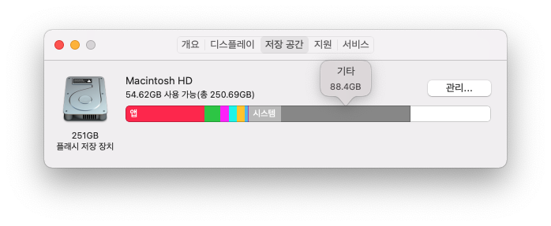
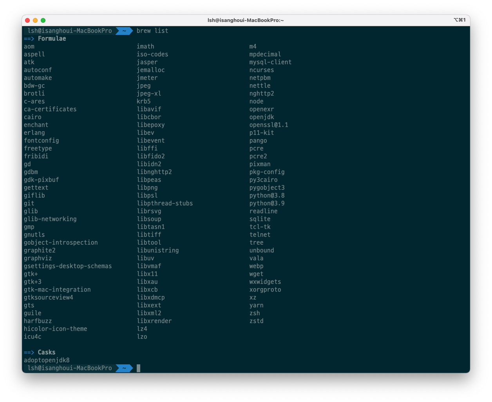

# [Mac] brew package uninstall

최근 docker 설치 및 homebrew 를 통해서 설치를 하게 되면서 용량을 신경쓰지 못하였습니다. 그래서 용량을 확보해야겠다고 느꼈습니다.

맥에서 저장공간을 볼 수 있는 방법은 다음과 같습니다.

- 화면 모서리에 있는 Apple 메뉴()에서 '이 Mac에 관하여'를 선택하면 저장 공간의 구성과 용량을 확인할 수 있습니다.



docker 파일은 지우면 되는데, homebrew를 통해서 설치한 파일은 어떻게 지워야할지 잘 몰랐습니다. 그래서 제거하는 방법을 정리하려고 합니다.


## package 제거

`brew` 를 통해서 설치한 package 를 제거하는 방법에 대해서 알아보도록 하겠습니다.

먼저 제거할 목록을 확인해보기 위해서 아래 명령어를 이용합니다.

```bash
brew list
```



brew list를 통해서 나온 결과는 설치한 package 목록이 나타나게 되며, 설치된 종류로  `Formulae`, `Casks` 가 있습니다.

`Formulae` 는 Mac 용 패키지 매니저이며, 터미널에서 패키지를 설치합니다.

- ex) brew install git, brew install python3

`Casks` 는 homebrew의 확장으로 Mac용 GUI 애플리케이션을 명령어로 설치합니다.

- ex) brew cask install google-chrome


제거할 package 이름을 확인한 다음 `brew uninstall` 을 이용하여서 제거하도록 하겠습니다.         

```bash
brew uninstall tree
```


제거 후 다시 `brew list` 를 통해서 해당 패키지 목록이 나타나지 않는 것을 확인할 수 있습니다.


감사합니다.

