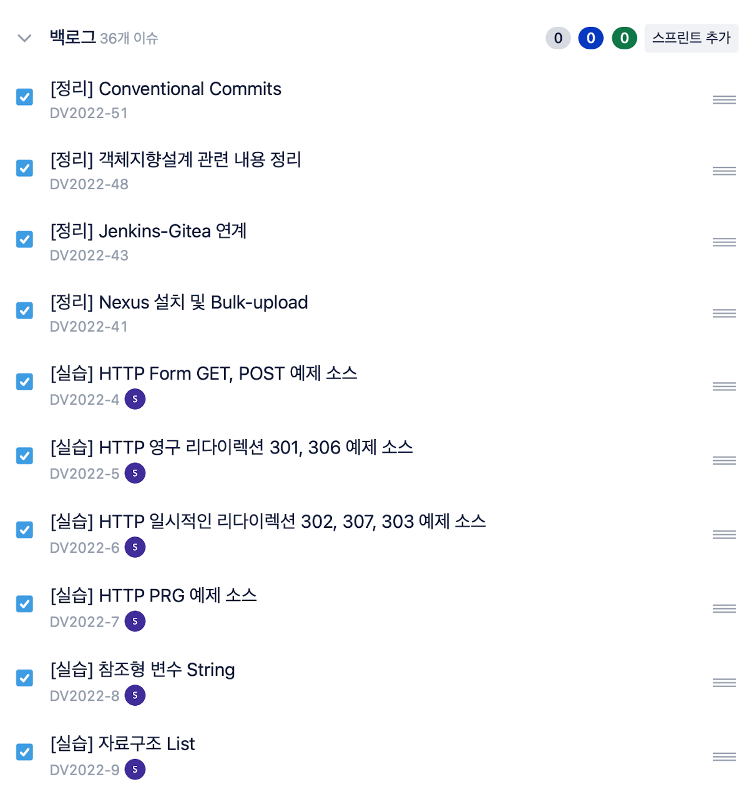
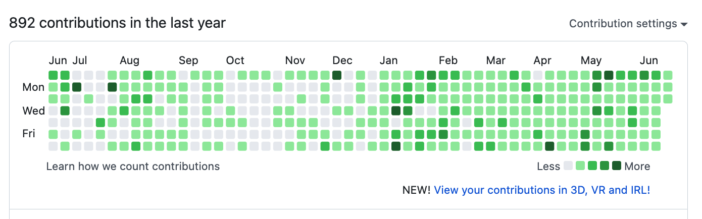
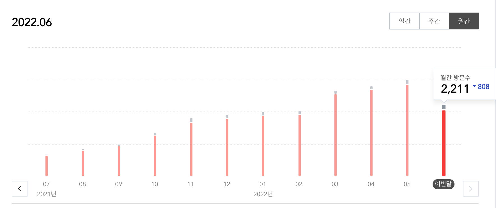
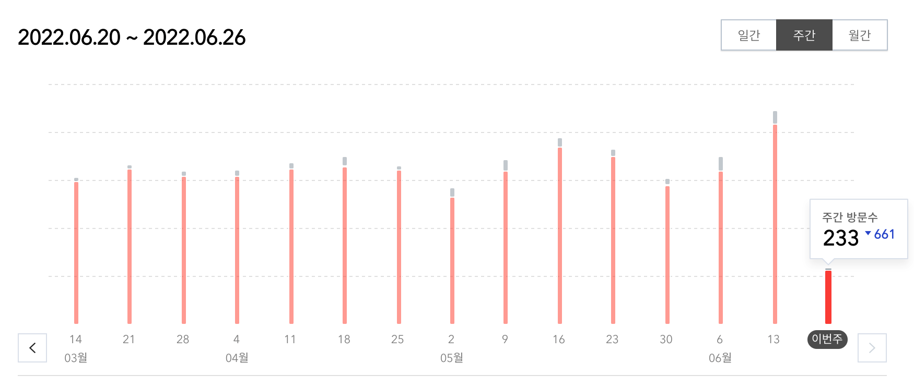
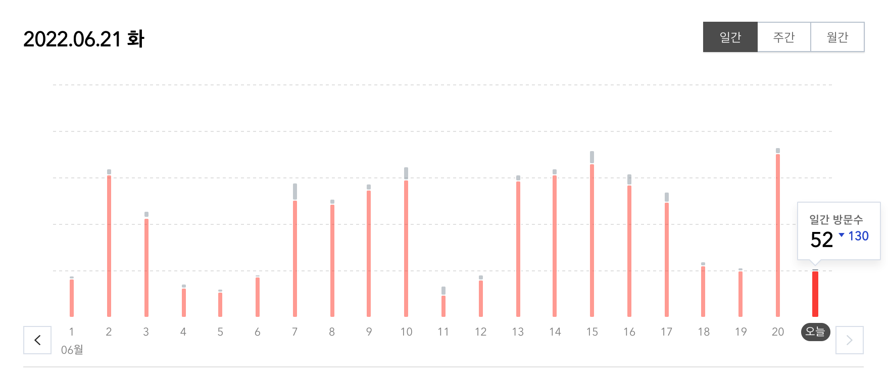
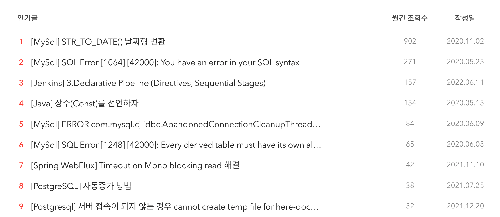

# 2022년 2분기 회고

2022년 2분기 회고를 맞이하였습니다. 1분기에 이어서 포기하지 않고 2분기도 회고의 글을 쓰고 있습니다.

왜 회고를 쓰게 되었는지에 대해서 회고를 해보면, 개인적으로 회고를 해오면 살아오지 않았던 부분과 SI 프로젝트에서 회고는 사치라는 점 등을 이유로 내가 해왔던 일들에 대해서 나의 주관적인 관점에서 다시 나를 살펴보기로 하였습니다.

> 나 자신을 알라
>
> 소크라테스


## 꾸준히 하는 것

### 매일 기록 남기기

2022년 1월부터 시작한 매일 기록 남기는 부분을 이어서 꾸준히 진행을 하고 있습니다. 

메모를 너무 하지 않다보니 무엇을 진행하고 있는지, 진행하였는지 파악이 어려워서 메모하는 습관을 만들기 위해서 시작한 매일 기록 남기는 부분이 이제는 습관으로 자리를 잡았습니다. 애초에 계획은 회사에서 진행한 부분과 개인적으로 진행한 부분을 나누어서 메모 작성을 이어갔었는데, 회사에서 외부로 프로젝트를 나오게 되면서 회사에서 진행하는 부분을 개인적으로 진행하는 부분으로 합치게 되었습니다. 

매일 기록을 남기는 부분은 이제는 익숙해지다보니 놓치지 않고 하고 있지만 가끔은 정말 기록을 남기기 위한것보다는 습관으로 하는 부분도 있어서 이 부분을 조심하면서 이어나가고 있습니다.

또한 작성 포맷도 변경이 있었습니다. 기존에 작성한 기록을 남기는 부분은 진행해야될 내용과 앞으로 해야될 내용을 계속 달고 다녔습니다. 바로 아래처럼 말이죠.

*AS-IS 작성 포맷*

```
# 2022.03.20

- 매직 넘버 정리
	- [x] 내용 정리
	- [ ] 블로그 공유
- 자바 ORM 표준 JPA 프로그래밍 - 기본편
	- [X] 섹션 1. 강좌 소개 - 100%
	- [X] 섹션 2. JPA 소개 - 100%
	- [X] 섹션 3. JPA 시작하기 - 100%
	- [x] 섹션 4. 영속성 관리 - 내부 동작 방식 - 100%
	- [ ] 섹션 5. 엔티티 매핑 - 40%

## TO-DO

- [HTTP] 모든 개발자를 위한 HTTP 웹 기본 지식
	- [ ] 실습 진행 필요
		- [ ] HTTP Form GET, POST 예제
		- [ ] 영구 리다이렉션 301, 308 예제
		- [ ] 일시적인 리다이렉션 302, 307, 303 예제
		- [ ] PRG 예제
- 이력서 필요한 사항 정리
	- Experience 주제 추가하여 내용 추가
		- 블로그 내용부터 추가
		- 회사에서 리팩토링하는 내용 블로그 이동한 후 이력서 추가
	- favicon 생성하여 변경
		- https://hongpage.kr/28
- 스프링 MVC 1편 - 백엔드 웹 개발 핵심 기술
	- [x] 섹션 1. 웹 애플리케이션 이해 - 100%
	- [x] 섹션 2. 서블릿 - 100%
	- [X] 섹션 3. 서블릿, JSP, MVC 패턴 - 100%
	- [X] 섹션 4. MVC 프레임워크 만들기 - 100%
	- [ ] 섹션 5. 스프링 MVC - 구조 이해 - 10%
- Message Queue 내용 정리
	- [x] RabbitMQ 개념 및 설징 정리
	- [ ] 실습 진행 과정 설정
		- [ ] 1단계
		- [ ] 2단계
```


위의 처럼 기록을 남기는 부분에 대해서는 문제점이 있었습니다.

- 내용이 너무 많아서 한눈에 잘 안보임
- TO-DO에 내용이 많아서 일을 처리한것보다는 자꾸 쌓여가는 느낌이 많이남

이러한 문제점들은 고치고 TO-DO의 대한 내용들은 계속 챙기고 싶었습니다.

그리하여서 매일 기록을 남기는 부분은 그날 진행한 일만 기록을 하기로 변경을 하였습니다. 

```
# 2022.06.01

- 독서 : 객체지향의 사실과 오해
	- 6장 진행 중
- 자바 ORM 표준 JPA 프로그래밍 - 기본편
	- 엔티티 매핑
		- 연관관계 매서드 정리 중
```

진행한 내용만 간결하게 정리를 하니 진행한 내용을 보기가 더 편해졌습니다.

그리고 추가적으로 공부 또는 정리가 필요한 내용은 JIRA를 통해서 백로그로 관리하여 잊어버리지 않게 하였습니다.



이렇게 관리를 하니 진행한 내용에 대해서는 간단하게 기록으로 남길수 있고 추후 진행해야될 목록에 대해서는 백로그를 통해서 기록을 남기게 되니 잊어버리지 않고 진행할 수 있게 되었습니다.

1월부터 시작하여 지금까지 약 6개월간의 기록을 이어가고 있으며, 현재 [Github](https://github.com/codeleesh/TIL/tree/main/2022)를 통해서 확인이 가능합니다. (재미는 없습니다..)


### 1일 1커밋



1일 1커밋은 꾸준히 순항중에 있습니다. 1차 목표는 푸르른 잔디를 만드는 것이며, 2차 목표는 그것을 꾸준히 이어나가는 것입니다. 지금처럼 꾸준히만 한다면 가능할것 같습니다! (보고 있으니 뿌듯합니다)


## 이벤트 

### 프로젝트 투입

3월말에 외부 프로젝트 투입을 하게 되었습니다. 그동안 본사에서 플랫폼 개발을 진행하고 있었고 해당 플랫폼으로 수주를 하게 되면서 기술 지원을 하기 위해서 현재는 외부로 출근을 하고 있습니다. 매번 느끼는 거지만 초기 셋업을 해보는 경험은 값진 경험이었습니다. CI/CD 구성부터 서버 Application 구성부터 방화벽 정책 등등 평소에는 (마음을 먹지 않는 이상) 연습을 해볼수 없는 부분들을 경험해볼 수 있었습니다.


### 이직 준비

커리어 고민을 하다가 이직을 하기로 하였습니다. 이직을 본격적으로 준비하게 되면서 이력서를 몇군데 넣었습니다. 그 중에서 면접을 2군데를 보게 되었습니다. 한 곳은 전화 인터뷰를 본 후 합격이 되면 1차와 2차면접의 순으로 이어지는 프로세스였습니다. 전화 인터뷰에서 질문하셨던 자료구조론의 기초적인 질문에 대해서 사실 제대로 답변을 하지 못하였습니다. 사실 해당 내용에 대해서 따로 공부를 해본적도 없어서 부끄럽다는 생각보다는(사실 엄청 부끄러웠음) 부족하다는 생각이 많이 들어서 해당 답변부터 TO-DO의 우선순위를 높여서 정리하게 되었습니다. 결과적으로는 떨어졌습니다.

그 후 또 다른 회사를 지원하게 되었고 면접을 보게 되었습니다. 면접지원자의 이동 편의를 생각해서 1차 면접이 붙게 되면 2차까지 바로 보게 되는 프로세스였습니다. 면접 채용과정이 길 수 있는데, 하루만에 끝나게 되니 회사를 다니는 입장에서는 좋다고 생각을 하게 되었습니다. 사실 회사를 다니면서 면접을 보기 위해서 휴가를 사용할때마다 여러가지 사유를 생각하는 것도 어려웠습니다. 면접을 보는 분위기는 굉장히 좋았으며, 어느 정도 합격의 확신이 있었습니다. 결과적으로 합격을 하게 되었고 이직을 하기로 결정을 하게 되었습니다.


### 글또

작년에 수강한 [우아한테크프로](https://edu.nextstep.camp/) 를 통해서 지인에게 [글또](https://www.notion.so/zzsza/ac5b18a482fb4df497d4e8257ad4d516) 라는 모임을 알게 되었습니다. 그때 한참 글을 쓰는 습관과 더불어 글이 전달해주는 선한 영향력에 대해서 고민을 많이 하고 있었습니다. 그래서 너무나 좋은 모임이라고 생각을 하게 되면서 지원을 하게 되었고 글또 7기 일원으로 활동하게 되었습니다. [글또를 지원하게된 배경](https://lovethefeel.tistory.com/86?category=925742) 에 대해서는 해당 글을 통해서 좀 더 자세하게 풀어보았습니다. 

글또를 진행하면서 발행된 글들은 다음과 같습니다.

프로젝트를 진행하면서 CI/CD로 Jenkins를 사용하고 있는데, Jenkins pipeline을 정리하였습니다. 블로그에 총 4개의 글을 정리하게 되었는데, 관심있으시면 읽어봐주시고 잘못된 내용 또는 부족한 내용은 댓글로 문의 부탁드립니다. 여기서는 가장 첫번째글의 링크를 공유합니다.

[[Jenkins] 1.설치와 초기 설정](https://lovethefeel.tistory.com/94)

로그와 관련된 내용도 한번 정리하고 싶어서 총 7개의 주제로 정리하게 되었습니다. 여기서는 가장 첫번째글의 링크를 공유합니다.

[[Logback] 1.SpringBoot에서 Logback 사용하기 - 주의점, 구성, 상속, 파라미터 처리](


### 공부중인 내용

주된 공부는 Spirng과 JPA 학습을 주로 하고 있습니다. 최근에는 JPA를 확실하게 정리하고 싶어서 노력중에 있어요. 최근에는 곧 이직할 회사에서 kafka를 사용하고 있어서 kafka와 관련된 내용을 틈틈이 공부하고 있습니다. 그리고 `오브젝트` 와 `Real MySQL` 책을 읽고 있습니다.


## 노력이 필요한 것

### 독서

무엇을 배우기 위해서는 인터넷을 통해 강의를 수강하면 쉽게 배울 수 있습니다. 강의를 통해 모르고 있었던 내용을 빠르게 학습할 수 있어서 좋았지만 깊이 있게 배우기 위해서는 따로 학습을 더 진행해야 합니다. 이건 당연한 이야기입니다. 그렇다면 어떻게 학습을 하는 것이 좋을까? 제가 생각한 것은 바로 책을 통해서 배우는것이었습니다. 

하지만 생각보다 독서는 잘 되지 않았습니다. 퇴근 후 컴퓨터 앞에 앉으면 메일 확인하고 일지 기록한 후 인터넷 강의를 들으면 하루가 끝나버렸습니다. 이렇게 몇일을 보낸뒤 지하철에서 읽어보려고 시도를 해보았지만 지하철에서는 집중이 잘 되지 않았습니다. 

그래서 `자기전에는 무조건 2장씩 꼭 읽어보자` 라는 목표를 세우고 실행하고 있는데, 이것을 잘 실행하기 위해서 노력하고 있습니다.


## Blog 현황

글쓰는 관심을 갖게 되면서 블로그 현황에 대해서도 관심이 가고 있습니다. 물론 현재는 인기글과 상관없이 올리고 있지만 추후에는 인기글 연관된 내용을 좀 더 심도있게 다뤄보면 좋을것 같습니다.


#### 월간 방문자수



그래프를 보면 꾸준히 방문자수가 올라가고 있습니다. (하지만 구글애드센스 수익은 좀처럼 나아지질 않고..)

| 구분  | 글 발행 수 |
| ----- | ---------- |
| 1분기 | 18개       |
| 2분기 | 15개       |

글 발행수는 1분기보다는 3개정도가 줄었는데, 방무자 수 유입은 더 늘어난것으로 보아서 인기글 상위 검색에서 노출이 잘 된 것 같습니다. 최근에 쓴글인 `Jenkins` 관련해서 `Crontab` 의 대한 내용에 대해서 많은 분들이 검색을 하였고 관련 키워드로 유입이 되면서 방문자 수가 올라온 부분도 한몫 했습니다.


#### 주간 방문자수



주간 방문자수도 3월달부터 6월달까지 보면서 소폭 상승한 것을 볼 수 있습니다. 한편 5월 첫째주와 마지막주에는 떨어진 지표를 볼 수 있습니다. 기술블로그가 저와 같은 직장인 개발자분들의 검색을 통해서 유입이 이루어지고 있다보니 공휴일이 중간에 있으면 방문자 유입이 떨어지는 모습을 볼 수 있습니다. 


#### 일간 방문자수



일간방문자수는 평균적으로 160 ~ 180 사이로 유입이 되고 있습니다. 3월달과 비교하였을때 10 ~ 20 정도의 상승이 있었습니다.


#### 유입 경로


주로 구글을 통해서 많은 분들이 들어오는 것을 알 수 있습니다. 실제로 구글을 통해서 검색을 주로 하기 때문인데, 개발자분들의 생각이 비슷한것 같습니다. 그리고 디바이스가 모바일과 PC가 비슷할것으로 예상하였으나 PC가 압도적으로 많습니다. 


#### 인기글 목록



여전히 블로그 인기글 1등은 압도적인 수치를 기록하는 [[MySql] STR_TO_DATE() 날짜형 변환](https://lovethefeel.tistory.com/47?category=782454)입니다. 인기글 3순위인 [[Jenkins] 3.Declarative Pipeline (Directives, Sequential Stages)](https://lovethefeel.tistory.com/96) 글은 최근에 작성한 내용치고는 많은 분들이 유입이 되고 있는 것을 확인할 수 있었습니다. 해당 내용에 `crontab` 과 관련된 내용을 알아보시기 위해서 검색을 많이 한 것으로 판단이 됩니다.


## 목표

다음 분기전까지 목표는 다음과 같습니다.

- 글또 100% 참여하기!
- 1일1커밋 꾸준히 진행
- 매일 독서하여 한달에 한권씩 읽기


그동안 목표가 없다보니 주관적으로 회고를 하게 되었는데, 다음 분기부터는 위의 목표를 토대로 객관적인 회고가 될 수 있도록 해보려고 합니다.

3분기도 화이팅입니다!