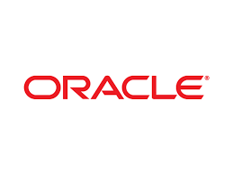
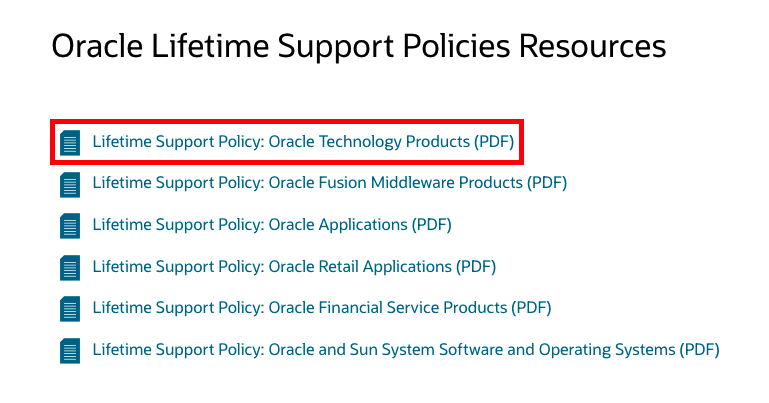
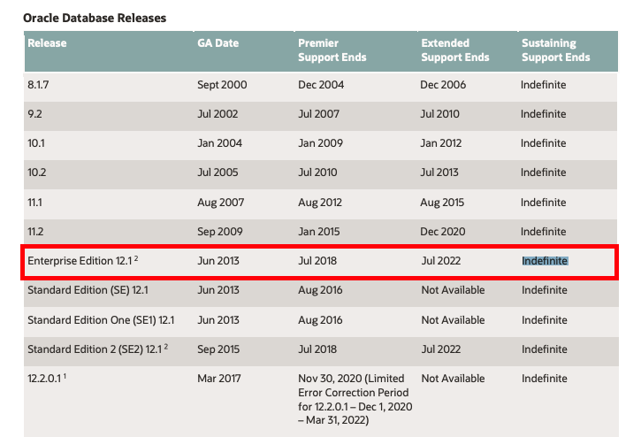
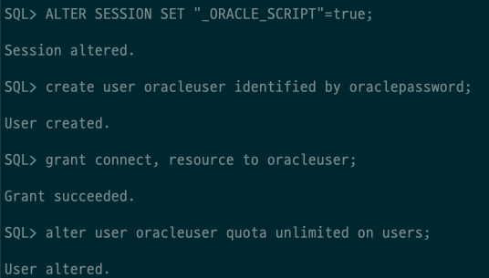
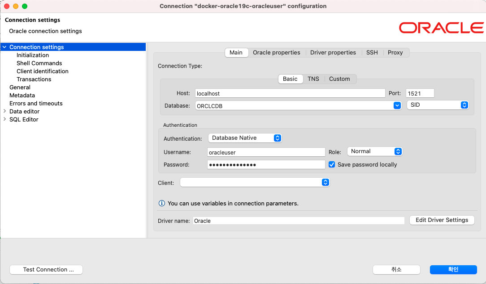
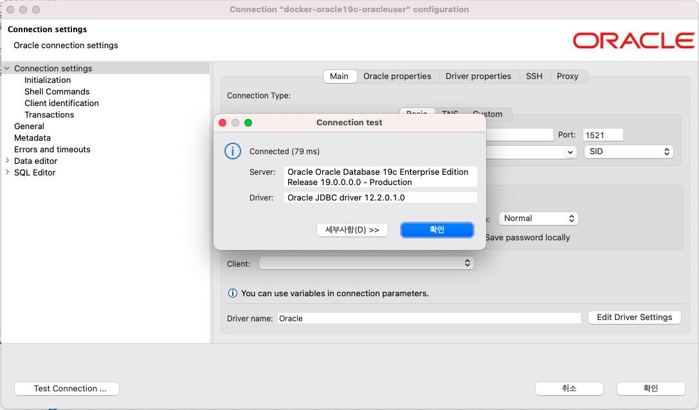

# [Oracle19c] MacOS docker 설치




JPA 실습을 위해서 테스트용 Oracle 데이터베이스가 필요하였습니다. 실제 프로젝트에서는 Oracle 12c를 많이 사용하겠지만, Oracle 12c의 Enterprise Edition이 이번에 `EOS` 가 되었습니다.

EOS를 확인해볼 수 있는 사이트는 다음과 같습니다. - [Oracle EOS 확인](https://www.oracle.com/support/lifetime-support/resources.html)

사이트에 접속하면 Oracle에서 제공하는 다양한 제품군에 대해서 서비스 지원에 관한 내용을 확인해볼 수 있습니다. 특히 Oracle Database의 경우, `Oracle Technology Products (PDF)` 에서 확인할 수 있습니다.



Oracle Database Releases의 Enterprise Edition 12.1 버전의 EOS가 2022.07에 끝나는 것을 확인할 수 있습니다.




그래서, Oracle 19c로 설치를 해보도록 하겠습니다.


## 환경

- OS : MacOS


## Oracle 19c 설치

[docker-hub](https://hub.docker.com/)에서 Oracle 19c 이미지를 검색하였습니다. 사람들이 많이 사용하는 `banglamon/oracle193db:19.3.0-ee` 이미지를 사용하였습니다. 해당 링크로 바로 가시려면 [banglamon/oracle193db](https://hub.docker.com/r/banglamon/oracle193db) 여기를 눌러주세요.


### Oracle Container Shell Script

설치한 docker shell script 다음과 같습니다.

```bash
#!/bin/bash

readonly CONFIG_PATH=/Users/lsh/Desktop/docker_home/config/oracle19c/oradata

docker run --name oracle19c 
           -p 1521:1521 
           -e ORACLE_SID=ORCLCDB 
           -e ORACLE_PDB=ORCLPDB1 
           -e ORACLE_PWD=qwer1234 
           -v ${CONFIG_PATH}:/opt/oracle/oradata 
           banglamon/oracle193db:19.3.0-ee
```


아래 명령어를 수행한 후 수십분의 시간이 필요합니다.

```bash
$ docker start oracle19c
```

설치 도중 54%에서 장기간 멈춰있다면 중단한 뒤 다시 `docker start oracle19c` 를 해볼 것을 추천드립니다. 실제로 첫 설치시 54%에서 멈춰서 중단한 후 다시 설치하니 설치가 되었습니다.


설치가 완료되면 다음과 같이 docker 상태를 확인할 수 있습니다.

```bash
$ docker ps
```

```
CONTAINER ID   IMAGE                             COMMAND                  CREATED        STATUS                  PORTS                                                 NAMES
f01e448d062d   banglamon/oracle193db:19.3.0-ee   "/bin/sh -c 'exec $O…"   46 hours ago   Up 31 hours (healthy)   0.0.0.0:1521->1521/tcp, :::1521->1521/tcp, 5500/tcp   oracle19c
```


### docker container 접속

sqlplus 접속을 하기 위해서 docker container 접속을 해보도록 하겠습니다. 다음 명령어를 통해서 접속할 수 있습니다.

```bash
$ docker exec -it oracle19c bash
```

다음과 같이 `CONTAINER ID` 로도 접속할 수 있습니다.

```
$ docker exec -it f01e448d062d bash
```


### sqlplus 접속

작업용 스키마, 권한 등을 생성하기 위해서 sqlplus를 접속하도록 하겠습니다.

```bash
$ sqlplus '/as sysdba'
```


공통 사용자 생성을 위해서 아래 DDL를 수행합니다.

```sql
ALTER SESSION SET "_ORACLE_SCRIPT"=true;
```


여기서는 사용자를 oracleuser로 만들고 패스워드는 oraclepassword로 지정하겠습니다.

```sql
create user oracleuser identified by oraclepassword;
grant connect, resource to oracleuser;
alter user oracleuser quota unlimited on users;
```

실제 쿼리 수행 모습입니다.




### 접속 테스트

해당 접속를 이용해서 커넥션을 진행해보도록 하겠습니다. 데이터베이스 도구는 [dbeaver](https://dbeaver.io/) 를 사용하였습니다.

아래 접속 정보를 설정한 후 `Test Connection` 를 선택하였습니다.




그러면 다음과 같이 Connection test 가 정상적으로 성공한 것을 확인할 수 있습니다.




## 정리

- 로컬 테스트용으로 손쉽게 Oracle19c 데이터베이스를 설치할 수 있습니다.


## 참고

- [Oracle Support](https://www.oracle.com/support/lifetime-support/resources.html)
- [banglamon/oracle193db](https://hub.docker.com/r/banglamon/oracle193db)
