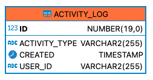
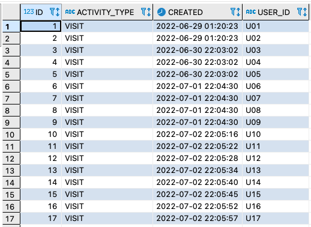
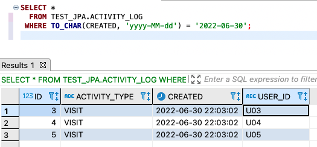

# [Oracle] localdatetime을 조회해보자


LocalDateTime으로 데이터베이스에 저장이 되었을 때 실제 사용자는 문자열로된 날짜를 입력하여서 해당 날짜 문자열을 데이터베이스에 조회하여 결과를 보여주는 요구사항이 있었습니다. 사실 너무도 간단한 내용이지만 정리해두고 까먹지 않기 위해서, 또는 까먹었다면 해당 블로그를 통해서 기억을 하기 쉽게 정리해두려고 합니다. 


## 객체 및 테이블 생성

실습을 위한 테스트 객체는 다음과 같습니다. 활동 로그를 기록하기 위한 테이블로, `sequence` 오브젝트를 사용한 대리키를 사용하고 있습니다. `@SequenceGenerator` 의 대한 자세한 내용은 다음 블로그를 통해서 확인해주시면 됩니다. 


```java
@Entity
@Table(schema = "test_jpa", name = "activity_log")
public class ActivityLog {
    @Id
    @SequenceGenerator(
            name = "log_seq_gen",
            sequenceName = "activity_seq",
            schema = "test_jpa",
            allocationSize = 1
    )
    @GeneratedValue(generator = "log_seq_gen")
    private Long id;
    @Column(name = "user_id")
    private String userId;
    @Column(name = "activity_type")
    private String activityType;
    private LocalDateTime created;
    
    // 생성자 및 Getter, Setter 메소드 생략
}
```


이를 통해서 생성한 데이터베이스객체는 다음과 같습니다.



샘플 데이터는 다음과 같이 생성하였습니다.




## 실습

### 특정 날짜 조회

문자열 날짜를 이용해서 조회하기 위해서는 오라클에서는  `TO_CHAR` 함수를 이용하면 됩니다. CREATED가  `2022-06-30` 의 날짜에 해당되는 데이터는 총 3개입니다.

```sql
SELECT * 
  FROM TEST_JPA.ACTIVITY_LOG
 WHERE TO_CHAR(CREATED, 'yyyy-MM-dd') = '2022-06-30';
```




추가로 범위 날짜 조회에 대해서 알아보고 가도록 하겠습니다.


### 범위 날짜 조회

범위를 구하기 위해서는 다음을 사용할 수 있습니다.

- `BETWEEN` 
- 부등호(`<`, `>`, `==`, `>=` , `<=`) 활용

실습을 위해서 `2022-06-30` 부터 `2022-07-01` 기간의 데이터를 조회해보도록 하겠습니다.


#### BETWEEN AND

```sql
SELECT *
  FROM TEST_JPA.ACTIVITY_LOG
 WHERE CREATED BETWEEN TO_DATE('2022-06-30', 'yyyy-MM-dd') AND TO_DATE('2022-07-02', 'yyyy-MM-dd'); 
```


#### 부등호

```sql
SELECT * 
  FROM TEST_JPA.ACTIVITY_LOG
 WHERE CREATED >= TO_DATE('2022-06-30', 'yyyy-MM-dd') AND CREATED <= TO_DATE('2022-07-02', 'yyyy-MM-dd'); 
```


2가지 방식 중 원하는 방식을 사용하면 되나, 많은 데이터를 다루면서 성능의 신경을 쓴다면 부등호 방식이 더 좋다고 합니다.

부등호 방식이 성능의 더 좋은 내용에 대해서 추후 다루도록 하겠습니다.


## 마무리

- 특정 문자열 날짜를 조회하기 위해서는 `TO_CHAR` 를 사용합니다.
- 범위 날짜 조회를 위해서는 `BETWEEN AND` 또는 `부등호` 를 사용합니다.
  - 많은 데이터를 다루거나 성능을 좀 더 신경쓴다면 `부등호` 가 더 좋습니다.