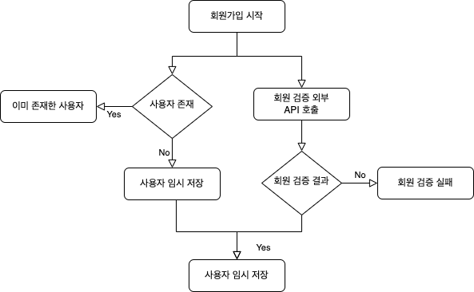
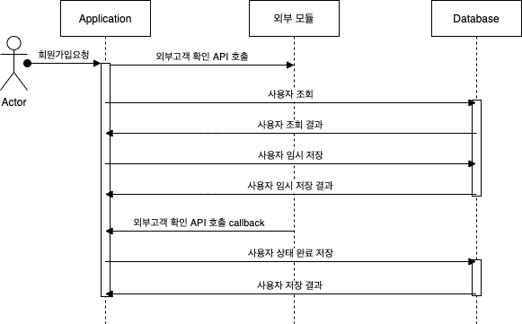

# [Spring] 비동기(@Async) API 처리 예시


비동기 처리를 위한 API 설계를 위해서 개념과 관련된 내용에 정리를 진행한 후 Spring boot를 이용하여서 비동기 처리를 위한 방식에 대해서 예제를 진행하면서 정리해보도록 하겠습니다.

먼저, 동기와 비동기에 대한 개념부터 정리해보도록 하겠습니다.


## 동기와 비동기

- 비동기는 데이터의 요청과 결과과 동시에 일어나지 않는다는 것을 의미합니다.

- 동기는 데이터의 요청과 결과가 한 자리에서 동시에 일어나는 것을 이야기합니다.


개념적인 부분도 의미를 파악해볼순 있겠지만 예시를 들어서 좀 더 설명을 해보도록 하겠습니다.


### 비동기

커피숍에서 커피를 마시기 위해서 커피숍에 들어갔습니다. 커피를 주문받는 직원과 커피를 만드는 바리스타 직원이 있습니다. 커피를 주문받는 직원에게 커피를 주문하니 진동벨을 주었고 주문받은 커피를 바리스타 직원에게 요청하였습니다. 

- 커피를 주문받는 직원은 커피 요청 작업을 바리스타 직원에게 요청하고 기다리지 않습니다.
- 그렇기에 커피를 주문받는 직원은 다른 손님의 커피 주문을 받을 수 있습니다.


비동기 처리에 대해서 알아보았으니 다음으로는 동기에 대해서 알아보도록 하겠습니다.


### 동기

커피숍에서 커피를 마시기 위해서 커피숍에 들어갔습니다. 커피를 주문받는 직원이 한명 있습니다. 이 직원은 바리스타 자격증까지 보유하여서 커피도 직접 만들었습니다. 커피를 주문받는 직원에게 커피를 주문하니 직접 주문받은 커피를 만들기 시작하였습니다. 만드는 도중 손님이 한분더 오셔서 뒤에 줄을 섰습니다. 뒤에 오신 분은 자기 주문을 받아주길 기다리고 있었습니다.

- 커피를 주문받는 직원이 주문받은 커피를 직접 만들때까지 손님들은 기다려야 합니다.

- 주문받은 커피를 만들때까지 커피를 주문받는 직원에게 주문을 할 수 없습니다.


동기와 비동기에 대한 개념적인 부분에 대해서 알아보았습니다. 위 내용만 보고 비동기는 왜 필요할지 생각이 드셨나요?


### 비동기는 왜 필요할까?

성능의 향상을 위해서 입니다. 대부분의 어플리케이션이 서버와의 통신(네트워크 작업)으로 이루어져있기 때문입니다. 


동기와 비동기의 내용이랑 혼돈하는 직렬 처리와 병렬 처리에 대해서 알아보고 넘어가도록 하겠습니다.


## 직렬 처리와 동시 처리

작업 처리 방식에 따라서 직렬처리와 동시처리로 구분됩니다. 이 부분도 예시를 이용해서 정리를 해보도록 하겠습니다.


### Serial(직렬처리)

커피숍에서 커피를 마시기 위해서 커피숍에 들어갔습니다. 커피를 주문받는 직원이 1명이 있었으며, 커피를 만드는 바리스타 직원이 2명 있습니다. 커피를 주문받는 직원에게 커피를 주문하니 A 바리스타 직원에게 커피 제조 요청이 들어갔습니다. 실력이 좋아서 모든 커피 제조 요청이  A 바리스타에게만 전달됩니다.

- 커피를 주문받는 직원이 분산처리 시킨 주문 요청을 A 바리스타가 모든 커피를 제조합니다.
- 예시를 설명하기 위해서 A 바리스타가 모든 커피를 제조하지만, 실제로는 작업의 순서가 정해져있는 것을 처리하는데 직렬처리가 사용됩니다.


### Concurrent(동시처리)

커피숍에서 커피를 마시기 위해서 커피숍에 들어갔습니다. 커피를 주문받는 직원이 1명이 있었으며, 커피를 만드는 바리스타 직원이 3명 있습니다. 커피를 주문받는 직원에게 10잔의 커피를 주문하니 3명의 바리스타 직원에게 커피 제조 요청이 들어갔습니다.

- 커피를 주문받는 직원이 분산처리 시킨 주문 요청을 모든 바리스타가 커피를 제조합니다.


위 내용만 보면 동시 처리가 상당히 좋아보입니다. 그렇다면 동시 처리가 무조건 좋은 것일까요? 


### 동시 처리는 무조건 좋은것인가?

무조건 동시 처리로 진행하기보다는 상황에 맞게 적절한 선택을 해서 진행해야 합니다.

- 만약 작업에 순서가 필요한 작업이 있다면 그것은 직렬처리가 필요합니다.
- 각자 독립적이지만 유사한 여러개의 작업을 처리할때 동시처리를 사용할 수 있습니다.


## 비동기 예제

소스를 활용하여서 비동기 API 처리를 진행하는 예제에 대해서 알아보도록 하겠습니다.


### 개발 환경

- Spring Boot : 2.7.1
- Java : 11
- IDE : Intellij


모든 소스는 Github 통해서 확인이 가능합니다. - [소스 바로가기](https://github.com/codeleesh/study-code/tree/main/spring-boot-async)


### 설계

회원가입을 진행하는 Flow가 있습니다. 회원가입의 순서는 다음과 같습니다. 비동기 테스트를 위함이라서 예외처리는 고려하지 않았습니다.

- 데이터베이스를 조회하여 사용자가 존재하는지 먼저 체크합니다.
- 사용자가 존재하지 않으면 데이터베이스의 사용자를 임시 저장합니다.
- 회원 검증을 위해 외부 API를 호출하여 검증 결과를 응답 받습니다. 이 작업은 시간이 다소 소요됩니다.
  - 테스트를 위해서 `1000ms` 시간이 소요된다고 가정하겠습니다.
- 회원 검증 결과가 인증 완료(`true`) 인 경우 사용자를 최종 저장합니다.


`Flow Chart` 는 다음과 같습니다. 




`Sequence Diagram` 은 다음과 같습니다.





### 소스 내용

web 을 사용해야 하기에 다음 라이브러리를 추가하였습니다.


#### build.gradle

```groovy
implementation 'org.springframework.boot:spring-boot-starter-web'
```


#### AsyncConfig

비동기 설정을 위해서 `AsyncConfig` 설정 파일을 만들고 `@EnableSync`을 설정하고 관련 설정을 한곳에서 관리합니다.

```java
@EnableAsync
@Configuration
public class AsyncConfig {

    @Bean
    public ThreadPoolTaskExecutor threadPoolTaskExecutor() {
        ThreadPoolTaskExecutor executor = new ThreadPoolTaskExecutor();
        executor.setCorePoolSize(5);
        executor.setMaxPoolSize(30);
        executor.setQueueCapacity(50);
        executor.setThreadNamePrefix("LSH-ASYNC-");
        executor.initialize();
        return executor;
    }
}
```


#### CertService

비동기로 처리할 API에 대해서 `@Async` 어노테이션을 붙여줍니다. 그리고 `CallBack` 처리를 해야되기 때문에 `CompletableFuture` 를 응답으로 지정하였습니다. 여기서`CallBack` 이란 함수가 끝나고 난 뒤에 실행하는 함수를 말하고 있습니다. 외부 고객 확인 API호출 결과의 따라서 사용자 최종 저장 API를 호출해야 하기때문에 `CallBack` 이 필요한 상황입니다.

```java
@Slf4j
@Service
public class CertService {

    @Async
    public CompletableFuture<String> certProcess(final long memberId) {

        String result = "false";
        try {
            Thread.sleep(500);
            result = "true";
        } catch (InterruptedException ie) {
            log.error("CertService::certProcess::InterruptedException {}", ie);
            Thread.currentThread().interrupt();
        }
        return CompletableFuture.completedFuture(result);
    }
}
```


#### MemberService

사용자 회원 가입을 위해서 회원 검증 외부 API 호출, 데이터베이스 사용자 조회 및 저장 등을 진행하는 서비스입니다.

```java
@Slf4j
@Service
@RequiredArgsConstructor
public class MemberService {

    private final MemberRepository memberRepository;

    // 외부 API호출
    private final CertService certService;

    public MemberResponse certMember(final MemberRequest memberRequest) {

        log.info("대기응답이 긴 Thread 호출전 - 1");
        final CompletableFuture<String> certResult = certService.certProcess(memberRequest.getMemberId());
        certResult.thenAccept(
                result -> {
                    log.info("대기응답이 긴 Thread 응답 결과 {}", result);
                    if ("false".equals(result)) {
                        log.warn("Cert 인증 실패");
                        return ;
                    }
                    log.info("사용자 최종 상태 변경 호출전 - 4");
                    memberRepository.registerById(memberRequest.getMemberId());
                    log.info("사용자 최종 상태 변경 호출전 - 4");
                    log.info("대기응답이 긴 Thread 호출 후 - 1");
                }
        );

        log.info("대기응답이 짧은 사용자 조회 호출전 - 2");
        final Member findMember = memberRepository.findById(memberRequest.getMemberId());
        log.info("대기응답이 짧은 사용자 조회 호출후 - 2");

        if (Objects.nonNull(findMember)) {
            throw new IllegalArgumentException();
        }

        log.info("대기응답이 짧은 사용자 저장 호출전 - 3");
        final Member saveMember = memberRepository.save(new Member(memberRequest.getMemberName()));
        log.info("대기응답이 짧은 사용자 저장 호출후 - 3");

        return new MemberResponse().toEntity(saveMember);
    }
}
```


### 호출 결과

#### http 호출 예시

```http
POST http://localhost:8080/v1/member/cert
Content-Type: application/json

{
  "memberId" : 1,
  "memberName" : "sangho"
}
```


#### 로그 결과

```
[2022.07.23 03:29:40.284] [INFO ] [http-nio-8080-exec-1] [m.l.m.a.MemberService] 대기응답이 긴 Thread 호출전 - 1
[2022.07.23 03:29:40.297] [INFO ] [http-nio-8080-exec-1] [m.l.m.a.MemberService] 대기응답이 짧은 사용자 조회 호출전 - 2
[2022.07.23 03:29:40.298] [INFO ] [http-nio-8080-exec-1] [m.l.m.a.MemberService] 대기응답이 짧은 사용자 조회 호출후 - 2
[2022.07.23 03:29:40.298] [INFO ] [http-nio-8080-exec-1] [m.l.m.a.MemberService] 대기응답이 짧은 사용자 저장 호출전 - 3
[2022.07.23 03:29:40.299] [INFO ] [http-nio-8080-exec-1] [m.l.m.a.MemberService] 대기응답이 짧은 사용자 저장 호출후 - 3
[2022.07.23 03:29:40.808] [INFO ] [LSH-ASYNC-1] [m.l.m.a.MemberService] 대기응답이 긴 Thread 응답 결과 true
[2022.07.23 03:29:40.811] [INFO ] [LSH-ASYNC-1] [m.l.m.a.MemberService] 사용자 최종 상태 변경 호출전 - 4
[2022.07.23 03:29:40.812] [INFO ] [LSH-ASYNC-1] [m.l.m.a.MemberService] 사용자 최종 상태 변경 호출전 - 4
[2022.07.23 03:29:40.812] [INFO ] [LSH-ASYNC-1] [m.l.m.a.MemberService] 대기응답이 긴 Thread 호출 후 - 1
```

- 대기응답이긴 API를 호출한 후 대기하지 않고 사용자 조회 및 저장 API를 호출합니다.
- 대기응답이긴 API 응답이 요청되면 결과에 따라서 사용자 최종 상태 변경 API를 호출합니다.


## 정리

- `AsyncConfig` 설정을 이용하여 비동기 설정을 진행할 수 있습니다.
- 비동기 진행시 장점은 응답시간이 긴 API에 대해서 기다리지 않고 다른 작업을 진행할 수 있습니다.
  - kafka, rabbitMq 등 message queue를 이용하여서도 비동기 처리를 할 수 있습니다.