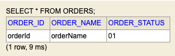
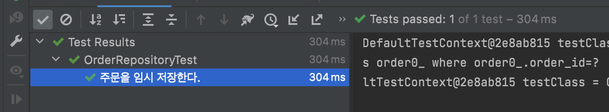

# [JPA] Converter 활용하기


`Converter` 활용을 통한 내용을 일전에 작성한적이 있었습니다. - [[리팩토링] 코드 JPA Converter](https://lovethefeel.tistory.com/80?category=912947)

두번째 내용으로 `@Enumerated` 를 활용할 수 없을때 `@Converter` 를 활용하는 방법에 대해서 공유드리려고 합니다.


## Jpa에서 Enum 활용

하나의 필드가 요소, 멤버라 불리는 명명된 값의 집합을 이루는 상수 역할을 하는 식별자가 필요할 때  `enum`과 `@Enumerated` 를 활용하였습니다.

예를 들어, 아이템을 저장하는 테이블에는 아이템의 상태를 관리하는 필드가 있습니다. `Status` 라는 필드는 활성화(`ENABLE`)와 비활성화(`DISABLE`) 상태를 갖고 있습니다. 

```java
public enum Status {
    ENABLE, DISABLE
}
```

그래서 해당 필드는 `@Enumerated(EnumType.STRING)` 을 이용하여서 처리하였습니다.

```java
@Entity
@Getter
@Setter
@NoArgsConstructor(access = PROTECTED)
public class Item {
    @Id
    @GeneratedValue(strategy = IDENTITY)
    private Long id;

    @Column
    private String name;

    @Column
    @Enumerated(EnumType.STRING)
    private Status status;
    
    ...
}
```

그래서 실제 데이터베이스에는 enum의 값인 `ENABLE`, `DISABLE` 으로 저장이 됩니다.


## 문제 발생

현재 진행중인 프로젝트에서도 사용하려고 하였지만 해당 부분을 사용하지 못하였습니다. 

테이블 설계 후 DBA 담당자와 미팅시 데이터베이스의 저장되는 코드는 의미없는 코드로 저장이 되었으면 한다고 하였습니다. 의미없는 코드로 설정한 부분들은 여기서는 중요한 내용이 아니기 때문에 다루지 않겠습니다.

그래서 아래와 같이 변경하여서 사용해볼수도 있을 것 같았습니다.

```java
public enum Status {
    01("ENABLE"), 02("DISABLE")
}
```

하지만 *개발 진행시 `01`, `02` 의 값이 직관적이지 않고 해당 코드를 읽기 위해서는 부가적인 정보를 확인해야 합니다.*

즉, 데이터베이스에서는 의미 없는 코드인 `01`, `02` 로 저장이 되어야 하고, 데이터베이스에서 조회된 값은 자바에서 직관적인 표현으로 `ENABLE`, `DISABLE` 을 사용하고 싶습니다.

그렇다면, 어떻게 해야 할까요? `Converter` 를 통해서 해결할 수 있습니다.


## 개발 환경

- Spring Boot : 2.6.4
- Java : 11
- IDE : Intellij


모든 소스는 Github 통해서 확인이 가능합니다. - [소스 바로가기](https://github.com/codeleesh/study-code/tree/main/stream)


### Converter 활용

`Converter` 는 엔티티의 데이터를 변환해서 데이터베이스에 저장할 수 있습니다.

예를 들어, 주문을 저장하는 도메인이 있고, 주문은 여러 상태를 가지고 있다고 가정하겠습니다. 주문 상태는 `임시저장`, `주문진행중`, `주문완료` 상태를 갖고 있으며, 의미 없는 코드를 가져야 하기 때문에 `01`, `02`, `03` 의 값을 갖게 됩니다.

해당 코드를 다음과 같이 나타낼 수 있습니다.

```java
@Getter
public enum OrderStatus {

    TEMPSAVE("01", "임시저장"),
    INPROGRESS("02", "주문진행중"),
    COMPLETED("03", "주문완료");

    private String typeCode;
    private String typeName;

    OrderStatus(final String typeCode, final String typeName) {
        this.typeCode = typeCode;
        this.typeName = typeName;
    }

    private static final Map<String, String> orderStatusMap = Collections.unmodifiableMap(Stream.of(values())
                    .collect(Collectors.toMap(OrderStatus::getTypeCode, OrderStatus::name)));

    public static OrderStatus from(final String typeCode) {

        return OrderStatus.valueOf(orderStatusMap.get(typeCode));
    }
}
```


`Converter` 를 통해서 변환을 하기 위해서는 Converter용 클래스를 만들어야 합니다. 또한  `AttrributeConverter` 인터페이스를 구현해야 합니다.그리고 제네릭에 현재 타입과 변환할 타입을 지정해야 합니다. 해당 인터페이스를 구현해야할 2개의 메소드가 있습니다.

```java
@Converter
public class OrderStatusConverter implements AttributeConverter<OrderStatus, String> {

    @Override
    public String convertToDatabaseColumn(final OrderStatus orderStatus) {

        return orderStatus.getTypeCode();
    }

    @Override
    public OrderStatus convertToEntityAttribute(final String hobby) {

        return OrderStatus.valueOf(hobby);
    }
}
```

- `convertToDatabaseColumn` 메소드는 해당 필드에 신규 생성 또는 수정으로 인하여 저장이 필요할때 사용되며, 메소드에 반환값은 데이터베이스에 저장됩니다.
- `convertToEntityAttribute` 메소드는 해당 필드를 조회하여서 엔티티의 데이터로 변환되며, 메소드에 반환값은 엔티티에서 사용하는 타입입니다. 


Enum과 Converter를 작성하였다면, 해당 부분을 적용하기 위해서는 `Entity` 의 해당 필드에 적용하면 됩니다.

```java
@Getter
@Entity
@Table(name = "orders")
public class Order {

    @Id
    @Column(name = "order_id")
    private String orderId;

    @Column(name = "order_name")
    private String orderName;

    @Column(name = "order_status")
    @Convert(converter = OrderStatusConverter.class)
    private OrderStatus orderStatus;
    
    // business logic
}
```


### 데이터베이스 저장

실제 데이터베이스의 저장된 결과는 다음과 같습니다.



의미없는 코드인 `01` 이 저장된 것을 확인할 수 있습니다.


### 데이터베이스 조회

데이터베이스에서 해당 주문을 조회하여서 상태값을 확인해보고 싶습니다. 우리가 예상한데로 의미없는 코드값이 아닌 직관적인 키가 나와야 합니다.

```java
@DataJpaTest
@AutoConfigureTestDatabase(replace = NONE)
class OrderRepositoryTest {

    @Autowired
    OrderRepository orderRepository;

    @DisplayName("주문을 임시 저장한다.")
    @Test
    void save_temp_order() {

        final Order entity = Order.createEntity("ORDER001", "주문", OrderStatus.TEMPSAVE);

        final Order saveOrder = orderRepository.save(entity);

        assertThat(saveOrder.getOrderStatus()).isEqualTo(OrderStatus.TEMPSAVE);
    }
}
```

해당 테스트의 결과는 다음과 같이 성공하게 됩니다.




### 옵션 정리

`@Converter` 의 옵션은 다음과 같습니다.

- `autoApply`
  - 모든 `OrderStatus` enum 타입에 컨버터를 적용합니다.
  - 기본값은 `false` 입니다.


`@Convert` 의 옵션은 다음과 같습니다.

- `converter`
  - 사용할 컨버터를 지정합니다.
- `attributeName` 
  - 컨버터를 적용할 필드를 지정합니다.
- `disableConversion` 
  - 글로벌 컨버터나 상속 받은 컨버터를 사용하지 않습니다.
  - 기본값은 `false` 입니다.


## 정리

- `Converter` 는 엔티티의 데이터를 변환해서 데이터베이스에 저장할 수 있으며, 데이터베이스의 데이터를 변환해서 엔티티로 변환할 수 있습니다.
  -   `AttrributeConverter` 인터페이스를 구현해야 합니다.


## 참조

- [Legacy DB의 JPA Entity Mapping (Enum Converter 편)](https://techblog.woowahan.com/2600/)