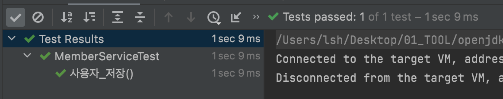
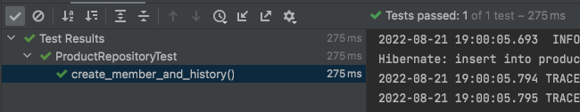

# [DataBase] 이력 구현해보기


데이터베이스를 사용하면서 이력 관리를 위해서 이력 테이블을 사용하는 일들이 많이 있습니다. 먼저 이력 관리에 대해서 알아보고 이력의 종류는 어떤것이 있는지도 알아보겠습니다. 그리고 마지막으로 이력 관리를 위한 구현 방법에 대해서 알아보겠습니다.


## 이력 관리

데이터는 현재의 프로세스만 처리하고 버리는 것이 아니라 각 상태의 따른 데이터를 처리 및 기록합니다.

예를 들어, 주문 상태의 따른 이력 정보가 있다고 가정하였을 때, 이 주문 정보는 임시저장, 주문 등록, 주문 접수, 진행 중, 주문 완료, 주문 취소 등 각각의 상태에 따라 이력이 관리 됩니다. 이렇게 각 상태의 대한 이력을 기록하고 관리하는 것을 이력 관리라고 합니다.


### 이력 관리 대상 선정

이력 관리를 한다고 하면 하지 않았을 때와 비교하였을 때 많은 비용이 들어가게 됩니다. 따라서 이력 관리가 필요할 때는 판단을 잘하여야 하는데, 다음과 같은 질문에 대해서 검증을 해보는 것도 좋습니다.

- 변경 내역을 감시할 필요가 있는가?
- 시간의 경과에 따라 데이터가 변할 수 있는가?
- 시간의 경과에 따라 관계가 변할 수 있는가?
- 과거의 데이터를 조회할 필요가 있는가?
- 과거 버전을 보관할 필요가 있는가?


### 이력 관리 형태

데이터베이스에서 이력관리를 하는 형태는 두가지가 있습니다.

#### 시점 이력

시점 이력이란, 특정 정보가 변경 되면, 변경된 정보가 변경된 시간을 기록함으로써, 어느 시점에 어느 값으로 변경되었다라는 정보를 관리한다. 시점 이력은 특정시점의 데이터를 추출하고자 할 경우에 불필요한 작업을 수행하게 되므로 주의하여야 한다.

#### 선분 이력

각 정보의 특정 기간 동안 유효한 정보를 관리한다. 바뀐 정보들의 이력을 다 갖고 있어야 하는 상황이라면 선분 이력으로 관리하는 것이 효율적이다.


## 이력 적용해보기

주문 진행 상태의 대한 이력을 적용하기전 주문 진행 상태의 이력이 필요한 부분을 작성해보았습니다.

- 주문의 변경되는 상태를 기록하여 추후 문제가 발생하였을시 기록 확인용
- 각 주문의 진행 상태의 대한 통계 데이터 추출시 활용

그리고 스스로 검증해본 내용에 대해서 답변을 적어보도록 하겠습니다.

- 변경 내역을 감시할 필요가 있는가?
  - `주문의 변경되는 상태를 기록할 필요가 있음`
- 시간의 경과에 따라 데이터가 변할 수 있는가?
  - `시간이 경과된다면 주문의 상태가 변경할 수 있음`
- 시간의 경과에 따라 관계가 변할 수 있는가?
  - `관계가 변하진 않음`
- 과거의 데이터를 조회할 필요가 있는가?
  - `유지보수 차원에서 주문의 상태를 조회할 필요 있음`
- 과거 버전을 보관할 필요가 있는가?
  - `유지보수 차원에서 주문의 상태 조회 및 통계 데이터 추출을 위해서 필요할 수 있음`


이력을 적용해보는 방법은 크게 3가지를 생각하였습니다.

- 직접 이력 테이블 저장
- `@EntityListener`
- `ApplicationEventPublisher` 


### 개발 환경

- Spring Boot : 2.7.2
- Java : 11
- IDE : Intellij


모든 소스는 Github 통해서 확인이 가능합니다. - [소스 바로가기](https://github.com/codeleesh/study-code/tree/main/jpa-history)


### 직접 이력 테이블 저장

회원 정보 등록 및 수정하는 API가 있습니다.

#### 도메인 정보

사용자 도메인 정보는 다음과 같습니다.

```java
@Getter
@Entity
@EntityListeners(AuditingEntityListener.class)
public class Member {

    @Id
    @Column(name = "member_id")
    @GeneratedValue(strategy = GenerationType.IDENTITY)
    private Long id;

    @Column(name = "member_name")
    private String memberName;

    @CreatedDate
    @Column(updatable = false)
    private Timestamp created;

    @Column(updatable = false)
    private String createBy;

    @LastModifiedDate
    private Timestamp updated;

    private String updateBy;
  
    // business logic
}
```

사용자의 이력 정보를 저장하는 도메인은 다음과 같습니다.

```java
@Entity
@ToString
@AllArgsConstructor(access = PRIVATE)
@EntityListeners(AuditingEntityListener.class)
public class MemberHistory {

    @Id
    @Column(name = "member_history_id")
    @GeneratedValue(strategy = GenerationType.IDENTITY)
    private Long id;

    @Column(name = "member_id")
    private Long memberId;

    @Column(name = "member_name")
    private String memberName;

    @Column(name = "comment")
    private String comment;

    @CreatedDate
    @Column(updatable = false)
    private Timestamp created;

    @Column(updatable = false)
    private String createBy;
  
    // business logic
}
```


#### 서비스 로직

로직은 간단합니다. 같은 트랜잭션안에 묶어서 로직 처리만 해주면 됩니다.

```java
@Slf4j
@Service
@RequiredArgsConstructor
@Transactional(readOnly = true)
public class MemberService {

    private final MemberRepository memberRepository;
    private final MemberHistoryRepository historyRepository;

    @Transactional
    public MemberResponse createMember(final MemberRequest memberRequest) {

        final Member saveMember = memberRepository.save(memberRequest.toCreateEntity());
        final MemberHistory memberHistory = MemberHistory.fromEntity(saveMember, "신규 저장");
        historyRepository.save(memberHistory);

        return MemberResponse.fromResponse(saveMember);
    }
}
```

- `MemberRepository` 를 통해서 사용자 정보를 저장합니다.
- 그 후 `MemberHistoryRepository` 를 통해서 사용자 이력 정보를 저장합니다.


#### 테스트 진행

사용자 신규 저장 테스트를 진행해보도록 하겠습니다.

```java
@ExtendWith(MockitoExtension.class)
class MemberServiceTest {

    @Mock
    private MemberRepository memberRepository;

    @Mock
    private MemberHistoryRepository historyRepository;

    @InjectMocks
    private MemberService memberService;

    @Test
    void 사용자_저장() {

        final MemberRequest 사용자_요청 = MemberRequest.from("lsh");
        final Timestamp 현재시간 = Timestamp.valueOf("2022-08-21 14:00:00.000");
        final Member 사용자_저장_결과 = Member.ofCreate(1L, "lsh", 현재시간, "lah", 현재시간, "lsh");
        final MemberHistory 사용자_이력_저장_결과 = MemberHistory.fromEntity(1L, 사용자_저장_결과, "신규 저장");

        when(memberRepository.save(any())).thenReturn(사용자_저장_결과);
        when(historyRepository.save(any())).thenReturn(사용자_이력_저장_결과);

        memberService.createMember(사용자_요청);

        verify(memberRepository, times(1)).save(any());
        verify(historyRepository, times(1)).save(any());

        final InOrder inOrder = inOrder(memberRepository, historyRepository);
        inOrder.verify(memberRepository).save(any());
        inOrder.verify(historyRepository).save(any());
    }
}
```

- Mock 객체를 활용하여서 메소드를 호출하는지의 대해서 테스트를 진행해보았습니다.
-  `memberRepository` 와 `historyRepository` 가 순차적으로 실행이 된것을 테스트로 확인하였습니다.




실제 데이터를 확인하는 방법은 `@SpringBootTest` , 애플리케이션 구동 후 http, postMan 활용 등이 있을 것입니다.

소스에는 http를 활용한 예시가 있어서 생략하겠습니다.


#### 특징

- 사용자 저장 및 이력 저장에 대한 로직이 한곳에 있어서 로직을 보기가 편합니다.


다음으로는 `@EntityListener` 를 활용하여 이력을 저장하는 방법을 알아보도록 하겠습니다.


### `@EntityListener` 를 활용한 저장

먼저 EntityListerner에 대해서 알아보고 넘어가겠습니다.


#### @EntityListener 란?

Listerner는 이벤트를 관찰하고 있다가 해당 이벤트가 발생하면 특정 동작을 진행합니다. 여기서는 상품이 신규로 저장이 되기전에(insert method 호출되기전) 상품 이력 테이블에 저장을 하는 메소드를 호출합니다.

JPA에서는 7가지 이벤트를 제공합니다.

- `@PrePersist`
  - persist() 메소드를 호출해서 엔티티를 영속성 컨텍스트에 관리하기 직전에 호출됩니다. 식별자 생성 전략을 사용한 경우 엔티티에 식별자는 아직 존재하지 않습니다. 새로운 인스턴스를 merge할 때도 수행됩니다.
- `@PreUpdate`
  - flush 또는 commit을 호출해서 엔티티를 데이터베이스에 수정하기 직전에 호출됩니다.
- `@PreRemove`
  - remove() 메소드를 호출해서 엔티티를 영속성 컨텍스트에서 삭제하기 직전에 호출됩니다. 또한 삭제 명령어로 영속성 전이가 일어날 때도 호출됩니다. orphanRemoval에 대해서는 flush 또는 commit 시에 호출됩니다.
- `@PostPersist `
  - flush 또는 commit을 호출해서 엔티티를 데이터베이스에 저장한 직후에 호출됩니다. 식별자가 항상 존재합니다. 참고로 식별자 생성 전략이 IDENTITY면 식별자를 생성하기 위해 persist() 를 호출하면서 데이터베이스에 해당 엔티티를 저장하므로 이때는 persist()를 호출한 직후에 바로 PostPersist가 호출됩니다.
- `@PostUpdate `
  - flush 또는 commit을 호출해서 엔티티를 데이터베이스에 수정한 직후에 호출됩니다.
- `@PostRemove`
  - flush 또는 commit을 호출해서 엔티티를 데이터베이스에 삭제한 직후에 호출됩니다.
- `@PostLoad`
  - 엔티티가 영속성 컨텍스트에 조회된 직후 또는 refresh를 호출한 후(2차 캐시에 저장되어 있어도 호출)


#### 이벤트 적용 위치

이벤트는 엔티티에서 직접 받거나 별도의 리스너를 등록해서 받을 수 있습니다.

- 엔티티에 직접 적용
- 별도의 리스너 등록
- 기본 리스너 사용


#### 리스너 호출 순서

여러 리스너를 등록했다면, 이벤트 호출 순서를 알고 있다면 좋습니다.

- 기본 리스너
- 부모 클래스 리스너
- 리스너
- 엔티티


#### 리스너 무시 설정

기본 리스너 무시 및 상위 클래스 이벤티 리스너 무시 등을 설정할 수 있습니다.

- `@ExcludeDefaultListeners`
- `@ExcludeSuperClassListerners` 


이제 실제 예시를 통해서 알아보도록 하겠습니다. 여기 상품 정보를 관리하는 API가 있습니다.


#### 도메인

아래는 상품 정보를 저장 및 관리하는 도메인과 그 이력 정보를 저장 및 관리하는 도메인입니다.

```java
@Getter
@Entity
@ToString
@AllArgsConstructor(access = PRIVATE)
@EntityListeners({ProductListeners.class, AuditingEntityListener.class})
public class Product {

    public static final String SYSTEM = "SYSTEM";
    @Id
    @Column(name = "product_id")
    @GeneratedValue(strategy = GenerationType.IDENTITY)
    private Long id;

    @Column(name = "product_name")
    private String productName;

    @CreatedDate
    @Column(updatable = false)
    private Timestamp created;

    @Column(updatable = false)
    private String createBy;

    @LastModifiedDate
    private Timestamp updated;

    private String updateBy;
    
    // business logic
}
```

```java
@Entity
@ToString
@AllArgsConstructor(access = PRIVATE)
@EntityListeners(AuditingEntityListener.class)
public class ProductHistory {

    @Id
    @Column(name = "product_history_id")
    @GeneratedValue(strategy = GenerationType.IDENTITY)
    private Long id;

    @Column(name = "product_id")
    private Long productId;

    @Column(name = "product_name")
    private String productName;

    @Column(name = "comment")
    private String comment;

    @CreatedDate
    @Column(updatable = false)
    private Timestamp created;

    @Column(updatable = false)
    private String createBy;
    
    // business logic
}
```


이벤트 적용은 별도의 리스너를 생성하여서 추가하였습니다. 

```java
@Slf4j
public class ProductListeners {

    @PrePersist
    public void productInsert(final Product product) {

        final ProductHistoryRepository historyRepository = (ProductHistoryRepository) BeanUtils.getBean(ProductHistoryRepository.class);
        log.info("Product Insert product {}", product);

        final ProductHistory productHistory = ProductHistory.fromEntity(product, "신규 저장");
        historyRepository.save(productHistory);
        log.info("ProductHistory Insert productHistory {}", productHistory);
    }
}
```

- 저장 및 수정에 대해서만 이벤트 적용을 위해서 `@PrePersist` , `@PreUpdate` 를 적용하였습니다.

- Listener의 경우 Spring Bean이 아니기 때문에 `ProductHistoryRepository` Bean을 찾아야 합니다.
- Spring Bean을 찾는 유틸 메소드를 만들어서 `ProductHistoryRepository` Bean을 찾을 수 있습니다.


Spring에서 제공하는 `ApplicationContextProvider` 를 이용해서 Bean을 찾을 수 있습니다.

```java
public class BeanUtils {

    public static Object getBean(final Class clazz) {

        final ApplicationContext applicationContext = ApplicationContextProvider.getApplicationContext();
        return applicationContext.getBean(clazz);
    }

    public static Object getBean(final String beanName) {

        final ApplicationContext applicationContext = ApplicationContextProvider.getApplicationContext();
        return applicationContext.getBean(beanName);
    }

    protected BeanUtils() {}
}
```


#### 서비스 로직

로직은 더 간단해졌습니다.

```java
@Slf4j
@Service
@RequiredArgsConstructor
@Transactional(readOnly = true)
public class ProductService {

    private final ProductRepository productRepository;

    @Transactional
    public ProductResponse createProduct(final ProductRequest productRequest) {

        final Product saveProduct = productRepository.save(productRequest.toCreateEntity());

        return ProductResponse.fromResponse(saveProduct);
    }
}
```

- `ProductRepository` 를 통해서 상품 정보를 저장합니다.
- 저장시 `@EntityListener` 를 통해 상품 이력이 저장됩니다.


#### 테스트

```java
@SpringBootTest
class ProductRepositoryTest {

    @Autowired
    private ProductRepository productRepository;
    @MockBean
    private ProductHistoryRepository historyRepository;

    @Test
    @Transactional
    void create_member_and_history() {

        final Product product = Product.fromCreate("아이템");

        final Product saveProduct = productRepository.save(product);

        assertThat(saveProduct).isEqualTo(product);

        verify(historyRepository, times(1)).save(any());
    }
}
```

- `ProductRepository` 의 save를 실행한 후 `ProductHistoryRepository`  실행 여부 검증을 하였습니다.
- 간편하게 진행하기 위해 `@SpringBootTest` 를 이용하여 빈의 대한 의존성을 주입하였습니다.




테스트가 실행된 로그를 보시면 product 테이블의 데이터를 생성하고 ProductListeners를 통해서 ProductHistory의 데이터를 생성하는 것을 확인할 수 있습니다.

```
Hibernate: insert into product (product_id, create_by, created, product_name, update_by, updated) values (default, ?, ?, ?, ?, ?)
2022-08-21 19:00:05.814  INFO 24962 --- [           main] m.l.j.product.domain.ProductListeners    : Product Insert product Product{id=5, productName='아이템', created=2022-08-21 19:00:05.74432, createBy='SYSTEM', updated=2022-08-21 19:00:05.74432, updateBy='SYSTEM'}
2022-08-21 19:00:05.856  INFO 24962 --- [           main] m.l.j.product.domain.ProductListeners    : ProductHistory Insert productHistory ProductHistory{id=null, productId=5, productName='아이템', comment='신규 저장', created=null, createBy='null'}
```


#### 특징

- 상품 저장 및 수정 로직이 여러 곳에 있을 경우 해당 로직을 모두 찾아서 이력을 남기는 것은 비효율적인데, 엔티티 리스너를 이용하면 효과적으로 이력을 남길 수 있습니다.


다음으로는 `ApplicationEventPublisher` 를 활용하여 이력을 저장하는 방법을 알아보도록 하겠습니다.


### `ApplicationEventPublisher` 를 활용한 저장

먼저 ApplicationEventPublisher에 대해서 알아보기전에 이벤트에 대해서 먼저 개념을 정리해보도록 하겠습니다.


#### 이벤트

- 이벤트가 발생한다는 것은 상태의 변화가 생겼다는 것을 의미합니다.
- 보통 '~할 때', '~가 발생하면', '만약 ~하면'와 같은 상태 변경은 이벤트를 이용해서 구현할 수 있습니다.


#### 이벤트 관련 구성요소

- 도메인 모델에서 이벤트 주체는 엔티티, 밸류, 도메인 서비스와 같은 도메인 객체입니다.
- 도메인 객체는 도메인 로직을 실행해서 상태가 바뀌면 관련 이벤트를 발생합니다.
- 이벤트 핸들러(handler)는 이벤트 생성 주체가 발생한 이벤트에 반응합니다.
- 이벤트 핸들러는 생성 주체가 발생한 이벤트를 전달받아 이벤트에 담긴 데이터를 이용해서 원하는 기능을 실행합니다.
- 이벤트 생성 주체와 이벤트 핸들러를 연결해 주는 것이 이벤트 디스패처(dispatcher)입니다.
- 이벤트를 전달받은 디스패처는 해당 이벤트를 처리할 수 있는 핸들러에 이벤트를 전파합니다.


#### 이벤트의 구성

- 이벤트는 현재 기준으로 (바로 직전이라도) 과거에 벌어진 것을 표현하기 때문에 이벤트 이름에는 과거 시제를 사용합니다.
- 이벤트는 이벤트 핸들러가 작업을 수행하는 데 필요한 최소한의 데이터를 담아야 합니다.


#### 이벤트 용도

- 도메인의 상태가 바뀔 때 다른 후처리를 해야 할 경우 후처리를 실행하기 위한 트리거로 이벤트를 사용할 수 있습니다.
- 이벤트의 두 번째 용도는 서로 다른 시스템 간의 데이터 동기화입니다.


#### 이벤트 장점

- 서로 다른 도메인 로직이 섞이는 것을 방지할 수 있습니다.
- 이벤트 핸들러를 사용하면 기능 확장도 용이합니다.


#### ApplicationEventPublisher 란?

- 이벤트 프로그래밍에 필요한 인터페이스 제공
- ApplicationEvent 상속 (4.2 이전)
- ApplicationEventPublisher.publishEvent();
- ApplicationEventPublisherAware


#### 이벤트 핸들러

- ApplicationListener 상속 (4.2 이전)
- @EventListener
- @Order
- @Async (@EnableAsync)


이제 실제 예시를 통해서 알아보도록 하겠습니다. 여기 작가 정보를 관리하는 API가 있습니다.

작가 정보 등록 및 수정의 대한 이벤트 처리 구조는 다음과 같이 진행할 예정입니다.

1. Event 정의 - 신규 등록 및 정보 변경의 도메인
2. Event 처리 방법 정의 - @EventListener(작가 이력 저장)
3. Event 발생 - ApplicationEventPublisher.publishEvent()


#### 도메인

아래는 작가 정보를 저장 및 관리하는 도메인과 그 이력 정보를 저장 및 관리하는 도메인입니다.

```java
@Getter
@Entity
@Table(name = "writes")
@ToString
@AllArgsConstructor(access = PRIVATE)
@EntityListeners(AuditingEntityListener.class)
public class Write {

    @Id
    @Column(name = "write_id")
    @GeneratedValue(strategy = GenerationType.IDENTITY)
    private Long id;

    @Column(name = "write_name")
    private String writeName;

    @CreatedDate
    @Column(updatable = false)
    private Timestamp created;

    @Column(updatable = false)
    private String createBy;

    @LastModifiedDate
    private Timestamp updated;

    private String updateBy;
    
  // business logic
}
```

```java
@Entity
@ToString
@AllArgsConstructor(access = PRIVATE)
@EntityListeners(AuditingEntityListener.class)
public class WriteHistory {

    @Id
    @Column(name = "write_history_id")
    @GeneratedValue(strategy = GenerationType.IDENTITY)
    private Long id;

    @Column(name = "write_id")
    private Long writeId;

    @Column(name = "write_name")
    private String writeName;

    @Column(name = "comment")
    private String comment;

    @CreatedDate
    @Column(updatable = false)
    private Timestamp created;

    @Column(updatable = false)
    private String createBy;
    
  // business logic
}
```


#### 이벤트

변경된 작가 도메인과 코멘트를 담고 있는 이벤트 도메인입니다.

```java
public class WriteEvent {

    protected WriteEvent() {}

    public static class WriteHistory {
        private Write write;
        private String comment;
        private WriteHistory(final Write write, final String comment) {

            this.write = write;
            this.comment = comment;
        }

        public static WriteHistory of(final Write write, final String comment) {
            return new WriteHistory(write, comment);
        }

        public Write getWrite() {
            return this.write;
        }

        public String getComment() {
            return this.comment;
        }
    }
}
```

- 스프링 4.2 부터는 ApplicationEvent 상속받지 않아도 됩니다.


이벤트 처리를 위한 핸들러입니다.

```java
@Component
@RequiredArgsConstructor
public class WriteEventHandler {

    private final WriteHistoryRepository historyRepository;

    @EventListener
    public void writeHistory(final WriteEvent.WriteHistory event) {
        this.saveWriteHistory(event.getWrite(), event.getComment());
    }

    private void saveWriteHistory(final Write write, final String comment) {

        if (Objects.isNull(write)) {
            return ;
        }

        final WriteHistory writeHistory = WriteHistory.fromEntity(write, comment);
        historyRepository.save(writeHistory);
    }
}
```

- 이벤트를 처리하는 메서드 위에 에너테이션을 추가해줍니다.
- 이벤트 핸들러는 상속은 하지 않더라도 꼭 빈으로 등록되어야 합니다.
  - 어떠한 빈이 처리하는지 알 수 있기 때문입니다.
- 스프링 4.2부터는 `@EventListener`를 사용해서 빈의 메서드에 사용할 수 있다.
- 기본적으로는 synchronized로 구현되어있지만, @Async를 사용할 수 있습니다.
- 순서를 정해주고 싶은 경우에는 @Order와 함께 사용합니다.


#### 서비스 로직

```java
@Slf4j
@Service
@RequiredArgsConstructor
@Transactional(readOnly = true)
public class WriteService {

    private final WriteRepository writeRepository;
    private final ApplicationEventPublisher applicationEventPublisher;

    @Transactional
    public WriteResponse createWrite(final WriteRequest writeRequest) {

        final Write saveWrite = writeRepository.save(writeRequest.toCreateEntity());
        applicationEventPublisher.publishEvent(WriteEvent.WriteHistory.of(saveWrite, "신규 저장"));

        return WriteResponse.fromResponse(saveWrite);
    }

}
```

- `ApplicationEventPublisher` 를 통해서 이벤트 발생하는 순간에 `publishEvent` 메소드를 이용하면 됩니다.


#### 테스트

```java
@SpringBootTest(webEnvironment = MOCK)
class WriteServiceTest {

    @Autowired
    private WriteService writeService;

    @Autowired
    private WriteRepository writeRepository;

    @Autowired
    private WriteHistoryRepository historyRepository;

    @Test
    @Transactional
    void writeSave() {

        final Timestamp currentTimestamp = Timestamp.valueOf("2022-08-12 22:10:00.000");
        final WriteRequest 작가_요청 = WriteRequest.from("lsh");
        final Write 작가_생성_저장값 = Write.ofCreate(1L, "lsh", currentTimestamp, "lsh", currentTimestamp, "lsh");

        final WriteResponse 작가_응답 = writeService.createWrite(작가_요청);

        assertAll(
                () -> assertThat(작가_응답).isNotNull(),
                () -> assertThat(작가_응답.getWriteName()).isEqualTo("lsh")
        );

        final Write findWrite = writeRepository.findById(작가_응답.getWriteId())
                .orElseThrow(IllegalArgumentException::new);

        assertAll(
                () -> assertThat(findWrite).isNotNull(),
                () -> assertThat(findWrite.getWriteName()).isEqualTo("lsh")
        );

        final List<WriteHistory> findWriteHistory = historyRepository.findByWriteId(findWrite.getId());

        assertAll(
                () -> assertThat(findWriteHistory).isNotNull()
        );
    }
}
```

- `WriteService` 의 createWrite 를 실행한 후 `WriteRepository` 와 `WriteHistoryRepository` 의 데이터가 존재하는지 쿼리로 조회하여 테스트를 하였습니다.


테스트가 실행된 로그를 보시면 Writer 테이블의 데이터를 생성하고 WriteEventHandler를 통해서 WriterHistory의 데이터를 생성하는 것을 확인할 수 있습니다.

```
Hibernate: insert into writes (write_id, create_by, created, update_by, updated, write_name) values (default, ?, ?, ?, ?, ?)
2022-08-21 20:58:02.699  INFO 26006 --- [           main] m.l.j.w.application.WriteEventHandler    : saveWriteHistory write me.lovethefeel.jpahistory.write.domain.Write@45 comment 신규 저장
Hibernate: insert into write_history (write_history_id, comment, create_by, created, write_id, write_name) values (default, ?, ?, ?, ?, ?)
```


#### 특징

- 작가 도메인에서 작가 이력 레파지토리를 직접 의존하지 않기 때문에 결합도를 낮출 수 있는 장점이 있습니다.
  - 사실 작가와 작가 이력 도메인은 생성주기가 같아서  `Aggreate` 에 속하기 때문에 결합도를 낮춘다는 말은 맞지 않습니다.
  - `Aggreate` 는 데이터 변경의 단위로 다루는 연관 객체의 묶음입니다.
  - 적절한 예로는 회원 가입 후 `Sms` 또는 `Mail` 인증 서비스를 호출해야 한다면 관련 서비스의 결합도를 낮출 수 있습니다.


## 정리

- 이력 관리를 위한 데이터는 현재의 프로세스만 처리하고 버리는 것이 아니라 각 상태의 따른 데이터를 처리 및 기록합니다.
- 이력 관리가 필요하다면 스스로 검증 질문을 통해서 이력 관리가 필요한지 확인할 수 있습니다.
- 직접 이력 테이블 저장은 로직에서 직관적으로 나타나기 때문에 이해하기 쉽습니다.
- `@EntityListener` 를 통해 중복되는 이력 저장 로직을 추가할 필요없이 한곳에서 처리할 수 있습니다.
- `ApplicationEventPublisher` 는 이벤트 발행을 통해 특정 트랜잭션과 분리하여 로직을 수행하고 이는 곧 결합도를 낮추는 역할을 합니다.


## 참고

- [DA 가이드 - 이력 관리](https://dataonair.or.kr/db-tech-reference/d-guide/da-guide/?mod=document&uid=288)
- [자바 ORM 표준 JPA 프로그래밍](http://www.kyobobook.co.kr/product/detailViewKor.laf?mallGb=KOR&ejkGb=KOR&barcode=9788960777330)