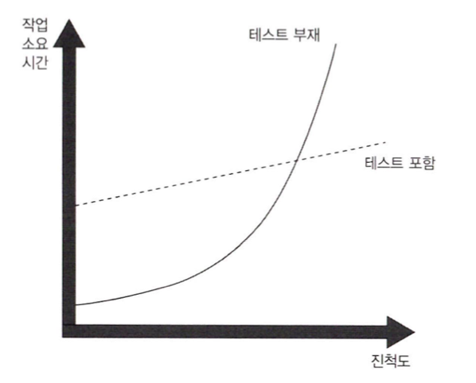

# [Unit Testing] 1장 단위 테스트의 목표

이 내용은 ` 단위 테스트 생산성과 품질을 위한 단위 테스트 원칙과 패턴` 를 읽으면서 정리한 내용을 포함하고 있습니다.

단위테스트 작성을 잘한 소프트웨어는 무난하게 성장하고 유지보수가 많이 필요하지 않으며 끊임없이 변화하는 고객의 요구에 신속히 대응할 수 있습니다. 단위테스트 작성의 노력을 많이 하였다고 해도 많은 버그와 유지비로 프로젝트 진행이 느려지게 됩니다. 

단위 테스트 작성과 유지 보수의 목표를 알아보고 테스트 스위트를 잘 작성할 수 있는 방법도 알아보도록 하겠습니다.

### 단위 테스트 현황

많은 프로젝트에는 자동화된 테스트가 있으며 심지어 많은 테스트가 실행됩니다. 그러나 테스트를 해도 개발자들이 원하는 결과를 얻지 못하는 경우가 많습니다. 프로젝트를 진행하면서 많은 노력이 필요합니다. 새로운 기능을 구현하려면 시간이 많이 들고, 이미 구현된 기능에는 새로운 버그가 지속적으로 나타나게 됩니다. 도움이 될 것이라 생각하였던 단위 테스트는 이러한 상황에 전혀 도움이 되지 않고 오히려 상황을 더 악화시킬 수 있습니다.

이러한 상황은 누구에게나 처할 수 있는 끔찍한 상황이고, 이는 제대로 작동하지 않는 단위 테스트의 결과입니다.

#### 기업용 애플리케이션

기업용 애플리케이션은 조직 내부 프로세스를 자동화하거나 지원하기 위한 응용프로그램입니다. 다양한 형태이지만, 일반적으로 다음과 같은 특성을 갖고 있습니다.

- 높은 비즈니스 복잡도
- 긴 프로젝트 수명
- 중간 크기의 데이터
- 낮은 수준이나 중간 수준 정도의 성능 요구

### 단위 테스트 목표

소프트웨어 프로젝트의 지속 가능한 성장을 가능하게 하는 것입니다. 여기서 `지속 가능한 성장` 이라는 것이 핵심입니다. 

좋은 단위 테스트 스위트는 개발 속도를 지키면서 침체 단계에 빠지지 않게 합니다. 이러한 테스트 스위트가 있다면 변경 사항이 회귀로 이어지지 않을 것이며, 코드를 리팩토링하거나 새로운 기능을 추가하는 것이 더 쉬워집니다.

- 테스트가 없는 일반 프로젝트의 성장 추이를 보여줍니다.
- 처음에는 발목을 잡을 것이 없으므로 빨리 시작할 수 있습니다.
- 아직 잘못된 아키텍처 결정이 없고, 걱장할 만한 코드가 있지도 않습니다.
- 시간이 지나면서 점점 더 많은 시간을 들여야 처음에 보여준 것과 같은 정도의 진척을 낼 수 있습니다.
- 결국 개발 속도가 현저히 느려지고, 심지어 전혀 진행하지 못할 정도로 느려질 수도 있습니다.

#### 소프트웨어 엔트로피

개발 속도가 빠르게 감소하는 현상을 말합니다.

- 지속적인 정리와 리팩토링 등과 같은 적절한 관리를 하지 않고 방치하면 시스템이 점점 더 복잡해지고 무질서해지게 됩니다. 

- 하나의 버그를 수정하면 더 많은 버그를 양산하고, 소프트웨어의 한 부분을 수정하면 다른 부분들이 고장납니다.

- 코드 베이스를 신뢰할 수 없게 되며, 제일 안 좋은 것은 안정화가 어렵게 됩니다.

> 테스트는 안전망 역할을 하며, 대부분의 회귀에 대한 보험을 제공하는 도구라 할 수 있습니다. 테스트는 새로운 기능을 도입하거나 새로운 요구 사항에 더 잘 맞게 리팩터링한 후에도 기존 기능이 잘 작동하는지 확인하는데 도움이 됩니다.

#### 좋은 테스트와 좋지 않은 테스트를 가르는 요인

테스트가 잘못 작성된 프로젝트는 초반에는 테스트가 잘 작성된 프로젝트의 속성을 보여주지만, 결국 침체 단계에 빠지게 됩니다.

프로젝트에 테스트를 더 많이 실행하더라도 단위 테스트의 목표를 달성할 수 없습니다. 테스트의 가치와 유지 비용을 모두 고려해야 합니다. 비용 요소는 다음과 같은 다양한 활동에 필요한 시간에 따라 결정됩니다.

- 기반 코드를 리팩터링할 때 테스트도 리팩터링하라.
- 각 코드 변경 시 테스트를 실행하라.
- 테스트가 잘못된 경고를 발생시킬 경우 처리하라.
- 기반 코드가 어떻게 동작하는지 이해하려고 할 때는 테스트를 읽는 데 시간을 투자하라.

##### 제품 코드 대 테스트 코드

테스트가 많으면 많을수록 좋다고 생각할 수 있지만 그렇지 않습니다. 코드는 자산이 아니라 책임입니다. 코드가 더 많아질수록 소프트웨어 내의 잠재적인 버그에 노출되는 표면적이 더 넓어지고 프로젝트 유지비가 증가하게 됩니다. 따라서 가능한 한 적은 코드로 문제를 해결하는 것이 좋습니다. 

테스트 역시 코드입니다. 특정 문제를 해결하는 것, 즉 애플리케이션의 정확성을 보장하는 것을 목표로 하는 코드베이스의 일부로 봐야 합니다. 다른 코드와 마찬가지로 단위 테스트도 버그에 취약하고 유지 보수가 필요합니다.

### 테스트 스위트 품질 측정을 위한 커버리지 지표

커버리지 지표는 테스트 스위트가 소스 코드를 얼마나 실행하는지를 백분율로 나타냅니다.

- 코드 커버리지
  - 하나 이상의 테스트로 실행된 코드 라인 수와 제품 코드베이스의 전체 라인 수의 비율로 나타냅니다.
  - 코드가 작을수록 테스트 커버리지 지표는 더 좋아지는데, 이는 원래 라인 수만 처리하기 때문입니다.
  - 코드를 작게 한다고 테스트 스위트의 가치나 기반 코드 베이스의 유지 보수성이 변경되지는 않습니다.
- 분기 커버리지
  - 코드 커버리지의 단점을 극복하는 데 도움이 되므로 코드 커버리지보다 더 정확한 결과를 제공합니다.
  - 테스트 스위트 내 하나 이상의 테스트가 통과하는 제어 구조의 수를 나타냅니다.

#### 커버리지 지표에 관한 문제점

테스트 스위트의 품질을 결정하는데 어떤 커버리지 지표도 의존할 수 없는 이유는 다음과 같습니다.

- 테스트 대상 시스템의 모든 가능한 결과를 검증한다고 보장할 수 없습니다.
- 외부 라이브러리의 코드 경로를 고려할 수 있는 커버리지 지표는 없습니다.

#### 특정 커버리지 숫자를 목표로 하기

커버리지 지표를 보는 가장 좋은 방법은 지표 그 자체로 보는 것이며, 목표로 여겨서는 안됩니다.

특정 커버리지 숫자를 목표로 하는 것은 단위 테스트의 목표와 반대되는 그릇된 동기 부여가 됩니다. 개발자들은 중요한 것을 테스트하는 데 집중하는 대신 인공적인 목표를 달성하기 위한 방법을 찾기 시작합니다. 적절한 단위 테스트는 이미 충분히 어렵습니다. 커버리지 숫자를 강요하면 개발자들은 테스트 대상에 신경쓰지 못하고, 결국 적절한 단위 테스트는 더욱 달성하기 어렵습니다.

커버리지 숫자가 낮으면 문제 징후라 할 수 있습니다. 코드베이스에 테스트되지 않은 코드가 많다는 뜻입니다. 그러나 높은 숫자도 별 의미는 없습니다. 그러므로 코드 커버리지를 측정하는 것은 품질 테스트 스위트로 가는 첫걸음일 뿐입니다.

### 무엇이 성공적인 테스트 스위트를 만드는가?

성공적인 테스트 스위트는 다음과 같은 특성을 갖고 있습니다.

- 개발 주기에 통합되어 있습니다.
  - 코드가 변경될 때마다 아무리 작은 것이라도 실행해야 합니다.
- 코드베이스에서 가장 중요한 부분만을 대상으로 합니다.
  - 시스템의 가장 중요한 부분에 단위 테스트 노력을 기울이고, 다른 부분은 간략하게 또는 간접적으로 검증하는 것이 좋습니다.
- 최소한의 유지비로 최대의 가치를 끌어냅니다.
  - 가치가 있는 테스트를 식별하는 노력과 가치가 있는 테스트를 작성하기 위한 노력이 필요합니다.

## 정리

- 단위 테스트를 작성하는 것이 중요합니다. 이와 더불어 좋은 단위 테스트를 작성하는 것도 중요합니다.

- 단위 테스트의 목표는 소프트웨어 프로젝트가 지속적으로 성장하게 만드는 것입니다.

- 좋은 단위 테스트 스위트는 개발 속도를 지키면서 침체 단계에 빠지지 않게 합니다.

- 모든 테스트를 똑같이 작성할 필요는 없습니다. 테스트 스위트 내에 가치 있는 테스트만 남기고 나머지는 모두 제거해야 합니다. 애플리케이션과 테스트 코드는 모두 자산이 아니라 부채입니다.

- 단위 테스트의 목표를 달성하기 위한 방법은 다음과 같습니다

  - 좋은 테스트와 좋지 않은 테스트를 구별하는 방법을 배웁니다.

  - 테스트를 리팩토링해서 더 가치 있게 만듭니다.